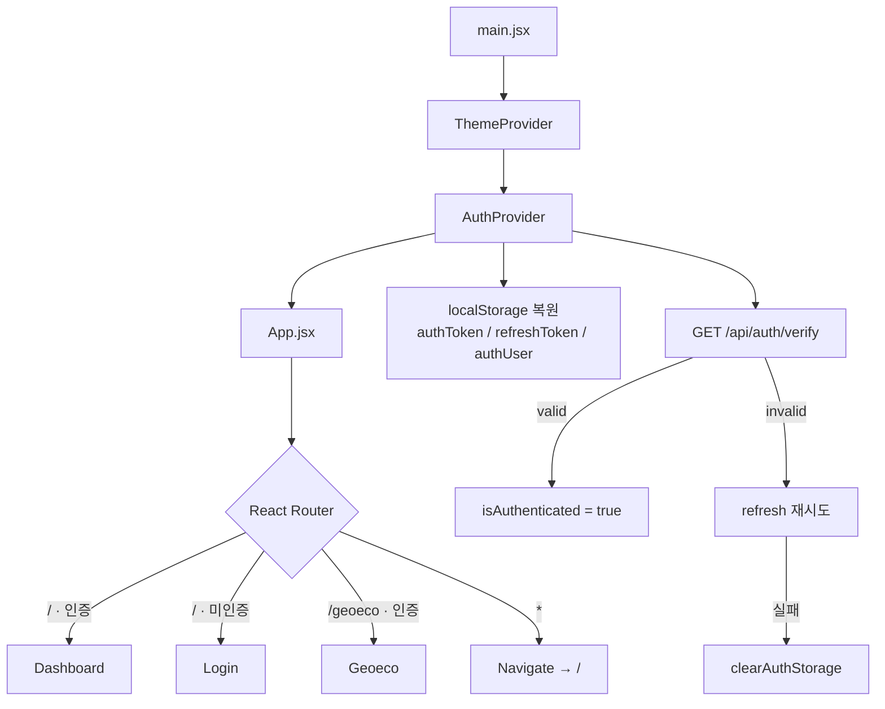
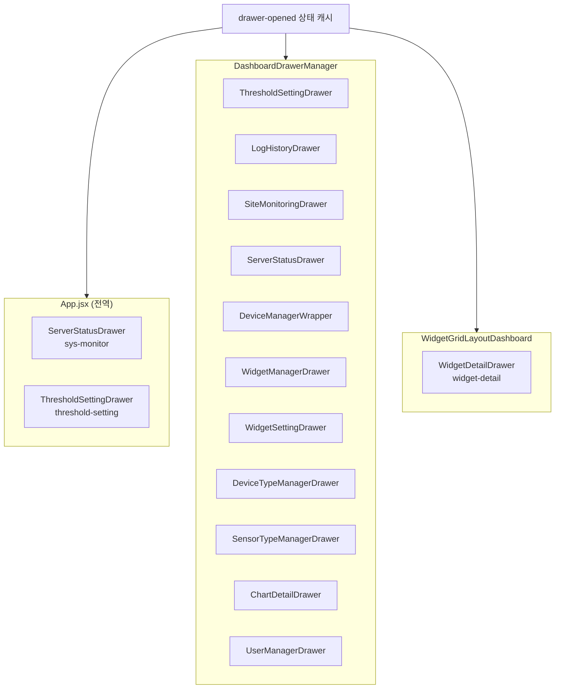

# 앱 진입·라우팅·전역 드로어 — 프로그램 명세

**작성 기준**: `src/main.jsx`, `App.jsx`, `AuthContext.jsx`, `DashboardDrawerManager.jsx`

> `chart-detail` : 정적 그리드 화면에서의 센서상세화면
>
> `wigeet-detail :` 동적그리드 화면에서 센서상세화면

## 1. 데이터 구조와 흐름

### 1.1 앱 부트스트랩 흐름



**실행 순서**

1. `main.jsx` — `ThemeProvider` → `AuthProvider` → `App` 렌더
2. `AuthProvider` — localStorage에서 토큰·사용자 복원 후 서버 `verify`로 유효성 검증

***

### 1.2 인증 데이터 구조

| 저장 위치        | 키              | 타입          | 설명                             |
| ------------ | -------------- | ----------- | ------------------------------ |
| localStorage | `authToken`    | string      | Access Token (약 15분)           |
| localStorage | `refreshToken` | string      | Refresh Token (약 7일)           |
| localStorage | `authUser`     | JSON object | 사용자 프로필 (`role`, `username` 등) |

**AuthContext가 제공하는 값**

| 필드                       | 타입             | 설명                                   |
| ------------------------ | -------------- | ------------------------------------ |
| `isAuthenticated`        | boolean        | 로그인 여부                               |
| `token` / `refreshToken` | string \| null | 현재 토큰                                |
| `user`                   | object \| null | 사용자 정보                               |
| `isAdmin`                | boolean        | `site_admin` 또는 `super_admin`        |
| `isSuperAdmin`           | boolean        | `super_admin`                        |
| `login()`                | 콜백 함수          | `POST /api/auth/login/v2`            |
| `logout()`               | 콜백 함수          | `POST /api/auth/logout` + storage 정리 |
| `fetchUserInfo()`        | 콜백 함수          | `GET /api/auth/verify`               |
| `refreshAccessToken()`   | 콜백 함수          | `POST /api/auth/refresh`             |

**인증 복원 흐름(refresh-token)**

```
앱 기동
  → localStorage에 accessToken 있음?
    → verify API
      → valid → applySession(user)
      → invalid → refresh → 재 verify
        → 성공 → applySession
        → 실패 → clearAuthStorage()
```

***

### 1.3 라우팅 분기

| 경로        | 조건                | 렌더 컴포넌트           |
| --------- | ----------------- | ----------------- |
| `/`       | `isAuthenticated` | `Dashboard`       |
| `/`       | 미인증               | `Login`           |
| `/geoeco` | 인증                | `Geoeco`          |
| `/geoeco` | 미인증               | `Login`           |
| `*`       | —                 | `Navigate to="/"` |

***

### 1.4 드로어 전역 상태 관리(핵심 데이터 구조)

전역 상태 캐시를 사용한다. fetcher 없이 `mutate(key, value)`로 상태를 읽고 쓴다.

| 상태 키                   | 값 타입           | 예시                                                 | 용도                         |
| ---------------------- | -------------- | -------------------------------------------------- | -------------------------- |
| `drawer-opened`        | string \| null | `'chart-detail'`, `'threshold-setting'`, `null`    | 현재 열린 드로어 종류               |
| `chart-detail-params`  | object         | `{ sensorType, chartId, sensorId, channel, mode }` | Grid/siteConfig 차트 상세 파라미터 |
| `widget-detail-widget` | object         | DB 위젯 전체 객체                                        | 그리드형 위젯 상세 대상              |
| `widget-detail-scope`  | object \| null | `{ sensorId, channel }`                            | 형제(sibling) 위젯 채널 필터       |

전체 상태 키 목록은 [주요 데이터 구조 — 프로그램 명세](17-주요-데이터-구조.md)에 정리돼 있다.

**`drawer-opened` 가능 값 (코드 기준)**

| 값                     | 드로어       | 여는 위치                  |
| --------------------- | --------- | ---------------------- |
| `threshold-setting`   | 기준치설정     | Header                 |
| `log`                 | 알림로그      | Header                 |
| `device-manager`      | 디바이스 관리자  | Header (super\_admin)  |
| `device-type-manager` | 디바이스목록    | Header (super\_admin)  |
| `sensor-type-manager` | 센서목록      | Header (super\_admin)  |
| `widget-manager`      | 위젯 관리자    | Header (admin+)        |
| `chart-detail`        | 정적그리드 상세  | Dashboard 차트·게이지 클릭    |
| `widget-detail`       | 동적 그리드 상세 | WidgetGridCard 클릭      |
| `user-manager`        | 사용자 관리    | Header 사용자 메뉴 (admin+) |

**드로어 열기/닫기 패턴**

```javascript
// Bento/siteConfig 차트 상세 열기
mutate('chart-detail-params', { sensorType, chartId, sensorId, channel, mode })
mutate('drawer-opened', 'chart-detail')

// 위젯 그리드 상세 열기
mutate('widget-detail-widget', widget)
mutate('widget-detail-scope', scope)  // 형제 위젯일 때만
mutate('drawer-opened', 'widget-detail')

// 닫기
mutate('drawer-opened', null)
```

***

### 1.5 드로어 렌더링 3계층



**모바일 제한**

* `chart-detail`: `DashboardDrawerManager`에서 `isMobile`이면 강제 닫기
* `widget-detail`: `WidgetDetailDrawer`에서 `!isMobile`일 때만 open

***

### 1.6 End-to-End 흐름 예시

**A. 로그인 → 대시보드**

```
Login.submit → AuthContext.login()
  → setAuthTokens + setAuthUser
  → isAuthenticated = true
  → App "/" → Dashboard 렌더
  → DashboardDrawerManager 마운트
```

**B. 정적그리드상의 위젯클릭 → 차트 상세**

```
Dashboard.handleGaugeClick(config)
  → mutate('chart-detail-params', { sensorType, chartId, sensorId, channel, mode })
  → setDrawerKey('chart-detail')
  → ChartDetailDrawer open
  → `chart-detail-params` 상태 구독
  → useNormalData / useFftData로 데이터 로드
  → NormalDrawerPanel / FftDrawerPanel 렌더
```

**C. 동적그리드상의 위젯 클릭 → 위젯 상세**

```
WidgetGridCardContent.click
  → openWidgetDetailDrawer(widget, scope)
  → 상태 키 3개 갱신
  → WidgetDetailDrawer open
  → useWidgetDetailData(widget, scope)
  → parseType에 따라 Normal / Fft / Gdms 패널 분기
```

***

## 2. 관련 파일과 주요 함수

### 2.1 진입·라우팅

| 파일                                | 역할                       | 주요 함수/컴포넌트                                                                                         |
| --------------------------------- | ------------------------ | -------------------------------------------------------------------------------------------------- |
| `src/main.jsx`                    | React 루트, Provider 래핑    | `createRoot().render()`                                                                            |
| `src/App.jsx`                     | 라우터, 전역 드로어              | `DetailPageRouter()`, `App()`                                                                      |
| `src/context/AuthContext.jsx`     | 인증 전역 상태                 | `AuthProvider`, `useAuth`, `login`, `logout`, `fetchUserInfo`, `requestVerify`, `applySession`     |
| `src/services/authTokenClient.js` | 토큰 storage + 401 refresh | `getAccessToken`, `setAuthTokens`, `clearAuthStorage`, `subscribeAuthChange`, `refreshAccessToken` |
| `src/providers/ThemeProvider.jsx` | 다크/라이트 테마                | `ThemeProvider`                                                                                    |

**App.jsx — DetailPageRouter**

```javascript
function DetailPageRouter() {
  const location = useLocation()
  const params = new URLSearchParams(location.search)
  const sensorType = params.get('sensorType')
  const chart = getChartBySensorType(sensorType)
  if (chart?.useFft) {
    return <FftDetailPage />
  }
  return <DetailPage />
}
```

***

### 2.2 드로어 상태 제어

| 파일                                                                         | 역할                       | 주요 함수                                                                             |
| -------------------------------------------------------------------------- | ------------------------ | --------------------------------------------------------------------------------- |
| `src/pages/dashboard/DashboardDrawerManager.jsx`                           | 대시보드 내 드로어 일괄 렌더         | `closeDrawer()` → `setDrawerKey(null)`                                            |
| `src/pages/dashboard/Header.jsx`                                           | 상단 메뉴 → 드로어 열기           | `setDrawerKey('...')`                                                             |
| `src/pages/dashboard/Dashboard.jsx`                                        | 게이지/마커 클릭 → chart-detail | `handleGaugeClick`, `handleMarkerClick`                                           |
| `src/pages/dashboard/widget-grid-layout/detail/widgetDetailDrawerUtils.js` | 드로어상태 제어                 | `openWidgetDetailDrawer`, `closeWidgetDetailDrawer`, `isWidgetDetailDrawerTarget` |

**openWidgetDetailDrawer**

```javascript
export function openWidgetDetailDrawer(widget, scope = null) {
  if (!isWidgetDetailDrawerTarget(widget)) return
  const effectiveScope = isWidgetSibling(widget) ? scope : null
  mutate('widget-detail-widget', widget)
  mutate(WIDGET_DETAIL_SCOPE_KEY, effectiveScope)
  mutate('drawer-opened', WIDGET_DETAIL_DRAWER_KEY)
}
```

**차트 클릭 시 (공통 패턴 — 여러 차트 컴포넌트)**

* `LowFrequencyChart`, `HighFrequencyChart`, `SensorValueBarChart`, `SensorStackedBarChart` 등
* `mutate('chart-detail-params', {...})` + `mutate('drawer-opened', 'chart-detail')`

***

### 2.3 AuthContext 주요 함수

| 함수                              | API                       | 동작                                 |
| ------------------------------- | ------------------------- | ---------------------------------- |
| `login({ username, password })` | `POST /api/auth/login/v2` | 토큰·user 저장, `isAuthenticated=true` |
| `logout()`                      | `POST /api/auth/logout`   | storage 정리, 상태 초기화                 |
| `fetchUserInfo()`               | `GET /api/auth/verify`    | 프로필 갱신                             |
| `refreshAccessToken()`          | `POST /api/auth/refresh`  | accessToken 재발급                    |
| `applySession(verifyUser)`      | —                         | JWT 메타 제외 후 user 저장                |

***

### 2.4 ChartDetailDrawer 데이터 훅

| 파일                                                          | 역할                                        |
| ----------------------------------------------------------- | ----------------------------------------- |
| `src/components/chart-detail-drawer/hooks/useNormalData.js` | 일반 시계열 상세 데이터                             |
| `src/components/chart-detail-drawer/hooks/useFftData.js`    | FFT 상세 데이터                                |
| `src/utils/table/drawerWidthCalculator.js`                  | `calculateDrawerWidth(params)` — 드로어 폭 계산 |

***

### 2.5 WidgetDetailDrawer 데이터 훅

| 파일                                                                        | 역할             |
| ------------------------------------------------------------------------- | -------------- |
| `src/pages/dashboard/widget-grid-layout/hooks/useWidgetDetailData.js`     | 위젯 상세 차트·표 데이터 |
| `src/pages/dashboard/widget-grid-layout/hooks/useWidgetFftImageData.js`   | FFT 이미지 데이터    |
| `src/pages/dashboard/widget-grid-layout/hooks/useWidgetGridThresholds.js` | GDMS 기준치 맵     |

***

## 3. 사용 컴포넌트 설명

### 3.1 페이지 컴포넌트

| 컴포넌트        | 파일                                  | 설명                                                 |
| ----------- | ----------------------------------- | -------------------------------------------------- |
| `Login`     | `src/pages/Login`                   | 미인증 시 `/` 진입 화면. `AuthContext.login()` 호출          |
| `Dashboard` | `src/pages/dashboard/Dashboard.jsx` | 메인 대시보드. siteCode에 따라 Bento/FlexGrid/WidgetGrid 분기 |
| `Geoeco`    | `src/pages/Geoeco`                  | `/geoeco` 전용 페이지 (인증 필요)                           |

***

### 3.2 드로어 관리 컴포넌트

| 컴포넌트                     | 파일                                                                 | 상태 키                                          | 설명                            |
| ------------------------ | ------------------------------------------------------------------ | --------------------------------------------- | ----------------------------- |
| `DashboardDrawerManager` | `pages/dashboard/DashboardDrawerManager.jsx`                       | `drawer-opened`                               | 대시보드 하위 모든 작업 드로어 컨테이너        |
| `ChartDetailDrawer`      | `components/chart-detail-drawer/index.jsx`                         | `chart-detail-params`                         | siteConfig 차트 상세 (패널·인쇄·폭 계산) |
| `WidgetDetailDrawer`     | `pages/dashboard/widget-grid-layout/detail/WidgetDetailDrawer.jsx` | `widget-detail-widget`, `widget-detail-scope` | DB 위젯 그리드 전용 상세               |

**ChartDetailDrawer 엔트리**

* `ChartDetailDrawer.jsx` — re-export만 수행
* 실제 구현: `chart-detail-drawer/index.jsx`

**ChartDetailDrawer 내부 분기**

```
params.sensorType ∈ FFT_SENSOR_TYPES?
  → FftDrawerPanel (useFftData)
  → NormalDrawerPanel (useNormalData)
+ ChartDetailPrintModal (인쇄)
+ Drawer UI (width 동적 계산)
```

**WidgetDetailDrawer 내부 분기**

```
params.widgetOptions.parseType
  → 'gdms'  → GdmsDrawerPanel
  → 'fft'   → FftDrawerPanel (+ useWidgetFftImageData)
  → 그 외   → NormalDrawerPanel
```

***

### 3.3 관리·설정 드로어

| 컴포넌트                      | drawer-opened 값                              | 권한           | 설명                          |
| ------------------------- | -------------------------------------------- | ------------ | --------------------------- |
| `ThresholdSettingDrawer`  | `threshold-setting`                          | 로그인          | 기준치 설정 (App + Dashboard 양쪽) |
| `LogHistoryDrawer`        | `log`                                        | 로그인          | 알림 로그                       |
| `SiteMonitoringDrawer`    | `site-monitoring`                            | —            | 현장 모니터링 (메뉴 미연결)            |
| `ServerStatusDrawer`      | `sys-monitor`                                | super\_admin | 서버 상태 (App + Dashboard 양쪽)  |
| `DeviceManagerWrapper`    | `device-manager`                             | super\_admin | 디바이스 트리·메타 관리               |
| `WidgetManagerDrawer`     | `widget-manager`                             | admin+       | 위젯 그룹 CRUD, DnD             |
| `WidgetSettingDrawer`     | 자체 상태 키 (`WIDGET_SETTING_DRAWER_TARGET_KEY`) | admin+       | 위젯 관리자에서 선택한 위젯 설정          |
| `DeviceTypeManagerDrawer` | `device-type-manager`                        | super\_admin | 디바이스 종류 관리                  |
| `SensorTypeManagerDrawer` | `sensor-type-manager`                        | super\_admin | 센서 종류 관리                    |
| `UserManagerDrawer`       | `user-manager`                               | admin+       | 사용자 관리                      |

***

### 3.4 공통 UI·패널

| 컴포넌트                               | 설명                                  |
| ---------------------------------- | ----------------------------------- |
| `Drawer` (`components/ui/drawer`)  | 측면 패널 공통 UI (title, width, onClose) |
| `NormalDrawerPanel`                | 일반 시계열 상세 (차트·표·기간·엑셀)              |
| `FftDrawerPanel`                   | FFT 상세 (주파수 차트·이미지·센서 전환)           |
| `GdmsDrawerPanel`                  | GDMS 파싱 위젯 전용 상세                    |
| `ChartDetailPrintModal`            | 상세 화면 인쇄 미리보기                       |
| `Header`                           | 상단 메뉴, 드로어 트리거, 로그아웃                |
| `Toaster` (`components/ui/sonner`) | 전역 토스트 알림                           |
| `SiteDocumentTitle`                | 브라우저 탭 제목 (현장명)                     |

***

## 4. 구현 시 주의사항

1. **드로어 확장** — 새 드로어는 `drawer-opened` 문자열 키 체계를 따른다.
2. **상세 파라미터 분리**
   * 정적그리드 → `chart-detail-params`
   * 동적그리드 → `widget-detail-widget` + `widget-detail-scope`
3. **인증·라우팅 순서** — `AuthProvider`의 verify가 끝나기 전 `isAuthenticated`가 false일 수 있어, 잠깐 Login이 보였다가 Dashboard로 전환될 수 있다.
4. **모바일** — `chart-detail`, `widget-detail` 드로어는 데스크톱 전용이다.

***

## 5. 관련 문서

| 문서                                                         | 내용                     |
| ---------------------------------------------------------- | ---------------------- |
| [주요 데이터 구조 — 프로그램 명세](17-주요-데이터-구조.md)              | 상태 키 전체 목록, 위젯 JSON 구조 |
| [차트 상세 드로어(일반) — 프로그램 명세](08-차트-상세-드로어-일반.md)  | 일반 차트 상세 흐름            |
| [차트 상세 드로어(FFT) — 프로그램 명세](09-차트-상세-드로어-FFT.md)    | FFT 상세 흐름              |
| [위젯 그리드 상세 드로어 — 프로그램 명세](19-위젯-그리드-상세-드로어.md) | 위젯 그리드 상세 흐름           |
