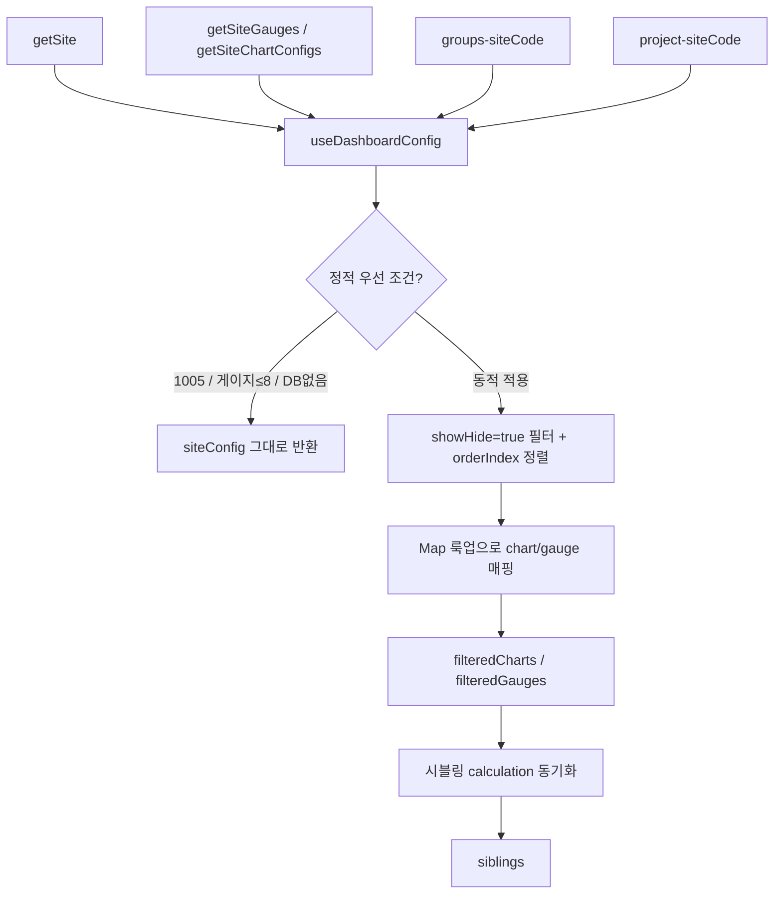

# 사이트 설정과 대시보드 구성 — 프로그램 명세

**작성 기준**: `siteConfig.js`, `useDashboardConfig.js`, `projectService.js`

***

## 1. 데이터 구조와 흐름

### 1.1 입력 소스

| 구분    | 함수/소스                                           | 반환 내용         |
| ----- | ----------------------------------------------- | ------------- |
| 정적그리드 | `getSite()`                                     | 현재 siteCode   |
| 정적그리드 | `getSiteGauges()`                               | 게이지 설정 배열     |
| 정적그리드 | `getSiteChartConfigs()`                         | 차트 설정 배열      |
| 정적그리드 | `getSiteSiblings()`                             | 시블링(통합) 차트 그룹 |
| 동적그리드 | `projectService.getGroupsBySiteCode(siteCode)`  | 센서 그룹(순서·가시성) |
| 동적그리드 | `projectService.getProjectBySiteCode(siteCode)` | 프로젝트(마커 등)    |

### 1.2 결합 흐름

### 1.3 정적 우선 조건

다음 중 하나면 DB 그룹 없이 `siteConfig` 전체를 사용한다.

* `siteCode === '1005'`
* `getSiteGauges().length <= 8`
* `dbSensorGroups`가 없거나 빈 배열

### 1.4 Map 룩업 키 규칙

| 대상  | 키                       | 비고               |
| --- | ----------------------- | ---------------- |
| 차트  | `String(groupId ?? id)` | 동일 키에 차트 여러 개 가능 |
| 게이지 | `String(groupId)`       | 그룹 ID 기준         |

### 1.5 반환 데이터 (`useDashboardConfig`)

| 필드               | 타입        | 설명                                  |
| ---------------- | --------- | ----------------------------------- |
| `filteredCharts` | array     | 대시보드에 표시할 차트 목록                     |
| `filteredGauges` | array     | 대시보드에 표시할 게이지 목록                    |
| `siblings`       | array     | 활성 센서 타입 기준 필터·calculation 동기화된 시블링 |
| `activeGroupIds` | string\[] | 활성 DB 그룹 ID (정적 우선 시 `[]`)          |
| `isLoading`      | boolean   | 그룹 로딩 중                             |
| `error`          | any       | 그룹/프로젝트 API 오류                      |
| `siteCode`       | string    | 현재 현장 코드                            |
| `dbSensorGroups` | array     | DB 원본 그룹                            |
| `dbProject`      | object    | DB 프로젝트(마커 등)                       |

### 1.6 시블링 후처리

1. `filteredCharts`의 `sensorType`으로 활성 타입 Set 생성
2. 시블링 `items`에서 비활성 타입 제거
3. 차트 센서 Map(`sensorId-channel-dataKey`)에서 `calculation` 동기화
4. `items`가 남은 그룹만 반환

***

## 2. 관련 파일과 주요 함수

| 파일                                | 역할              | 주요 함수                                                                                        |
| --------------------------------- | --------------- | -------------------------------------------------------------------------------------------- |
| `src/config/siteConfig.js`        | 정적 현장·차트·게이지 정의 | `getSite`, `getSiteGauges`, `getSiteChartConfigs`, `getSiteSiblings`, `getChartBySensorType` |
| `src/hooks/useDashboardConfig.js` | 정적+동적 결합        | `useDashboardConfig()`                                                                       |
| `src/services/projectService.js`  | DB 프로젝트/그룹 API  | `getGroupsBySiteCode`, `getProjectBySiteCode`                                                |
| `src/config/dashboardRouting.js`  | 대시보드 타입 분기      | `isBentoSite`, `isWidgetGridDashboardSite`                                                   |

**상태관리 키**

* `groups-${siteCode}` — 그룹 목록
* `project-${siteCode}` — 프로젝트 정보

**성능 옵션**: `revalidateOnFocus: false`, `dedupingInterval: 600000`, 필터/매핑은 `useMemo`

***

## 3. 사용 컴포넌트 설명

| 컴포넌트                    | 사용 방식                                                                                  |
| ----------------------- | -------------------------------------------------------------------------------------- |
| `Dashboard`             | `useDashboardConfig()`로 `filteredCharts`, `filteredGauges`, `siblings`, `dbProject` 소비 |
| 정적그리드                   | `filteredCharts`, `filteredGauges`로 카드 렌더                                              |
| `SensorMonitoringBoard` | `filteredGauges` + `siblings`                                                          |
| `SiteBlueprint`         | `dbProject` 마커 + `availableBlueprintSensors`                                           |

***

## 4. 관련 문서

| 문서                                                                                                                                             | 내용             |
| ---------------------------------------------------------------------------------------------------------------------------------------------- | -------------- |
| [01-앱-진입-라우팅-전역-드로어.md](01-%EC%95%B1-%EC%A7%84%EC%9E%85-%EB%9D%BC%EC%9A%B0%ED%8C%85-%EC%A0%84%EC%97%AD-%EB%93%9C%EB%A1%9C%EC%96%B4.md)         | 앱 진입·라우팅       |
| [10-위젯-그리드-계산-파이프라인.md](10-%EC%9C%84%EC%A0%AF-%EA%B7%B8%EB%A6%AC%EB%93%9C-%EA%B3%84%EC%82%B0-%ED%8C%8C%EC%9D%B4%ED%94%84%EB%9D%BC%EC%9D%B8.md) | DB 위젯 그리드 대시보드 |
