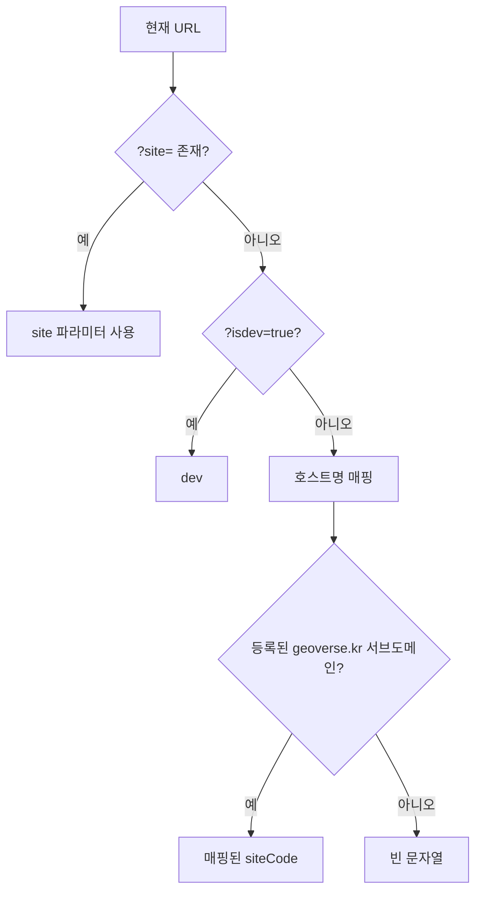
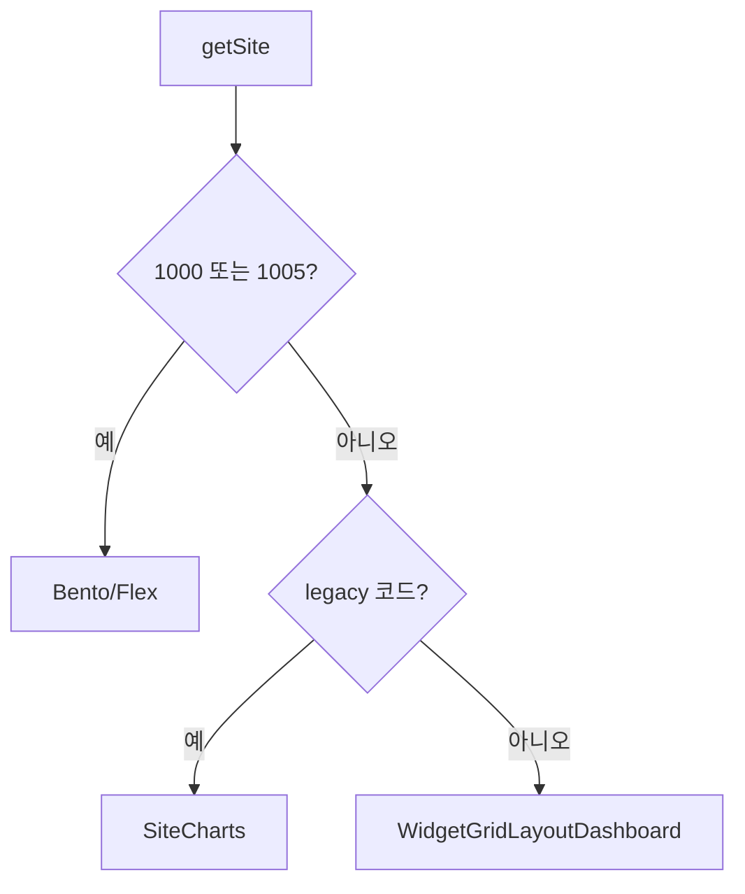
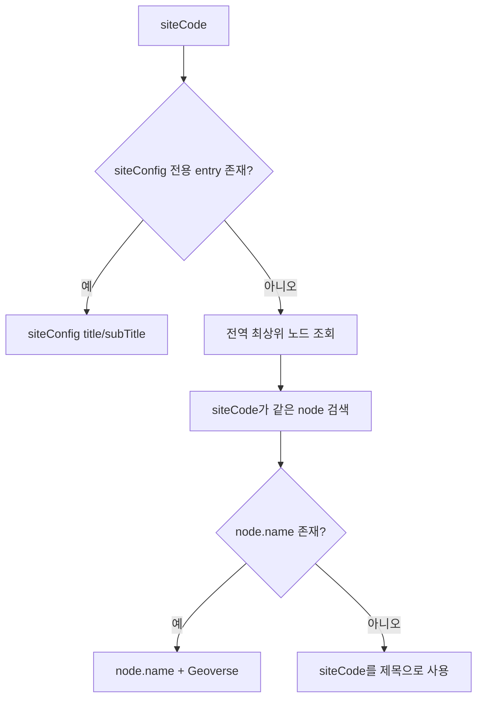

# 사이트 설정과 대시보드 구성 — 프로그램 명세

**작성 기준**: `siteConfig.js`, `dashboardRouting.js`, `useDashboardConfig.js`, `useSiteDisplayTitle.js`, `Dashboard.jsx`, `WidgetGridLayoutDashboard.jsx`

***

### 1. 현재 현장 코드 결정

`getSite()`는 다음 우선순위로 `siteCode`를 결정한다.


```mermaid
flowchart TD
  A[현재 URL] --> B{"?site= 존재?"}
  B -->|예| C[site 파라미터 사용]
  B -->|아니오| D{"?isdev=true?"}
  D -->|예| E[dev]
  D -->|아니오| F[호스트명 매핑]
  F --> G{"등록된 geoverse.kr 서브도메인?"}
  G -->|예| H[매핑된 siteCode]
  G -->|아니오| I[빈 문자열]
```

`?site=`가 서브도메인보다 우선하므로 개발·관리 작업에서는 URL로 현장을 명시할 수 있다. `isdev=true`는 하위 호환용이다.

현재 정적 호스트 매핑은 다음과 같다.

| 호스트명                 | siteCode |
| -------------------- | -------- |
| `nopo.geoverse.kr`   | `1000`   |
| `sihwa.geoverse.kr`  | `1001`   |
| `bosung.geoverse.kr` | `1002`   |
| `honam.geoverse.kr`  | `1003`   |
| `ichon.geoverse.kr`  | `1005`   |

### 2. 대시보드 유형 분기

현장 코드에 따라 `Dashboard`가 렌더링할 대시보드 구현이 달라진다.

| 유형                | siteCode                                 | 주요 데이터 원본                      |
| ----------------- | ---------------------------------------- | ------------------------------ |
| Bento/Flex        | `1000`, `1005`                           | `siteConfig`의 정적 게이지·차트·레이아웃   |
| Legacy SiteCharts | `default`, `dev`, `1001`, `1002`, `1003` | `siteConfig`의 정적 게이지·차트        |
| Widget Grid       | 위 목록을 제외한 모든 현장                          | DB `sensor-widgets`, 프로젝트 레이아웃 |


```mermaid
flowchart TD
  A[getSite] --> B{"1000 또는 1005?"}
  B -->|예| C[Bento/Flex]
  B -->|아니오| D{"legacy 코드?"}
  D -->|예| E[SiteCharts]
  D -->|아니오| F[WidgetGridLayoutDashboard]
```

신규 Geoverse 현장은 별도 코드 추가가 없으면 Widget Grid가 기본이다. 신규 현장을 Bento 또는 Legacy 방식으로 만들려면 `dashboardRouting.js`와 `siteConfig.js`의 명시적인 코드 변경이 필요하다.

### 3. `useDashboardConfig`의 현재 동작

#### 3.1 입력 소스

| 함수/소스                                           | 반환 내용             |
| ----------------------------------------------- | ----------------- |
| `getSite()`                                     | 현재 `siteCode`     |
| `getSiteGauges()`                               | 정적 게이지 설정         |
| `getSiteChartConfigs()`                         | 정적 차트 설정          |
| `getSiteSiblings()`                             | 정적 시블링 차트 그룹      |
| `projectService.getProjectBySiteCode(siteCode)` | 프로젝트·마커·조감도·배치 정보 |

#### 3.2 DB 센서 그룹 필터는 현재 비활성

현재 코드에서는 다음 값이 고정되어 있다.

```javascript
const dbSensorGroups = undefined
const isGroupsLoading = false
const groupsError = undefined
```

따라서 `projectService.getGroupsBySiteCode()`를 호출하지 않으며, `showHide`·`orderIndex`를 이용한 DB 그룹 필터 분기는 실행되지 않는다. `filteredCharts`와 `filteredGauges`는 현재 `siteConfig` 전체 설정을 반환한다.

파일 안에 DB 그룹을 필터링하는 계산 로직은 남아 있지만, `dbSensorGroups` 조회를 복구하지 않는 한 동작하지 않는 대기 코드다.

#### 3.3 시블링 후처리

정적 차트 설정을 기준으로 다음 처리를 수행한다.

1. `filteredCharts`의 `sensorType`으로 활성 타입 Set을 만든다.
2. 시블링 `items`에서 활성 타입이 아닌 항목을 제거한다.
3. `sensorId-channel-dataKey` 키로 해당 차트 센서의 `calculation`을 찾아 시블링 항목에 복사한다.
4. 항목이 하나도 남지 않은 시블링 그룹을 제외한다.

#### 3.4 반환 데이터

| 필드               | 현재 의미                     |
| ---------------- | ------------------------- |
| `filteredCharts` | `siteConfig` 차트 목록        |
| `filteredGauges` | `siteConfig` 게이지 목록       |
| `siblings`       | 활성 타입과 계산식이 정리된 시블링 목록    |
| `activeGroupIds` | 현재 항상 빈 배열                |
| `isLoading`      | 현재 그룹 로딩을 하지 않으므로 `false` |
| `error`          | 프로젝트 조회 오류                |
| `siteCode`       | 현재 현장 코드                  |
| `dbSensorGroups` | 현재 `undefined`            |
| `dbProject`      | DB 프로젝트 정보                |

### 4. 현장 표시명 결정

헤더, 로그인 화면, 브라우저 탭 제목은 `useSiteDisplayTitle` 계열 훅에서 결정한다.


```mermaid
flowchart TD
  A[siteCode] --> B{"siteConfig 전용 entry 존재?"}
  B -->|예| C[siteConfig title/subTitle]
  B -->|아니오| D[전역 최상위 노드 조회]
  D --> E[siteCode가 같은 node 검색]
  E --> F{"node.name 존재?"}
  F -->|예| G[node.name + Geoverse]
  F -->|아니오| H[siteCode를 제목으로 사용]
```

신규 현장의 이름을 관리자에서 입력해야 하는 이유가 여기에 있다. 전용 `siteConfig`가 없는 현장은 DB 최상위 노드의 `name`이 헤더 표시명이 된다.

`SiteDocumentTitle`은 같은 제목을 `document.title`에 반영한다. 단, GeoEco 화면은 자체적으로 `GeoEco`를 다시 지정한다.

### 5. 신규 현장과 코드의 연결

신규 현장을 코드에 연결할 때 핵심 식별자는 `siteCode`다.

1. 디바이스 관리자에서 최상위 현장 노드를 만든다.
2. 현장 이름과 `siteCode`를 입력한다.
3. 같은 저장 과정에서 프로젝트를 생성하거나 기존 프로젝트를 갱신한다.
4. 신규 현장은 기본적으로 Widget Grid 대시보드로 분기한다.
5. 헤더 제목은 최상위 노드 이름을 사용한다.
6. 사용자 관리와 위젯·기준치 조회도 같은 `siteCode`를 사용한다.

현장 추가의 실제 운영 순서는 운영 가이드에서 다루고, 이 문서는 코드가 현장을 판별하고 화면을 선택하는 원리만 설명한다.

### 6. 관련 파일과 주요 함수

| 파일                                                                     | 역할                | 주요 함수                                                                |
| ---------------------------------------------------------------------- | ----------------- | -------------------------------------------------------------------- |
| `src/config/siteConfig.js`                                             | 현장 코드 판별·정적 현장 설정 | `getSite`, `getSiteConfig`, `hasDedicatedSiteConfig`                 |
| `src/config/dashboardRouting.js`                                       | 대시보드 유형 분기        | `isBentoSite`, `isLegacySiteChartsSite`, `isWidgetGridDashboardSite` |
| `src/hooks/useDashboardConfig.js`                                      | 정적 차트·시블링·프로젝트 결합 | `useDashboardConfig`                                                 |
| `src/hooks/useSiteDisplayTitle.js`                                     | 헤더·로그인·탭 제목 결정    | `useSiteDisplayTitle`, `useLoginSiteTitle`, `SiteDocumentTitle`      |
| `src/pages/dashboard/Dashboard.jsx`                                    | 대시보드 최종 분기와 공통 화면 | `Dashboard`, `SiteCharts`                                            |
| `src/pages/dashboard/widget-grid-layout/WidgetGridLayoutDashboard.jsx` | DB 위젯 그리드         | `WidgetGridLayoutDashboard`                                          |
| `src/services/projectService.js`                                       | 프로젝트 조회           | `getProjectBySiteCode`                                               |

### 7. 구현 시 주의사항

1. `siteConfig`에 없는 현장이 `default` 설정을 읽더라도 대시보드 유형은 Widget Grid다. 설정 fallback과 라우팅 분기는 별개다.
2. DB 그룹 필터 코드는 존재하지만 현재 비활성이다. 문서나 기능 수정 시 이를 활성 동작으로 오해하면 안 된다.
3. 신규 현장 이름은 정적 설정이 아니라 DB 노드명에서 올 수 있으므로 `siteCode`와 노드 저장이 모두 필요하다.
4. 슈퍼 관리자의 사용자 관리 대상도 현재 URL의 `siteCode`를 사용한다.

### 8. 관련 문서

| 문서                | 내용                  |
| ----------------- | ------------------- |
| 앱 진입·라우팅·전역 드로어   | 인증과 앱 진입            |
| 위젯 그리드 계산 파이프라인   | Widget Grid 계산 흐름   |
| 디바이스·채널·센서 타입 결합  | 현장과 장비 구성           |
| 현장 사용자와 알림 수신자 연동 | 현장 코드와 사용자 관리 대상 연결 |
