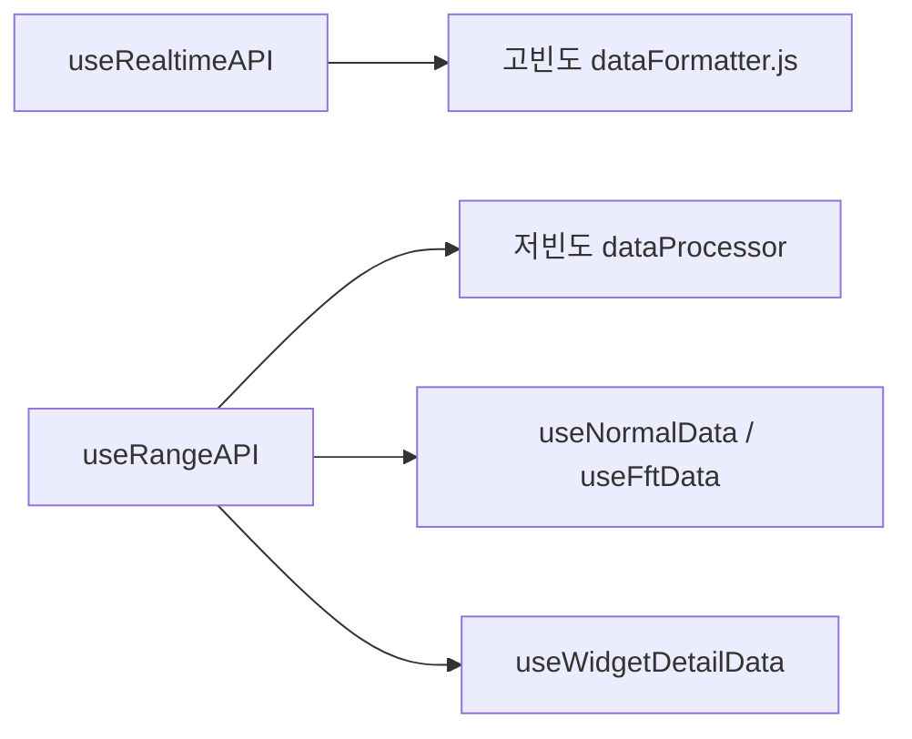

# 실시간·기간 데이터 조회 — 프로그램 명세

**작성 기준**: `useRealtimeAPI.js`, `useRangeAPI.js`, `sensorRangeParams.js`

---

## 1. 데이터 구조와 흐름

### 1.1 useRealtimeAPI

**역할**: 최근 N시간 실시간 구간 API 호출, 원본 응답 보관. 파싱은 센서 config `dataProcessor` 또는 `dataFormatter.js`에서 수행.

| 파라미터 | 타입 | 설명 |
|----------|------|------|
| `sensorId` | string | 센서 ID |
| `hours` | number | 조회 시간(기본 1) |
| `aggregateSeconds` | number | 집계 간격(초) |
| `options.includeMinMax` | boolean | min/max 포함 여부 |
| `options.channel` | string | 채널 (필수 — 없으면 호출 안 함) |

**요청**

```
GET {SENSOR_API}/api/sensors/realtime
  ?sensorId & hours & aggregateSeconds & types & channel
  types = avg | avg,min,max
```

**반환**

| 필드 | 설명 |
|------|------|
| `rawApiResponse` | API JSON 원본 |
| `loading` | 로딩 상태 |
| `error` | 오류 메시지 |
| `refetch` | 재조회 함수 |
| `currentAggregateSeconds` | 마지막 요청 집계 간격 |

### 1.2 useRangeAPI

**역할**: 기간별 시계열 조회. `startDate`/`endDate` 없으면 호출 차단, `rangeData = []`.

| 파라미터 | 타입 | 설명 |
|----------|------|------|
| `sensorId` | string | 센서 ID |
| `startDate` / `endDate` | Date/string | ISO 8601 변환 후 전송 |
| `options.includeMinMax` | boolean | min/max 포함 |
| `options.channel` | string | MQTT 채널 (LoRa/GDMS는 생략 가능) |
| `options.isFft` | boolean | FFT 조회 |
| `options.parseType` | string | LoRa/GDMS 판정용 |

**요청**

```
GET {SENSOR_API}/api/sensors/range
  ?sensorId & start & end & types [&channel] [&isFft=true] [&isLora=true]
```

`isLora`는 `appendIsLoraRangeParam()`이 `parseType`, `sensorId` 접두(`lora_`) 기준으로 추가.

**응답 처리**

1. `data.data` 배열 사용
2. `channel` 있으면 채널 필터
3. `time` 기준 오름차순 정렬

**반환**: `rangeData`, `loading`, `error`, `refetch`

### 1.3 차트·드로어 연계



---

## 2. 관련 파일과 주요 함수

| 파일 | 역할 |
|------|------|
| `src/hooks/useRealtimeAPI.js` | `useRealtimeAPI()` |
| `src/hooks/useRangeAPI.js` | `useRangeAPI()` |
| `src/utils/sensorRangeParams.js` | `appendIsLoraRangeParam()` |
| `src/components/chart/high-frequency/dataFormatter.js` | 고빈도 응답 파싱 |
| `src/components/chart-detail-drawer/hooks/useNormalData.js` | 상세 드로어 range 조합 |
| `src/components/chart-detail-drawer/hooks/useFftData.js` | FFT 상세 range 조합 |

> `sensorService.js`는 HTTP range/realtime이 아니라 Socket.IO 래퍼다.

---

## 3. 사용 컴포넌트 설명

| 컴포넌트/훅 | API 사용 |
|-------------|----------|
| `HighFrequencyChart` | `useRealtimeAPI` + `dataFormatter` |
| `LowFrequencyChart` | `useRangeAPI` / realtime + `dataProcessor` |
| `ChartDetailDrawer` (`useNormalData`, `useFftData`) | `useRangeAPI` 직접·복합 호출 |
| `WidgetDetailDrawer` (`useWidgetDetailData`) | 위젯별 range 조합 |

---

## 4. 구현 시 주의사항

1. `useRangeAPI`: `startDate`/`endDate` 없으면 API 호출 금지.
2. `useRealtimeAPI`: `channel` 없으면 호출 금지.
3. `options` 변경 시 `useCallback` 의존성에 포함되어야 재호출된다.
4. `types`·`channel` 조합 변경 시 테이블/차트 불일치 회귀 검증 필요.

---

## 5. 관련 문서

| 문서 | 내용 |
|------|------|
| [04-웹소켓-실시간-스트림.md](./04-웹소켓-실시간-스트림.md) | 소켓 합류 |
| [06-고빈도-차트.md](./06-고빈도-차트.md) | 고빈도 파싱 |
| [07-저빈도-차트.md](./07-저빈도-차트.md) | 저빈도 파싱 |
| [17-주요-데이터-구조.md](./17-주요-데이터-구조.md) | API 파라미터 정본 |
