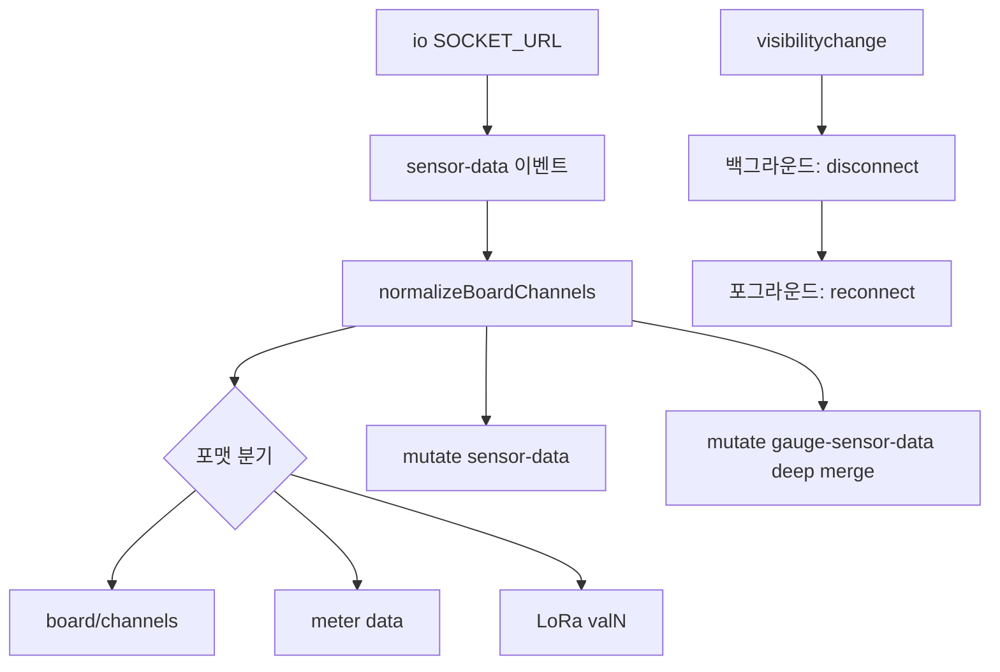

# WebSocket 실시간 스트림 — 프로그램 명세

**작성 기준**: `SocketControl.jsx`, `useGaugeData.js`, `useWebSocket.js`

***

## 1. 데이터 구조와 흐름

### 1.1 상태관리 키

| SWR Key                       | 값                                                   | 용도             |
| ----------------------------- | --------------------------------------------------- | -------------- |
| `websocket-connection-status` | `'Connecting'` \| `'Connected'` \| `'Disconnected'` | 연결 상태 UI       |
| `sensor-data`                 | `{ [sensorId]: normalizedPacket }`                  | 차트용 실시간 데이터    |
| `gauge-sensor-data`           | `{ [sensorId]: channelMerged }`                     | 게이지용 채널 병합 데이터 |

### 1.2 SocketControl 흐름

### 1.3 패킷 정규화

| 포맷                     | 처리                           |
| ---------------------- | ---------------------------- |
| `boardData.channels[]` | 채널별 `data`, `fieldTimes` 정규화 |
| meter `data[]`         | 채널명 `chN` 변환                 |
| LoRa `val1`, `val2`…   | 호환 채널 구조로 변환                 |

값 추출: `val?.value ?? val?.mean ?? val`

### 1.4 useGaugeData 연계

1. `gauge-sensor-data` SWR 구독
2. `sensorId` + `channel` + `dataKey` 값 추출
3. `useThresholds`와 결합 → `normal` / `warning` / `danger`
4. `sensor.calculation` 적용
5. 유량계(`NF`) 당일 파생값 계산

### 1.5 useWebSocket (보조)

특정 `sensorId`만 필터링해 반환. 프로젝트 메인 경로는 `SocketControl` + SWR.

***

## 2. 관련 파일과 주요 함수

| 파일                                  | 역할                 | 주요 함수                                                    |
| ----------------------------------- | ------------------ | -------------------------------------------------------- |
| `src/utils/SocketControl.jsx`       | 소켓 연결·정규화·SWR 반영   | `normalizeBoardChannels`, `normalizeChannel`, `getValue` |
| `src/hooks/useGaugeData.js`         | 게이지 표시값·상태         | `useGaugeData(gaugeConfig)`                              |
| `src/hooks/useWebSocket.js`         | 단일 센서 소켓 구독        | `useWebSocket(sensorId)`                                 |
| `src/utils/SensorDataRepository.js` | 센서 데이터 저장소(레거시/보조) | —                                                        |
| `src/hooks/useThresholds.js`        | DB 임계치             | 게이지 상태 판정에 사용                                            |

**마운트**: `Dashboard`에서 `<SocketControl />` 렌더

***

## 3. 사용 컴포넌트 설명

| 컴포넌트                          | 역할                                   |
| ----------------------------- | ------------------------------------ |
| `SocketControl`               | 전역 소켓 1개, SWR 캐시 갱신                  |
| `SensorGaugeWrapper` / 게이지 카드 | `useGaugeData`로 실시간 값·색상             |
| `HighFrequencyChart`          | `sensor-data` SWR 또는 API 혼합          |
| `ServerStatusDrawer`          | `websocket-connection-status` 표시(간접) |

***

## 4. 구현 시 주의사항

1. `normalizeBoardChannels` 변경 시 다중 포맷 회귀 위험이 크다.
2. `gauge-sensor-data`는 채널 단위 deep merge — 덮어쓰기 정책 변경 시 값 누락 가능.
3. 연결 상태(`Connected`)와 실제 데이터 수신은 별개 — UI에서 분리 해석.
4. 백그라운드 탭에서 연결 해제 후 복귀 시 재연결한다.

***

## 5. 관련 문서

| 문서                                                                                                                         | 내용         |
| -------------------------------------------------------------------------------------------------------------------------- | ---------- |
| [03-실시간-기간-데이터-조회.md](03-%EC%8B%A4%EC%8B%9C%EA%B0%84-%EA%B8%B0%EA%B0%84-%EB%8D%B0%EC%9D%B4%ED%84%B0-%EC%A1%B0%ED%9A%8C.md) | API 조회와 합류 |
| [13-임계치-상태-계산-엑셀.md](13-%EC%9E%84%EA%B3%84%EC%B9%98-%EC%83%81%ED%83%9C-%EA%B3%84%EC%82%B0-%EC%97%91%EC%85%80.md)           | 임계치·상태 계산  |
