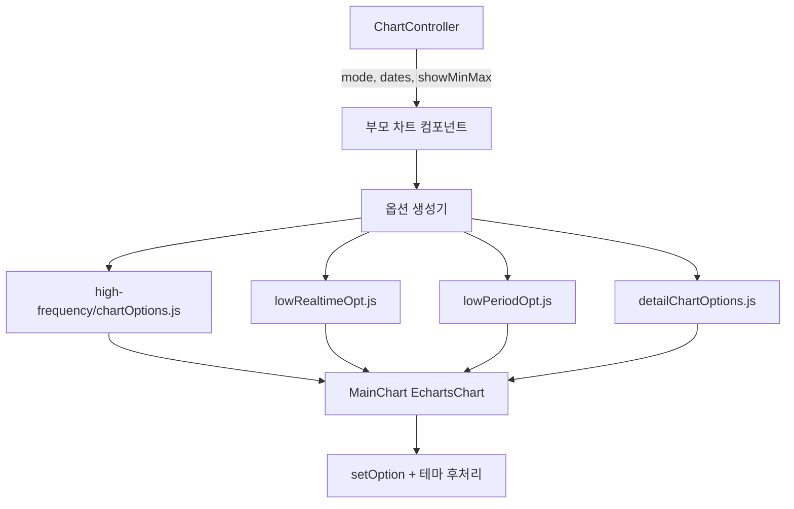

# 차트 공통 렌더링 시스템 — 프로그램 명세

**작성 기준**: `MainChart.jsx`, `ChartController.jsx`, 차트 옵션 생성 파일

---

## 1. 데이터 구조와 흐름

### 1.1 렌더링 계층

### 1.2 ChartController 상태

| 상태 | 설명 |
|------|------|
| `mode` | `realtime` \| `period` |
| `startDate` / `endDate` | 기간 검색 |
| `showMin` / `showMax` | Min/Max 시리즈 표시 |
| `hideMinMax` | 센서 정책별 UI 숨김 |
| `averageMinutes` / `timeStep` | 집계·스텝 표시 |

### 1.3 MainChart 옵션 적용 순서

1. `chartInstance.setOption(options, { notMerge, silent: true })`
2. `chartInstance.setOption(themeUpdateOptions, { notMerge: false, silent: true })`

테마 후처리는 **색상만** 주입. `splitLine.show`, `formatter`, `min/max` 등 구조 정책은 옵션 생성기 담당.

**테마 색상 주입 대상**: xAxis/yAxis의 axisLine, axisTick, axisLabel, splitLine, nameTextStyle

### 1.4 이벤트 규약

`onEvents` 핸들러: `(params, chartInstance) => void` — 두 번째 인자로 ECharts 인스턴스 전달.

---

## 2. 관련 파일과 주요 함수

| 파일 | 역할 |
|------|------|
| `src/components/chart/shared/MainChart.jsx` | ECharts init/dispose/resize/테마 |
| `src/components/chart/shared/ChartController.jsx` | 모드·날짜·MinMax UI |
| `src/components/chart/high-frequency/chartOptions.js` | `createChartOptions` |
| `src/components/chart/low-frequency/realtime/lowRealtimeOpt.js` | 저빈도 실시간 옵션 |
| `src/components/chart/low-frequency/period/lowPeriodOpt.js` | 저빈도 기간 옵션 |
| `src/components/chart/detail/detailChartOptions.js` | 상세 드로어 옵션 |
| `src/utils/echarts/themeUtils.js` | `getAxisThemeColors` (CSS 변수) |
| `src/utils/echarts/chartOptionBuilder.js` | 보조 빌더(레거시) |
| `src/utils/echarts/seriesTemplates.js` | 시리즈 템플릿 상수 |

---

## 3. 사용 컴포넌트 설명

| 컴포넌트 | 옵션 생성 경로 |
|----------|----------------|
| `HighFrequencyChart` | `high-frequency/chartOptions.js` |
| `LowFrequencyChart` | `lowRealtimeOpt` / `lowPeriodOpt` |
| `NormalDrawerPanel` / 상세 차트 | `detailChartOptions.js` |
| `MainChart` (`EchartsChart`) | 모든 ECharts 렌더 공통 래퍼 |

**Props (MainChart)**: `options`, `notMerge`, `replaceMerge`, `onEvents`, `isDashboard`, `isHalfWidth`, `marginTop`, `style`

---

## 4. 구현 시 주의사항

1. 스타일 변경 시 해당 차트가 쓰는 **실제 옵션 파일**을 먼저 확인한다.
2. `MainChart` 이벤트 시그니처 변경 시 상세 차트 클릭·줌 등 상호작용이 깨진다.
3. 테마는 CSS 변수 기반 — 디자인 토큰 변경 시 `themeUtils`를 함께 검증한다.
4. `utils/echarts/chartOptionBuilder.js`는 모든 차트의 중심 경로가 아니다.

---

## 5. 관련 문서

| 문서 | 내용 |
|------|------|
| [06-고빈도-차트.md](./06-고빈도-차트.md) | 고빈도 차트 |
| [07-저빈도-차트.md](./07-저빈도-차트.md) | 저빈도 차트 |
