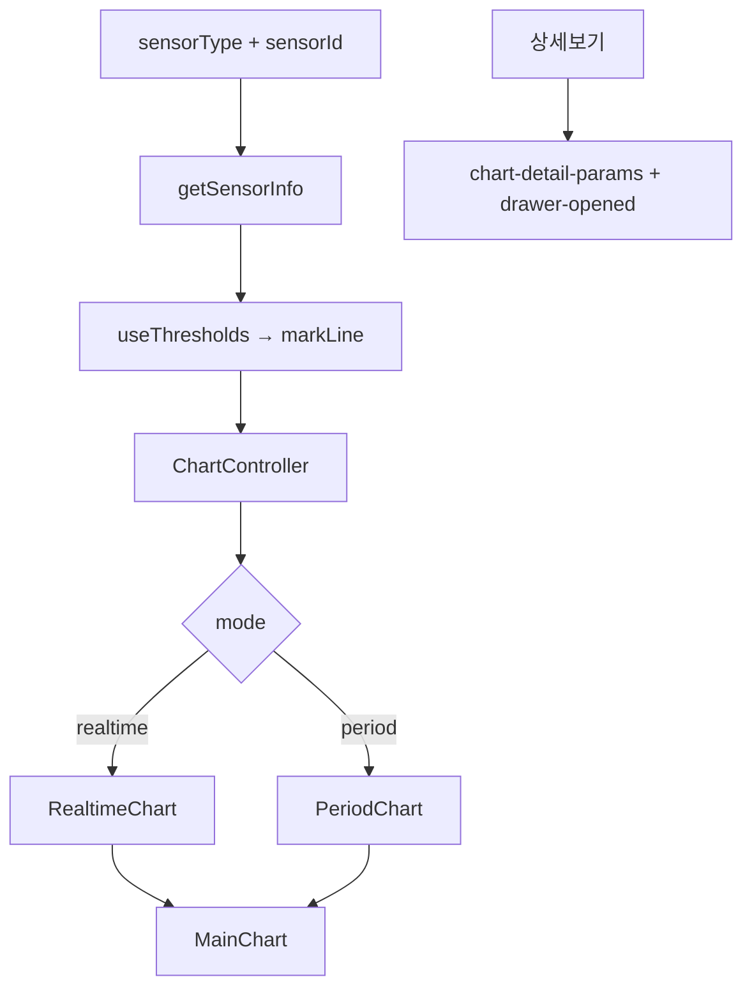

# 고빈도 차트 — 프로그램 명세

**작성 기준**: `HighFrequencyChart.jsx`, `dataFormatter.js`, `sensorConfig.js`

---

## 1. 데이터 구조와 흐름

### 1.1 컨테이너 (HighFrequencyChart)

### 1.2 RealtimeChart 데이터 결합

| 소스 | 처리 |
|------|------|
| SWR `sensor-data` | `dataFormatter.parseSocket` |
| `useRealtimeAPI` | `dataFormatter.parseApiResponse` |
| `SensorDataRepository` | 집계/실시간 적재 → `getCombinedData()` |

최종: `formatRealtimeData` → `createChartOptions(..., 'realtime')`

### 1.3 PeriodChart

`useRangeAPI` → 필드별 파싱 → `formatPeriodData` → `createChartOptions(..., 'period')`

### 1.4 sensorConfig 핵심 속성

`fields`, `hours`, `aggregateSeconds`, `midlinePosition`, `markLines`, `hideMinMax`

---

## 2. 관련 파일과 주요 함수

| 파일 | 역할 |
|------|------|
| `HighFrequencyChart.jsx` | 컨테이너·상태·상세 진입 |
| `realtime/RealtimeChart.jsx` | 실시간 렌더 |
| `period/PeriodChart.jsx` | 기간 렌더 |
| `sensorConfig.js` | `getSensorInfo`, `getChartBySensorType` 기반 설정 |
| `dataFormatter.js` | `parseApiResponse`, `parseSocket`, `formatRealtimeData`, `formatPeriodData` |
| `chartOptions.js` | `createChartOptions` |

---

## 3. 사용 컴포넌트 설명

| 컴포넌트 | 설명 |
|----------|------|
| `HighFrequencyChart` | 대시보드·Bento 고빈도 차트 진입점 |
| `HighFrequencyDashboardChart` | 대시보드 래퍼 |
| `ChartController` | 모드·날짜·MinMax UI |
| `MainChart` | ECharts 출력 |

---

## 4. 구현 시 주의사항

1. 단일 센서 중심 — 다중 센서 확장 시 `sensorConfig`·컨테이너 함께 변경.
2. markLine은 DB 임계치(`sensorId`, `channel`, `dataKey`)에 의존.
3. `midlinePosition` 기반 실시간 타임스탬프 뻥튀기는 UX에 직접 영향.

---

## 5. 관련 문서

| 문서 | 내용 |
|------|------|
| [03-실시간-기간-데이터-조회.md](./03-실시간-기간-데이터-조회.md) | API |
| [04-웹소켓-실시간-스트림.md](./04-웹소켓-실시간-스트림.md) | 소켓 |
| [05-차트-공통-렌더링-시스템.md](./05-차트-공통-렌더링-시스템.md) | MainChart |
