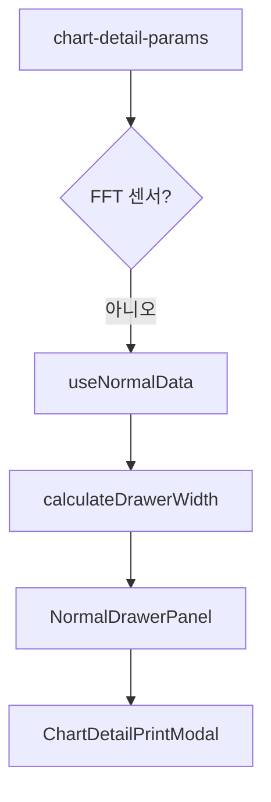

# 차트 상세 드로어(일반) — 프로그램 명세

**작성 기준**: `chart-detail-drawer/index.jsx`, `NormalDrawerPanel.jsx`, `useNormalData.js`

***

## 1. 데이터 구조와 흐름

### 1.1 엔트리 (ChartDetailDrawer)

### 1.2 useNormalData

| 단계  | 내용                                                   |
| --- | ---------------------------------------------------- |
| 날짜  | 기본 최근 24시간                                           |
| 센서  | `chartId` 우선 → `sensorType` → `sensorId+channel` 필터  |
| API | initialDate 구간 + 본문 range                            |
| 출력  | `rangeData`, `initialData`, `chartData`, `excelData` |
| 특수  | flow: 시간별/일별 분리 / waterLevel: valueMode              |

### 1.3 NormalDrawerPanel UI

1. `PeriodSearchHeader` (+ flow/waterLevel 토글)
2. `DetailChart`
3. `SummaryTable`
4. `BaseTable` | `GdmsAxisTable` (parseType `gdms`)

### 1.4 공용 패널

| 경로                              | 데이터 훅                 |
| ------------------------------- | --------------------- |
| `정적 그리드 드로어ChartDetailDrawer`   | `useNormalData`       |
| `동적 그리드 드로어 WidgetDetailDrawer` | `useWidgetDetailData` |

### 1.5 엑셀 overwrite (super\_admin)

* `measureSensorOverwritePayload({ isFFT, isLora }, records)`
* `isLora`: `isLoraParseType(parseType)` — `lora`/`gdms` → true
* 본문 5MB(`SENSOR_OVERWRITE_MAX_BODY_BYTES`) 초과 시 차단

***

## 2. 관련 파일과 주요 함수

| 파일                                     | 역할                |
| -------------------------------------- | ----------------- |
| `chart-detail-drawer/index.jsx`        | 드로어·패널 분기·인쇄      |
| `NormalDrawerPanel.jsx`                | UI 조합             |
| `hooks/useNormalData.js`               | 데이터 조회·가공         |
| `pages/detail/PeriodSearchHeader.jsx`  | 기간 검색·overwrite   |
| `utils/flowMeterCalculations.js`       | 유량계 파생            |
| `utils/sensorOverwritePayload.js`      | overwrite payload |
| `utils/table/drawerWidthCalculator.js` | 드로어 폭             |

***

## 3. 사용 컴포넌트 설명

| 컴포넌트                         | 설명                                           |
| ---------------------------- | -------------------------------------------- |
| `ChartDetailDrawer`          | Bento/siteConfig 상세 (DashboardDrawerManager) |
| `WidgetDetailDrawer`         | NormalDrawerPanel 재사용                        |
| `DetailChart`                | 상세 ECharts                                   |
| `SummaryTable` / `BaseTable` | 요약·로그 표                                      |

***

## 4. 구현 시 주의사항

1. 차트/테이블/엑셀 데이터 동시 생성 — 구조 변경 시 3화면 동시 영향.
2. flow/waterLevel 모드는 UI·데이터 강결합.

***

## 5. 관련 문서

| 문서                                                                                                                                     | 내용    |
| -------------------------------------------------------------------------------------------------------------------------------------- | ----- |
| [19-위젯-그리드-상세-드로어.md](19-%EC%9C%84%EC%A0%AF-%EA%B7%B8%EB%A6%AC%EB%93%9C-%EC%83%81%EC%84%B8-%EB%93%9C%EB%A1%9C%EC%96%B4.md)             | 위젯 경로 |
| [01-앱-진입-라우팅-전역-드로어.md](01-%EC%95%B1-%EC%A7%84%EC%9E%85-%EB%9D%BC%EC%9A%B0%ED%8C%85-%EC%A0%84%EC%97%AD-%EB%93%9C%EB%A1%9C%EC%96%B4.md) | SWR 키 |
