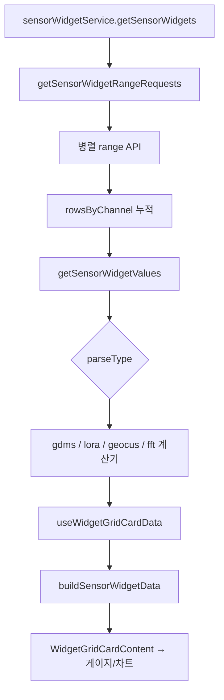

# 위젯 그리드 및 계산 파이프라인 — 프로그램 명세

**작성 기준**: `WidgetGridLayoutDashboard.jsx`, `useWidgetGridCardData.js`, `utils/*WidgetCalculations.js`

***

## 1. 데이터 구조와 흐름

### 1.1 화면 유형

| 컴포넌트                        | 용도                              |
| --------------------------- | ------------------------------- |
| `WidgetGridLayoutDashboard` | react-grid-layout 24열, 드래그·리사이즈 |

### 1.2 조회·계산 파이프라인

### 1.3 parseType별 계산기

| parseType | 유틸                            | 비고                  |
| --------- | ----------------------------- | ------------------- |
| `gdms`    | `gdmsWidgetCalculations.js`   | sensorList·공식       |
| `lora`    | `loraWidgetCalculations.js`   | deviceId 그대로, valNN |
| `geocus`  | `geocusWidgetCalculations.js` | formula 토큰          |
| `fft`     | `fftWidgetCalculations.js`    | isFft, min/max      |

### 1.4 위젯 채널 파싱 (`widgetChartTypeUtils`)

* `getWidgetChannelSensorConfigs(widget)`: sensorList 우선 → deviceChannels + values
* `getWidgetGaugeConfigs(widget)`: 게이지용 label, isWindDirection
* 조감도: `sensorId+channel+widgetId`, `valueConfigs[]`로 다중 dataKey 상태 색상

***

## 2. 관련 파일과 주요 함수

| 파일                                   | 역할                           |
| ------------------------------------ | ---------------------------- |
| `WidgetGridLayoutDashboard.jsx`      | 그리드·WidgetDetailDrawer       |
| `hooks/useWidgetGridCardData.js`     | range + gauge-sensor-data 병합 |
| `data/sensorWidgetRangeUtils.js`     | range job 생성                 |
| `data/sensorWidgetValueUtils.js`     | display values               |
| `data/widgetGridCardDataUtils.js`    | `buildSensorWidgetData`      |
| `card/widgetGridCardBindingUtils.js` | `buildValueByKey` 등          |
| `card/WidgetGridCardContent.jsx`     | 카드 UI·상세 진입                  |
| `utils/widgetChartTypeUtils.js`      | 채널 config                    |
| `services/sensorWidgetService.js`    | 위젯 CRUD API                  |

***

## 3. 사용 컴포넌트 설명

| 컴포넌트                                         | 설명                  |
| -------------------------------------------- | ------------------- |
| `WidgetGridLayoutDashboard`                  | siteCode별 대시보드      |
| `WidgetGridCardContent`                      | 게이지·차트·목록·CCTV 등    |
| `SensorGauge` / `LowFrequencyDashboardChart` | 카드 내부 차트            |
| `WindDistributionChart`                      | 실시간 API/상태파이프라인 재사용 |

***

## 4. 구현 시 주의사항

1. parseType별 계산기 입력 구조 일치 필요.
2. LoRa/GDMS `deviceId`는 저장값 그대로 (`lora_` 자동 접두 제거됨).

***

## 5. 관련 문서

| 문서                                                                                                                         | 내용     |
| -------------------------------------------------------------------------------------------------------------------------- | ------ |
| [19-위젯-그리드-상세-드로어.md](19-%EC%9C%84%EC%A0%AF-%EA%B7%B8%EB%A6%AC%EB%93%9C-%EC%83%81%EC%84%B8-%EB%93%9C%EB%A1%9C%EC%96%B4.md) | 상세     |
| [18-위젯-카드-데이터-래퍼.md](18-%EC%9C%84%EC%A0%AF-%EC%B9%B4%EB%93%9C-%EB%8D%B0%EC%9D%B4%ED%84%B0-%EB%9E%98%ED%8D%BC.md)           | 카드 데이터 |
