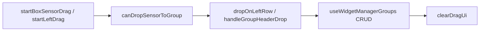

# 위젯 관리자 DnD 인터랙션 — 프로그램 명세

**작성 기준**: `useWidgetManagerDnD.js`, `WidgetManagerDrawer.jsx`, `widgetManagerUtils.js`

***

## 1. 데이터 구조와 흐름

### 1.1 DnD UI 상태 (useWidgetManagerDnD)

| 상태                  | 설명               |
| ------------------- | ---------------- |
| `dragOverGroupId`   | 드롭 대상 그룹         |
| `blockedGroupId`    | drop 불가 그룹       |
| `dragOverLeftIndex` | 좌측 리스트 insert 위치 |
| `dragOverLeftEdge`  | 좌측 가장자리          |
| `draggingSensorId`  | 드래그 중 센서         |

### 1.2 drop 정책

1. 타입 미지정 그룹: 자유 배정
2. 타입 지정 그룹: 동일 sensorType만
3. 그룹 헤더: 센서 drop 불가 (순서 변경만)
4. 좌측 목록: reorder + 센서 이동 동시

### 1.3 흐름

빈 drop zone → 그룹 자동 생성

***

## 2. 관련 파일과 주요 함수

| 파일                        | 함수                                                                                                                                                |
| ------------------------- | ------------------------------------------------------------------------------------------------------------------------------------------------- |
| `useWidgetManagerDnD.js`  | `startBoxSensorDrag`, `startLeftDrag`, `canDropSensorToGroup`, `dropOnLeftRow`, `dropSensorOnLeftListEnd`, `handleGroupHeaderDrop`, `clearDragUi` |
| `WidgetManagerDrawer.jsx` | DnD 이벤트 바인딩                                                                                                                                       |
| `widgetManagerUtils.js`   | `normalizeSensorType`                                                                                                                             |

***

## 3. 사용 컴포넌트 설명

| 컴포넌트                  | 역할                       |
| --------------------- | ------------------------ |
| `WidgetManagerDrawer` | DnD UI 전체                |
| 그룹 센서 타일              | `startBoxSensorDrag`     |
| 좌측 센서/CCTV 목록         | `startLeftDrag`, reorder |

***

## 4. 구현 시 주의사항

1. drop 후 `clearDragUi` 누락 시 UI 꼬임.
2. 헤더/바디/좌측 drop 범위 다름 — `stopPropagation` 유지.
3. `normalizeSensorType` 변경 시 drop 허용 기준 재검증.

***

## 5. 관련 문서

| 문서                                                                                                   | 내용   |
| ---------------------------------------------------------------------------------------------------- | ---- |
| [11-위젯-관리자-그룹-CRUD.md](11-%EC%9C%84%EC%A0%AF-%EA%B4%80%EB%A6%AC%EC%9E%90-%EA%B7%B8%EB%A3%B9-CRUD.md) | CRUD |
