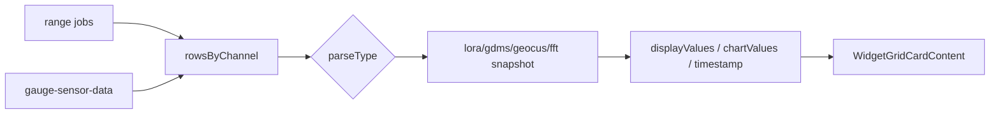

# 위젯 카드 데이터 래퍼 — 프로그램 명세

**작성 기준**: `useWidgetGridCardData.js`, `widgetGridCardDataUtils.js`, `WidgetGridCardContent.jsx`

**구현 상태**: 데이터 계층·카드 props 배선 완료. 통일 표시 구조 확장은 [21-위젯-카드-통일-표시-구조.md](./21-위젯-카드-통일-표시-구조.md)를 본다.

---

## 1. 데이터 구조와 흐름

### 1.1 목표 파이프라인

### 1.2 parseType별 snapshot

| parseType | 함수 |
|-----------|------|
| lora | `buildLoraWidgetSnapshot` |
| gdms | `buildGdmsWidgetSnapshot` |
| geocus | `buildGeocusWidgetSnapshot` |
| fft | `buildFftWidgetSnapshot` |

공통 진입: `getSensorWidgetDisplayValues(widget, rowsByChannel)`

### 1.3 출력 형태

| 필드 | 설명 |
|------|------|
| `displayValues` | `{ name, value, deviceId, channel, dataKey }[]` |
| `chartValues` | `{ timestamp, value }[]` |
| `timestamp` | 최신 시각 |

### 1.4 useWidgetGridCardData

range + socket → `rowsByChannel` 병합 → `buildSensorWidgetData` → 카드 props

---

## 2. 관련 파일과 주요 함수

| 파일 | 역할 |
|------|------|
| `hooks/useWidgetGridCardData.js` | 카드 데이터 훅 |
| `data/widgetGridCardDataUtils.js` | `buildSensorWidgetData` |
| `data/sensorWidgetRangeUtils.js` | range job |
| `data/sensorWidgetValueUtils.js` | display values |
| `card/widgetGridCardBindingUtils.js` | `buildValueByKey` |
| `card/WidgetGridCardContent.jsx` | 카드 UI |
| `utils/*WidgetCalculations.js` | parseType 계산 |
| `geoeco/hooks/useGeoecoWidgetData.js` | 패턴 선례 |

---

## 3. 사용 컴포넌트 설명

| 컴포넌트 | 설명 |
|----------|------|
| `WidgetGridCardContent` | 게이지·차트·목록 렌더 |
| `SensorGauge` / `SensorListGauge` | displayValues 바인딩 |
| `LowFrequencyDashboardChart` | chartValues |

---

## 4. 구현 시 주의사항

1. LoRa B(`singleOutput`) 합성 시계열은 `loraWidgetCalculations`에서 처리.
2. parseType별 jobs와 계산기 입력 구조 일치 필요.
3. 후속: `displayItems` 통일 구조 → [21번](./21-위젯-카드-통일-표시-구조.md)

---

## 5. 관련 문서

| 문서 | 내용 |
|------|------|
| [10-위젯-그리드-계산-파이프라인.md](./10-위젯-그리드-계산-파이프라인.md) | 전체 파이프라인 |
| [21-위젯-카드-통일-표시-구조.md](./21-위젯-카드-통일-표시-구조.md) | displayItems |
