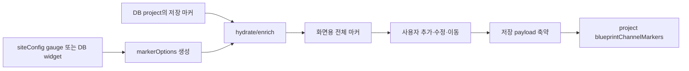

# 조감도 센서·CCTV 마커 — 프로그램 명세

**작성 기준**: `blueprintChannelMarkerUtils.js`, `SiteBlueprint.jsx`, `BlueprintMarker.jsx`, `Dashboard.jsx`, `WidgetGridLayoutDashboard.jsx`

***

### 1. 마커 데이터의 두 단계

조감도 마커는 화면에서 사용하는 정보와 DB에 저장하는 정보를 분리한다.



DB에는 위치와 센서·카메라 식별에 필요한 최소 정보만 저장한다. 제목, 단위, 센서 타입, 값 구성, CCTV URL 같은 표시 정보는 현재 위젯·게이지 설정으로 다시 보강한다.

이 구조를 통해 위젯 이름이나 센서 표시 설정이 바뀌어도 마커 위치를 유지하면서 최신 표시 정보를 사용할 수 있다.

### 2. 마커 유형과 출처

| 구분             | 값              | 의미                                 |
| -------------- | -------------- | ---------------------------------- |
| `markerType`   | `sensor`       | 센서 값 마커                            |
| `markerType`   | `cctv`         | CCTV 영상 마커                         |
| `markerSource` | `gauge`        | Bento 현장의 정적 `siteConfig` 게이지에서 생성 |
| `markerSource` | `widget` 또는 생략 | DB 위젯에서 생성                         |

CCTV는 `markerType === 'cctv'`이거나 `cameraId`가 있으면 CCTV 마커로 판정한다. 이전 저장 형식과의 호환을 위해 두 조건을 모두 사용한다.

### 3. 센서 마커 후보 생성

#### 3.1 DB 위젯 기반

표시 중인 비-CCTV 위젯에서 `getWidgetChannelSensorConfigs()` 결과를 읽는다.

* `sensorId`, `channel`, `widgetId`가 같은 항목을 하나의 후보로 묶는다.
* 같은 채널의 여러 `dataKey`는 `valueConfigs[]`에 합친다.
* 센서 이름, 값 이름, 위젯 이름을 조합해 마커 제목을 만든다.
* 위젯의 `markerInitial`을 우선하고 없으면 센서 타입 기본 옵션의 `markerInitial`을 사용한다.
* `showHide === false`인 위젯은 후보에서 제외한다.

GDMS는 개별 채널보다 위젯 단위 축 합산 의미가 크므로, 기존 마커를 복구할 때 `widgetId`를 우선해 후보를 찾는다.

#### 3.2 Bento 게이지 기반

`1000`, `1005` 현장은 `siteConfig` 게이지에서 후보를 만든다.

* `sensorId + channel + sensorType`으로 그룹화한다.
* 같은 센서의 여러 `dataKey`를 `valueConfigs[]`와 `gaugeKeys[]`에 합친다.
* 값이 하나면 기존 gauge key를 마커 key로 유지한다.
* 여러 값이면 채널 그룹 key를 사용한다.

### 4. CCTV 마커 후보 생성

`widgetType === 'cctv'`인 표시 위젯의 `options.cameras[]`를 읽는다.

후보 key는 `cctv-{cameraId}-{widgetId}`이며, 같은 카메라가 다른 위젯에 들어 있으면 서로 다른 후보가 된다. `cameraId`나 URL이 없는 카메라는 후보에서 제외한다.

### 5. 기존 마커 복구와 보강

센서 마커는 다음 순서로 현재 후보와 연결한다.

1. 현재 `key`와 정확히 일치
2. Bento legacy gauge key와 일치
3. GDMS의 `widgetId`와 일치
4. `sensorId + channel + dataKey`와 일치
5. `sensorId + channel + widgetId`와 일치
6. 후보가 하나뿐이면 그 후보 사용

CCTV 마커는 `cameraId`로 후보를 모은 뒤 `widgetId`가 있으면 정확히 일치하는 후보를 선택한다.

연결에 성공하면 현재 후보의 제목, 단위, 센서 타입명, 값 설정, CCTV URL을 기존 마커에 채운다. 연결하지 못한 마커는 원본을 그대로 유지한다.

### 6. 중복 마커 처리

마커 후보를 새로 추가하거나 기존 마커에 적용할 때 동일 대상을 가리키는 이전 마커를 목록에서 제거한다.

| 유형           | 중복 판정 기준                                           |
| ------------ | -------------------------------------------------- |
| CCTV         | `cameraId + widgetId`                              |
| Bento gauge  | 겹치는 gauge key 또는 `sensorId + channel + sensorType` |
| DB widget 센서 | `sensorId + channel + widgetId`                    |

편집 중인 마커의 ID는 중복 제거 대상에서 제외한다. 이 규칙으로 한 위젯 채널 또는 CCTV 후보가 조감도에 여러 번 배치되는 것을 막는다.

### 7. 저장 payload 차이

#### 7.1 Bento gauge 마커

Bento 현장은 정적 게이지 설정을 다시 찾을 수 있도록 다음 값을 함께 저장한다.

```json
{
  "id": "...",
  "x": 20.5,
  "y": 31.2,
  "key": "gauge-key",
  "sensorId": "device-id",
  "channel": "ch1",
  "dataKey": "value-key",
  "sensorType": "...",
  "unit": "...",
  "title": "...",
  "markerSource": "gauge"
}
```

#### 7.2 DB 위젯 센서 마커

```json
{
  "id": "...",
  "x": 20.5,
  "y": 31.2,
  "widgetId": 10,
  "sensorId": "device-id",
  "channel": "ch1"
}
```

#### 7.3 CCTV 마커

```json
{
  "id": "...",
  "x": 20.5,
  "y": 31.2,
  "widgetId": 20,
  "markerType": "cctv",
  "cameraId": 3
}
```

Widget Grid 마커는 프로젝트 API에 축약 payload를 저장하고, 다음 조회 시 위젯 설정으로 다시 hydrate한다.

### 8. 마커 상태와 클릭

센서 마커는 `gauge-sensor-data`의 현재 채널 값을 읽고 각 `valueConfigs`의 계산식과 기준치를 적용한다. 여러 표시값이 있으면 가장 높은 위험도의 상태를 마커 색상으로 사용한다.

CCTV 마커는 센서 상태 계산을 하지 않는다. 클릭 시 자체적으로 URL을 열지 않고 선택적인 `onMarkerClick` 콜백만 호출한다.

현재 Bento/Legacy 조감도는 센서 마커 콜백을 전달하므로 해당 센서 또는 게이지 정보를 `chart-detail-params`로 보내 상세 드로어를 연다. Widget Grid 조감도는 `onMarkerClick`을 전달하지 않으므로 센서·CCTV 마커 클릭 자체로 상세 화면이나 영상을 열지 않는다. CCTV 영상 표시는 별도의 `CctvWidget`이 담당한다.

### 9. 관련 파일과 주요 함수

| 파일                               | 역할                                     |
| -------------------------------- | -------------------------------------- |
| `blueprintChannelMarkerUtils.js` | 후보 생성, 매칭, 중복 제거, payload 축약·hydrate   |
| `SiteBlueprint.jsx`              | `BlueprintView`와 프로젝트 규칙 연결            |
| `BlueprintMarker.jsx`            | 센서/CCTV 마커 렌더링과 상태 계산                  |
| `Dashboard.jsx`                  | Bento·Legacy 마커 저장과 상세 클릭              |
| `WidgetGridLayoutDashboard.jsx`  | DB 위젯 마커 hydrate와 프로젝트 저장              |
| `projectService.js`              | `updateProjectBlueprintChannelMarkers` |

### 10. 구현 시 주의사항

1. DB payload만 보면 제목·단위·URL이 없는 것이 정상이다. 현재 후보로 hydrate한 뒤 화면에 표시한다.
2. 위젯 또는 카메라를 삭제하면 기존 마커가 더 이상 후보와 연결되지 않을 수 있다.
3. Bento와 Widget Grid는 저장 payload가 다르다. 한쪽 payload 함수를 다른 쪽에 사용하면 복구 키가 사라질 수 있다.
4. 중복 판정에 `widgetId`가 포함되므로 같은 카메라나 채널을 서로 다른 위젯에서 사용하는 경우는 별도 후보로 취급될 수 있다.
