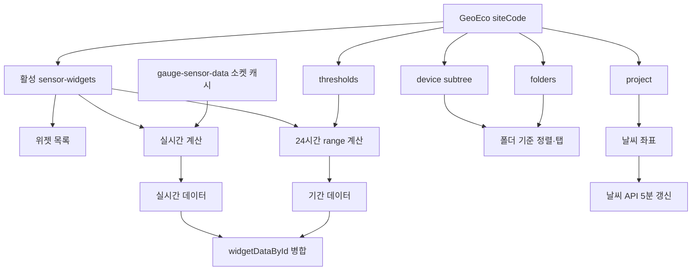
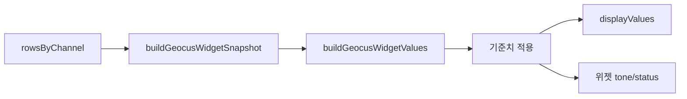

# GeoEco 데이터 결합과 탐색 — 프로그램 명세

**작성 기준**: `GeoecoDashboard.jsx`, `useGeoecoData.js`, `useGeoecoWidgetData.js`, `useGeoecoFolders.js`, `useGeoecoDeviceFolderMap.js`, `useGeoecoThresholds.js`, `useGeoecoWeather.js`, `geoecoSectionUtils.js`, `geoecoWidgetOrderUtils.js`

***

### 1. 전체 데이터 흐름



GeoEco는 일반 대시보드와 별도 라우트(`/geoeco`)를 사용하지만, 센서 위젯·프로젝트·기준치·실시간 소켓 캐시는 기존 Geoverse 데이터 구조를 재사용한다.

### 2. 현장과 위젯 선택

`getGeoecoSiteCode()`는 URL의 `site` 파라미터를 먼저 사용하고 값이 없으면 기본 현장 `6001`을 사용한다.

위젯은 `sensorWidgetService.getSensorWidgets({ siteCode, active: true })`로 조회한다. DB 위젯이 있으면 DB 목록을 사용하고, 없으면 정적 GeoEco 설정의 `widgets`를 fallback으로 사용한다.

화면 자체는 데이터 로딩 중에도 미리보기 위젯을 보여줄 수 있지만, 기간·실시간 데이터 조회는 실제 DB 위젯 배열을 기준으로 실행한다.

### 3. 기간 데이터 job 생성

기간 데이터는 `parseType === 'geocus'`인 위젯만 대상으로 한다.

1. `options.sensorList`가 있으면 이를 사용한다.
2. 없으면 `options.deviceChannels`를 사용한다.
3. `channel` 문자열에 쉼표가 있으면 여러 채널로 분리한다.
4. 채널이 없으면 `ch1`을 fallback으로 사용한다.
5. `deviceId-channel` 키로 중복 job을 제거한다.

각 job은 최근 24시간을 10분 단위 평균으로 조회한다.

| 파라미터       | 값                             |
| ---------- | ----------------------------- |
| `start`    | 현재 시각 - 24시간                  |
| `end`      | 현재 시각                         |
| `timeUnit` | `10m`                         |
| `types`    | `avg`                         |
| `channel`  | job의 채널                       |
| `isLora`   | 공통 range 파라미터 규칙에 따라 선택적으로 추가 |

여러 job은 `Promise.allSettled`로 병렬 실행한다. 일부 채널 조회가 실패해도 성공한 채널 데이터로 위젯을 구성한다.

### 4. 기간 데이터 계산

조회 결과는 위젯별 `rowsByChannel`로 묶는다.

```
widgetId
  └─ rowsByChannel
       └─ {deviceId}-{channel}: range row[]
```

이후 일반 Geocus 계산 함수를 재사용한다.



첫 번째 표시값을 대표 차트 값으로 사용해 시계열 `chartValues`를 만들고, 최신 데이터 시각을 기준으로 다음 평균을 계산한다.

| 필드    | 범위      |
| ----- | ------- |
| `m10` | 최근 10분  |
| `h1`  | 최근 1시간  |
| `h24` | 최근 24시간 |

평균 구간의 기준은 현재 시각이 아니라 조회 결과 중 가장 최신 timestamp다.

### 5. 실시간 데이터 결합

실시간 값은 WebSocket이 갱신하는 `gauge-sensor-data` SWR 캐시에서 가져온다.

1. 기간 조회와 같은 job 목록을 만든다.
2. `deviceId`로 디바이스를 찾고 `channel.name`으로 채널을 찾는다.
3. 소켓 채널의 `data`를 단일 row 형태로 변환한다.
4. Geocus 계산과 기준치 처리를 동일하게 적용한다.

최종 병합에서는 기간 데이터를 먼저 복사하고 실시간 필드를 덮어쓴다.

| 필드                            | 최종 원본                    |
| ----------------------------- | ------------------------ |
| `displayValues`               | 실시간 값이 있으면 실시간, 없으면 기간 값 |
| `tone`, `status`, `timestamp` | 실시간 값이 있으면 실시간           |
| `averageDisplayValues`        | 기간 계산값 유지                |
| `chartValues`                 | 기간 시계열 유지                |
| `periodAverages`              | 기간 평균 유지                 |

따라서 카드의 현재 값과 상태는 실시간으로 변하지만 차트와 구간 평균은 마지막 24시간 range 결과를 유지한다.

### 6. 센서 탭과 폴더 탭

GeoEco 헤더는 두 가지 탐색 모드를 가진다.

#### 6.1 센서 기준

위젯의 센서 타입 정보를 GeoEco 센서 탭 설정과 비교해 정렬한다. 탭을 누르면 해당 타입의 첫 위젯으로 스크롤하고, 같은 타입 위젯 테두리를 짧게 점멸한다.

#### 6.2 구간·폴더 기준

폴더 목록과 디바이스 subtree를 결합해 `deviceId → folderId` 맵을 만든다. 위젯의 `sensorList` 또는 `deviceChannels`에 포함된 디바이스를 기준으로 폴더를 판정한다.

폴더 탭을 누르면 해당 폴더에 속하는 첫 위젯으로 이동한다. 스크롤 위치가 바뀌면 `useGeoecoScrollSpy`가 헤더 아래 가장 위에 있는 위젯을 찾아 활성 탭을 갱신한다.

### 7. 날씨 좌표와 갱신

날씨 좌표는 DB 프로젝트의 `weather`를 우선하고, 값이 없으면 정적 GeoEco 설정을 사용한다.

유효한 `lat`, `lon`이 있으면 Sensor API의 `/api/weather`를 POST로 호출한다. 최초 즉시 조회 후 5분마다 갱신하며, 좌표가 없거나 조회가 실패하면 날씨 데이터 대신 오류 상태를 반환한다.

### 8. 관련 파일과 주요 함수

| 파일                            | 역할                    |
| ----------------------------- | --------------------- |
| `GeoecoDashboard.jsx`         | 데이터 조합, 헤더 모드, 탭 이동   |
| `useGeoecoData.js`            | 현장 설정과 DB 위젯 fallback |
| `useGeoecoWidgetData.js`      | 기간·실시간 계산과 병합         |
| `useGeoecoFolders.js`         | 현장 폴더 조회와 정렬          |
| `useGeoecoDeviceFolderMap.js` | 디바이스의 폴더 소속 계산        |
| `useGeoecoThresholds.js`      | 기준치 Map 생성            |
| `useGeoecoWeather.js`         | 날씨 조회와 5분 갱신          |
| `geoecoWidgetOrderUtils.js`   | 센서·폴더 기준 위젯 정렬        |
| `useGeoecoScrollSpy.js`       | 스크롤 위치와 활성 탭 동기화      |

### 9. 구현 시 주의사항

1. 현재 기간 조회는 Geocus 위젯만 job을 만든다. 다른 `parseType`을 추가하려면 별도 계산 경로가 필요하다.
2. `Promise.allSettled`이므로 전체 오류가 화면으로 전파되지 않는다. 일부 채널이 비어 보이면 개별 job 실패를 확인해야 한다.
3. 실시간 값이 들어와도 기간 차트는 자동 재조회되지 않는다. 수동 새로고침 또는 의존성 변경 시에만 range를 다시 읽는다.
4. 폴더 탭은 위젯에 직접 저장된 폴더 ID가 아니라 위젯의 디바이스와 디바이스 subtree를 통해 계산한다.
