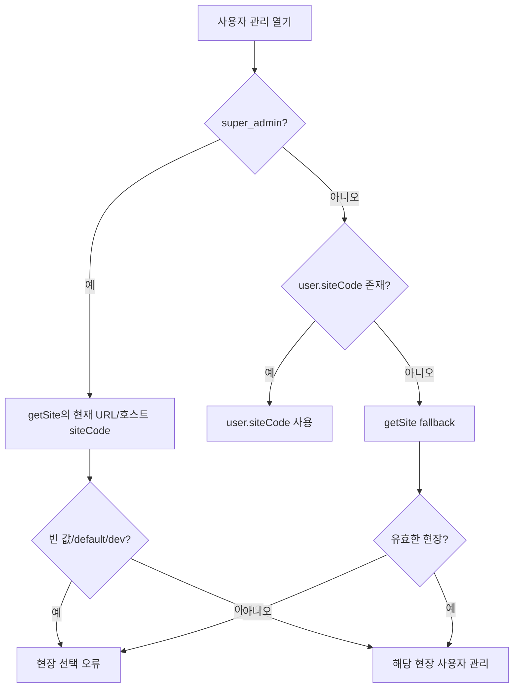
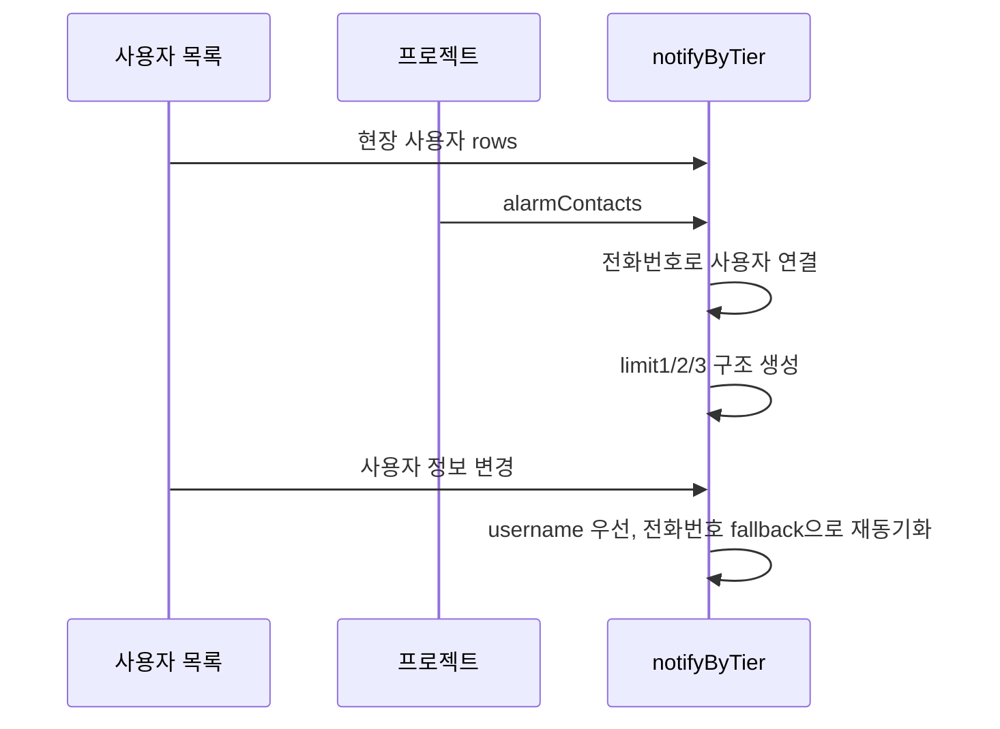

# 현장 사용자와 알림 수신자 연동 — 프로그램 명세

**작성 기준**: `useUserManagementSiteCode.js`, `UserManagerPanel.jsx`, `UserThresholdNotifySection.jsx`, `alarmContactsUtils.js`, `userService.js`, `projectService.js`

***

### 1. 문서 범위

사용자 CRUD 자체보다 이해가 필요한 두 결합 지점을 설명한다.

1. 로그인 사용자의 권한과 현재 URL로 관리 대상 현장을 결정하는 과정
2. 사용자 목록과 프로젝트의 `alarmContacts`를 단계별 알림 수신자로 동기화하는 과정

### 2. 관리 대상 현장 결정



`super_admin`은 계정에 연결된 현장이 아니라 현재 페이지의 `siteCode`를 사용한다. 따라서 신규 현장 관리자를 만들 때는 먼저 대상 현장의 `?site={siteCode}`로 접속한 후 사용자 관리를 열어야 한다.

`site_admin`은 자신의 `user.siteCode`를 우선 사용하고, 값이 없을 때만 현재 URL의 현장을 fallback으로 사용한다.

### 3. 사용자 권한

클라이언트가 사용하는 역할은 다음과 같다.

| 역할            | 의미               |
| ------------- | ---------------- |
| `super_admin` | 전체 현장 및 장비 관리    |
| `site_admin`  | 자신의 현장 사용자·위젯 관리 |
| `viewer`      | 일반 조회 사용자        |

사용자 편집 화면에서 새로 지정할 수 있는 역할은 `site_admin`, `viewer`다. `super_admin` 계정은 이 화면의 일반 선택 항목으로 만들지 않는다.

`isAdmin`은 `super_admin` 또는 `site_admin`일 때 참이고, `isSuperAdmin`은 `super_admin`만 참이다.

### 4. 사용자 목록과 프로젝트 동시 조회

사용자 관리 패널은 같은 `siteCode`로 두 데이터를 병렬 관리한다.

| 데이터    | 조회                               | 사용 목적                         |
| ------ | -------------------------------- | ----------------------------- |
| 사용자 목록 | `GET /api/users?siteCode=`       | 계정 표와 수신자 후보                  |
| 프로젝트   | `getProjectBySiteCode(siteCode)` | `project.id`, `alarmContacts` |

알림 수신 설정은 사용자 자원이 아니라 프로젝트 자원에 저장된다. 따라서 사용자 목록을 불러왔더라도 프로젝트를 찾지 못하면 수신 설정을 저장할 수 없다.

### 5. 알림 수신자 데이터 변환

UI는 영문 키를 사용하고 API는 한글 단계 키를 사용한다.

| UI key   | API key |
| -------- | ------- |
| `limit1` | `1차`    |
| `limit2` | `2차`    |
| `limit3` | `3차`    |

UI 항목은 다음 형태다.

```json
{
  "username": "site-admin",
  "name": "현장 관리자",
  "phone": "01012345678"
}
```

API로 저장할 때 이름이 있으면 `{ name, phone }`, 이름이 없으면 전화번호 문자열로 변환한다. 이전 API 데이터가 전화번호 문자열만 가지고 있어도 현재 사용자 목록에서 같은 번호를 찾아 사용자 이름과 ID를 복원한다.

### 6. 초기 로드와 동기화



프로젝트별 최초 1회 `alarmContacts`를 UI 상태로 변환한다. 이후 사용자 목록이 바뀌면 다음 규칙으로 수신자 정보를 맞춘다.

1. 같은 `username`의 사용자가 있으면 최신 이름·전화번호로 갱신한다.
2. username이 맞지 않으면 숫자만 남긴 전화번호로 다시 찾는다.
3. 연결된 사용자의 전화번호가 없어졌으면 수신 목록에서 제외한다.
4. 어느 사용자와도 연결되지 않지만 전화번호가 남아 있으면 기존 외부 연락처로 유지한다.

이전 클라이언트가 사용하던 현장별 localStorage 알림 키는 사용자 관리 진입 시 제거하고, 현재는 서버 프로젝트 API만 정본으로 사용한다.

### 7. 수신자 추가·제거와 사용자 삭제

수신 후보는 전화번호가 있는 사용자만 표시한다. 같은 단계에 이미 들어간 사용자는 다시 추가할 수 없지만, 한 사용자가 서로 다른 단계에 들어가는 것은 허용한다.

추가·제거 즉시 `notifyByTier`를 갱신한 뒤 다음 API를 호출한다.

```
PATCH /api/projects/{projectId}/alarm-contacts
```

사용자를 삭제할 때는 사용자 삭제 API를 먼저 호출한다. 성공하면 UI의 모든 단계에서 해당 사용자를 제거하고, 변경된 `alarmContacts` 저장을 비동기로 시작한 뒤 사용자 목록을 다시 조회한다.

따라서 사용자 삭제 성공과 알림 연락처 저장 성공은 하나의 원자적 작업이 아니다. 연락처 저장이 실패하면 삭제된 사용자의 전화번호가 프로젝트 `alarmContacts`에 남을 수 있고, 화면에는 `notifyError`가 표시된다.

### 8. 신규 현장 관리자 생성과의 관계

신규 현장 구성에서 관련 순서는 다음과 같다.

1. 디바이스 관리자에서 현장 이름과 `siteCode`를 가진 최상위 노드·프로젝트를 저장한다.
2. 대상 현장의 URL 또는 `?site={siteCode}`로 이동한다.
3. `super_admin`이 사용자 관리를 연다.
4. 역할이 `site_admin`인 사용자를 생성한다.
5. 전화번호가 있으면 필요한 기준치 단계의 알림 수신자로 지정한다.

1번과 4번은 자동으로 연결된 한 번의 요청이 아니다. 현장 프로젝트 생성과 현장 관리자 생성은 서로 다른 관리 흐름이다.

### 9. 관련 파일과 주요 함수

| 파일                               | 역할                             |
| -------------------------------- | ------------------------------ |
| `useUserManagementSiteCode.js`   | 권한·URL 기반 관리 현장 결정             |
| `UserManagerPanel.jsx`           | 사용자와 프로젝트 병렬 상태, 저장 순서         |
| `UserThresholdNotifySection.jsx` | 단계별 수신자 선택 UI                  |
| `alarmContactsUtils.js`          | UI/API 변환과 사용자 목록 동기화          |
| `userService.js`                 | 현장 사용자 CRUD                    |
| `projectService.js`              | 프로젝트 조회와 `updateAlarmContacts` |

### 10. 구현 시 주의사항

1. `super_admin`이 잘못된 `?site=`에서 사용자 관리를 열면 다른 현장 사용자 목록을 관리하게 된다.
2. 알림 수신에는 전화번호가 필수지만 사용자 계정 생성 자체에는 전화번호가 필수는 아니다.
3. 수신자 저장과 사용자 CRUD는 하나의 트랜잭션이 아니다. 특히 사용자 삭제 후 연락처 정리 저장은 await하지 않으므로 별도로 실패할 수 있다.
4. 전화번호 비교는 하이픈 등 숫자가 아닌 문자를 제거한 값으로 수행한다.
