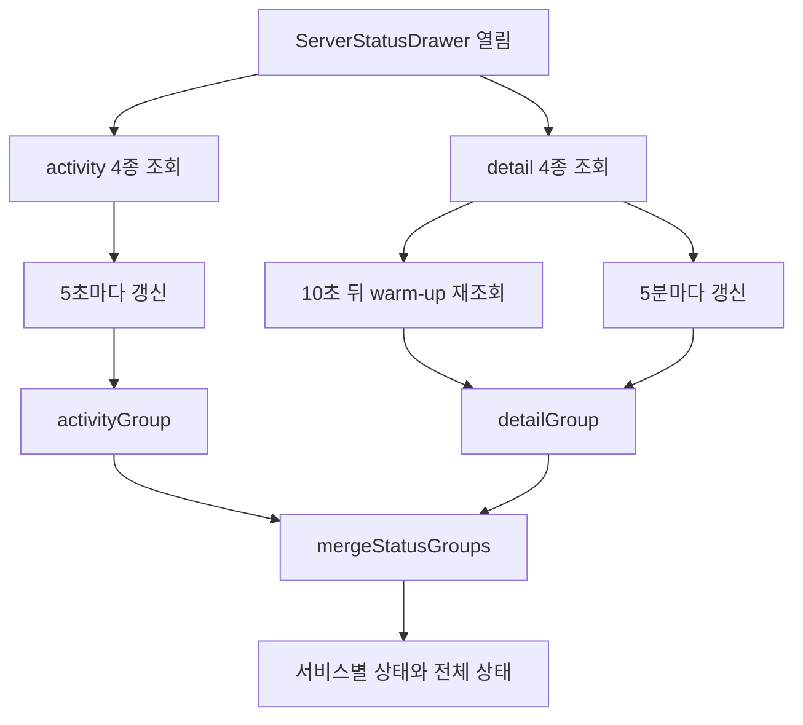

# 서버 상태 수집과 병합 — 프로그램 명세

**작성 기준**: `ServerStatusDrawer.jsx`, `api/serverStatus.js`, `App.jsx`, `Header.jsx`

***

### 1. 전체 구조

서버 상태 화면은 System, MQTT, Redis, InfluxDB 네 서비스를 두 종류의 주기로 조회한 뒤 하나의 상태 객체로 합친다.



### 2. 조회 대상

| 서비스      | 빠른 activity endpoint          | 느린 detail endpoint             |
| -------- | ----------------------------- | ------------------------------ |
| System   | `/monitoring/system-usage`    | `/monitoring/system-storage`   |
| MQTT     | `/monitoring/mqtt-traffic`    | `/monitoring/mqtt-diagnostics` |
| Redis    | `/monitoring/redis-activity`  | `/monitoring/redis-memory`     |
| InfluxDB | `/monitoring/influx-activity` | `/monitoring/influx-storage`   |

activity는 변동이 잦은 사용량·트래픽이고 detail은 저장공간·진단·메모리처럼 상대적으로 느리게 변하는 정보다.

### 3. 갱신 주기와 중복 요청 방지

드로어가 열리면 activity와 detail을 즉시 한 번씩 요청한다.

| 그룹             | 갱신                 |
| -------------- | ------------------ |
| activity       | 5초마다               |
| detail         | 5분마다               |
| detail warm-up | 최초 조회 10초 후 한 번 추가 |

서비스별로 현재 요청 중인 이름을 `Set`에 기록한다. 이전 요청이 끝나기 전에 같은 서비스 타이머가 다시 실행되면 중복 요청을 시작하지 않는다.

드로어가 닫히거나 컴포넌트가 해제되면 두 interval과 warm-up timeout을 모두 정리한다.

### 4. 개별 요청 실패 처리

개별 endpoint 실패는 예외를 화면 전체로 전달하지 않고 다음 결과로 변환한다.

```json
{
  "name": "redis",
  "data": null,
  "available": false,
  "fetchedAt": "ISO-8601"
}
```

따라서 한 서비스가 실패해도 나머지 서비스 카드는 계속 갱신된다. 성공 응답은 `result.data`가 있으면 이를 사용하고 없으면 응답 자체를 데이터로 사용한다.

`last_collected_at`이 없으면 응답 최상위 `timestamp`를 fallback으로 사용한다.

### 5. activity와 detail 병합

서비스별 데이터는 activity를 먼저 펼치고 detail을 나중에 펼친다. 같은 필드가 양쪽에 있으면 detail 값이 최종값이 된다.

병합 결과에는 수집 시각을 구분해 보존한다.

| 필드                      | 의미                            |
| ----------------------- | ----------------------------- |
| `activity_collected_at` | 빠른 endpoint의 마지막 수집 시각        |
| `detail_collected_at`   | 느린 endpoint의 마지막 수집 시각        |
| `last_collected_at`     | activity 시각 우선, 없으면 detail 시각 |
| `monitoring_supported`  | 데이터가 하나라도 있으면 `true`          |

### 6. 서비스별 상태 계산

activity와 detail의 성공 여부를 조합한다.

| activity | detail     | 상태        |
| -------- | ---------- | --------- |
| 아직 없음    | 하나라도 아직 없음 | `UNKNOWN` |
| 실패       | 실패         | `DOWN`    |
| 성공       | 실패         | `WARN`    |
| 실패       | 성공         | `WARN`    |
| 성공       | 성공         | `OK`      |

여기서 상태는 실제 프로세스 health 값이 아니라 두 모니터링 endpoint를 정상적으로 읽었는지를 뜻한다.

전체 상태 우선순위는 다음과 같다.

1. 하나라도 `DOWN`이면 전체 `DOWN`
2. 아니고 하나라도 `WARN`이면 전체 `WARN`
3. 모두 `OK`면 전체 `OK`
4. 그 외에는 `UNKNOWN`

### 7. 화면 진입

`ServerStatusDrawer`는 `App.jsx`에서 전역 렌더링된다. 일반 메뉴 버튼은 없으며, `super_admin`이 데스크톱 헤더의 현장 제목 영역을 더블클릭하면 `drawer-opened='sys-monitor'`가 설정되어 열린다.

서버 상태 API base URL은 현재 `api/serverStatus.js` 안에 별도 값으로 정의돼 있다. `public/config.js`의 Management API URL을 사용하지 않는다.

### 8. 관련 파일과 주요 함수

| 파일                                      | 역할                         |
| --------------------------------------- | -------------------------- |
| `src/api/serverStatus.js`               | endpoint 호출, 실패 정규화, 상태 병합 |
| `src/components/ServerStatusDrawer.jsx` | 이중 갱신 타이머와 서비스별 표시         |
| `src/App.jsx`                           | `sys-monitor` 전역 드로어 렌더링   |
| `src/pages/dashboard/Header.jsx`        | super admin 더블클릭 진입        |

### 9. 구현 시 주의사항

1. `WARN`과 `DOWN`은 서비스 자체 장애가 아니라 activity/detail endpoint 가용성 조합이다.
2. activity와 detail의 갱신 시각이 다르므로 한 화면에 서로 다른 시점의 값이 함께 표시될 수 있다.
3. base URL이 공통 `BASE_URL`과 분리돼 있으므로 모니터링 서버 주소 변경 시 별도로 수정해야 한다.
4. 드로어를 닫으면 자동 갱신도 중단된다.
