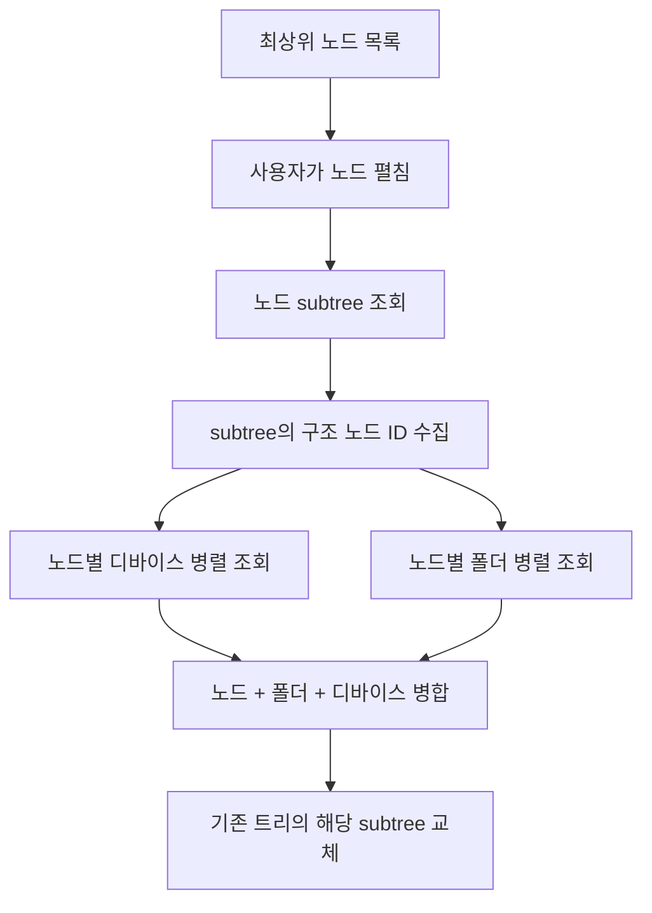
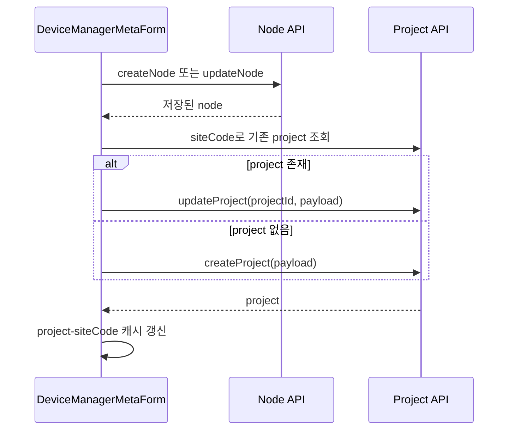

# 디바이스·채널·센서 타입 결합 — 프로그램 명세

**작성 기준**: `DeviceManagerDrawer.jsx`, `DeviceManagerMetaForm.jsx`, `DeviceManagerChannelSidePanel.jsx`, `useDeviceManagerDnD.js`, `filterSensorTypesForDeviceChannel.js`, `filterLoraSensorTypesByUsedCount.js`

***

### 1. 문서 범위

이 문서는 디바이스 관리 화면의 단순 CRUD 사용법이 아니라 다음 결합 규칙을 설명한다.

* 노드·폴더·디바이스를 하나의 트리로 만드는 과정
* 디바이스 타입이 채널 개수와 통신 방식을 결정하는 과정
* 채널 번호로 MQTT와 HTTP를 구분하는 규칙
* 디바이스 모델에 따라 선택 가능한 센서 타입을 제한하는 규칙
* 다채널 센서를 그룹으로 저장하는 규칙

### 2. 트리 데이터 결합



최초에는 `getGlobalTopLevelNodes()`로 최상위 노드만 읽는다. 하위 구조는 펼칠 때 `getNodeSubtree()`로 가져오며, 각 구조 노드의 디바이스와 폴더를 병렬 조회한 뒤 트리에 합친다.

이 방식 때문에 디바이스 저장이나 이동 후 전체 트리를 항상 다시 받지 않는다. 변경된 최상위 subtree를 찾아 그 부분만 다시 조회한다.

### 3. 현장 노드와 프로젝트의 이중 저장

최상위 현장 추가·수정 시 노드와 프로젝트는 서로 다른 API 자원으로 저장된다.



프로젝트 payload에는 노드 이름·설명, `siteCode`, `subdomain`, `nodeId`, 조감도 URL, `siteInfo`, 날씨 좌표가 포함된다.

#### 3.1 주요 구조 제한

Geoverse 트리는 다음 조건을 검증한다.

* 직접 디바이스 자식이 있거나 이미 `siteCode`가 지정된 노드 아래에는 구조 노드를 추가하지 않는다.
* 직접 구조 자식이 있는 노드에는 디바이스를 바로 추가하지 않는다.
* 구조 자식이 있는 기존 노드에는 새 `siteCode`를 부여하지 않는다.
* 프로젝트 `siteInfo`는 JSON 객체만 허용한다.
* 날씨 좌표 `lat`, `lon`은 둘 다 입력하거나 둘 다 비워야 한다.
* 조감도 파일은 저장된 `siteCode`가 있어야 업로드할 수 있고 JPEG·PNG·GIF·WebP, 최대 5MB만 허용한다.

### 4. 디바이스 타입에서 채널 생성

디바이스 생성 시 사용자가 고른 `deviceType` 코드로 디바이스 타입 카탈로그를 조회하고 다음 값을 payload에 복사한다.

| 필드                    | 원본          | 역할                 |
| --------------------- | ----------- | ------------------ |
| `model`               | device type | LoRa·GDMS·일반 장비 분기 |
| `sensorCount`         | device type | 생성할 논리 채널 개수       |
| `communicationMethod` | device type | MQTT·HTTP 채널 구성    |

채널 socket은 다음 규칙으로 생성한다.

| 조건                    | socket 목록                         |
| --------------------- | --------------------------------- |
| LoRa 또는 GDMS 계열       | `1..sensorCount`                  |
| 일반 장비 + `mqtt`        | `1..sensorCount`                  |
| 일반 장비 + `http`        | `101..(100+sensorCount)`          |
| 일반 장비 + `mqtt + http` | MQTT `1..N`과 HTTP `101..100+N` 모두 |

LoRa·GDMS는 통신 방식과 관계없이 연속 채널 `1..N`을 사용한다. 일반 장비의 socket이 100보다 크면 HTTP 채널로 해석한다.

### 5. 채널별 센서 타입 필터

센서 타입 카탈로그의 `defaultOptions.parseType`과 디바이스 모델·통신 방식을 결합해 선택 목록을 만든다.

| 디바이스 조건                | 허용 `parseType`                         |
| ---------------------- | -------------------------------------- |
| `model=LoRa`           | `lora`                                 |
| `model=GDMS` 또는 `GMDS` | `gdms`                                 |
| 일반 장비 MQTT 채널          | `geocus`                               |
| 일반 장비 HTTP 채널          | `fft`                                  |
| `mqtt + http`          | socket 1\~100은 `geocus`, 101 이상은 `fft` |

비활성 센서 타입은 새 선택 목록에서는 제외한다. 다만 기존 채널에 저장된 비활성·비호환 센서 타입은 값을 잃지 않도록 `(비활성)` 또는 `(비호환)` 항목으로 다시 추가한다.

### 6. LoRa `usedCount`와 채널 그룹

LoRa 센서 타입의 `defaultOptions.usedCount`는 센서 하나가 점유해야 하는 채널 수다.

| UI 상태   | 선택 가능한 LoRa 센서                    |
| ------- | --------------------------------- |
| 단일 채널 행 | `usedCount <= 1`                  |
| 그룹 행    | `usedCount > 1`이고 그룹 채널 수와 정확히 일치 |

그룹 생성과 저장 시 두 번 검증한다.

1. 이미 센서 타입이 선택된 채널을 그룹화할 때 선택한 채널 수를 검사한다.
2. 최종 저장 직전에 각 그룹의 실제 구성원 수를 다시 검사한다.

따라서 UI 조작 순서와 관계없이 잘못된 채널 수의 LoRa 그룹은 저장되지 않는다.

### 7. 채널 그룹 생성·해제·통합

채널 그룹 기능은 모델이 LoRa 또는 GDMS/GMDS일 때 제공한다.

* 채널 2개 이상을 선택해야 그룹화할 수 있다.
* 기존 그룹 전체만 선택하면 그룹을 해제한다.
* 여러 그룹을 선택하면 새 그룹 ID로 통합한다.
* 그룹 내부 순서는 `groupIndex`, 그룹 간 순서는 `groupOrder`로 유지한다.
* 그룹 이름이 없으면 첫 센서 타입의 표시명으로 자동 이름을 만든다.
* 최종 채널 이름은 `{groupName}-{01부터 시작하는 순번}` 형식이다.

저장 payload 예시는 다음과 같다.

```json
{
  "socket": 2,
  "name": "구조물 경사계1-01",
  "sensorType": "T-01",
  "enabled": true,
  "groupId": "channel-group-...",
  "groupName": "구조물 경사계1",
  "groupOrder": 1,
  "groupIndex": 0
}
```

### 8. 디바이스 이동 제한

DnD는 디바이스를 같은 구조 노드 안에서 폴더로 넣거나 폴더에서 노드 직속으로 빼는 용도다.

* 다른 구조 노드의 폴더로는 이동할 수 없다.
* 현재 폴더와 같은 폴더에 놓으면 아무 동작도 하지 않는다.
* 노드 직속 디바이스를 같은 노드에 다시 놓아도 아무 동작도 하지 않는다.
* 이동 API는 `folderId`만 바꾸고, 성공 후 해당 subtree를 다시 조회한다.

### 9. 관련 파일과 주요 함수

| 파일                                     | 역할                            |
| -------------------------------------- | ----------------------------- |
| `DeviceManagerDrawer.jsx`              | 지연 로딩 트리와 subtree 병합·새로고침     |
| `DeviceManagerMetaForm.jsx`            | 노드·프로젝트·폴더·디바이스 저장과 구조 검증     |
| `DeviceManagerChannelSidePanel.jsx`    | socket 생성, 그룹화, 채널 payload 생성 |
| `filterSensorTypesForDeviceChannel.js` | 모델·통신 방식별 `parseType` 필터      |
| `filterLoraSensorTypesByUsedCount.js`  | LoRa 채널 점유 수 필터               |
| `useDeviceManagerDnD.js`               | 같은 노드 안의 디바이스 폴더 이동           |
| `projectService.js`                    | 노드·프로젝트·조감도 API               |
| `deviceService.js`                     | 디바이스·채널 API                   |
| `folderService.js`                     | 폴더 API                        |

### 10. 구현 시 주의사항

1. `deviceType`, `model`, `sensorType`은 서로 다른 의미다. 디바이스 타입 코드는 장비 종류이고, 모델은 필터 분기이며, 센서 타입은 개별 채널의 해석 방식이다.
2. HTTP socket의 100 오프셋은 UI 표기용이 아니라 센서 타입 필터에도 사용된다.
3. 프로젝트 저장은 노드 저장 뒤에 실행되므로 일부 실패 시 노드와 프로젝트 상태가 달라질 수 있다.
4. 채널 자동 이름은 같은 센서 타입의 기존 번호를 피해 생성한다. 그룹 채널은 그룹명이 우선한다.
