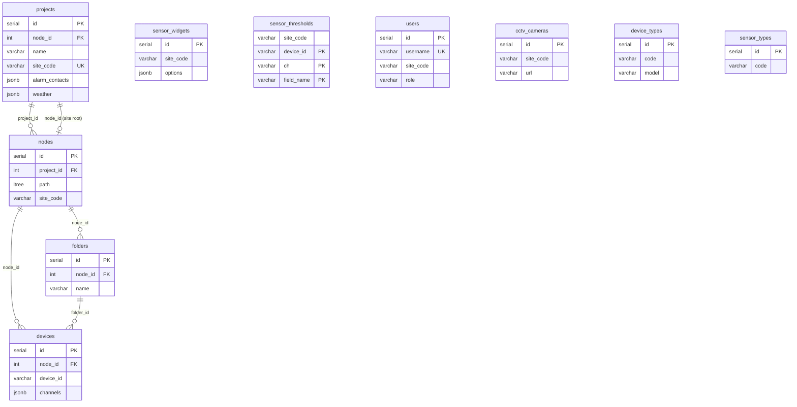
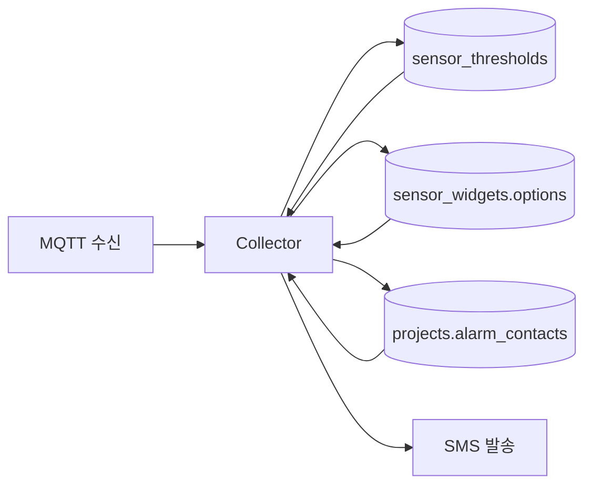

# 주 DB(PostgreSQL) ERD

Management 서버가 사용하는 PostgreSQL 메타데이터 스키마 ERD다. Collector 서버도 동일 DB에 연결해 `sensor_thresholds`, `sensor_widgets`, `projects` 등을 조회한다.

> **기준 코드:** `management/database/pg-client.js` → `initializeTables()`\
> **연결 설정:** `config/config.js` → `postgres` 섹션\
> **상세 명세:** docs/관리-서버.md

***

### 1. 개요

PostgreSQL은 **현장·설비 메타데이터**와 **화면·알람 설정**을 저장한다. 센서 시계열 값 자체는 InfluxDB, 실시간 캐시는 Redis가 담당한다.

| 역할           | 저장소        | 예                              |
| ------------ | ---------- | ------------------------------ |
| 현장 구조, 장비 등록 | PostgreSQL | `projects`, `nodes`, `devices` |
| 대시보드 위젯, 계산식 | PostgreSQL | `sensor_widgets.options`       |
| 알람 임계값       | PostgreSQL | `sensor_thresholds`            |
| 센서 측정값       | InfluxDB   | 채널별 시계열                        |
| 최신값 캐시       | Redis      | MQTT 수신 직후                     |

#### 1.1 두 계층 구조

운영 중인 데이터 모델은 **설비 계층**과 **표시 계층**으로 나뉜다. 두 계층은 FK로 직접 연결되지 않고, `site_code`·`device_id`·`channel` 문자열로 논리적으로 맞춘다.

| 계층        | 경로                                           | 용도                           |
| --------- | -------------------------------------------- | ---------------------------- |
| **설비 계층** | `projects` → `nodes` → `folders` → `devices` | 현장 트리, 장비 등록, MQTT 수집 식별자    |
| **표시 계층** | `projects` → `sensor_widgets`                | 대시보드 위젯, 채널·측정 항목·계산식, 알람 연동 |

```
설비 계층                          표시 계층
─────────                          ─────────
projects (site_code)               sensor_widgets (site_code)
  └─ nodes                           └─ options.sensorList[]
       ├─ folders                         ├─ deviceId  ──┐
       └─ devices                          ├─ channel   ──┼─→ 수집 데이터 키
            └─ device_id ──────────────────┘              │
                                                          ↓
                                              sensor_thresholds (device_id, ch, field_name)
```

#### 1.2 UI 개념 ↔ DB 대응

| UI 개념      | DB / API                                   | 설명                                       |
| ---------- | ------------------------------------------ | ---------------------------------------- |
| 현장         | `projects` 1행, `/api/projects`             | `site_code`가 전 서버 공통 식별자                 |
| 구역·구간      | `nodes` (ltree), `/api/nodes`              | `path`로 부모-자식 탐색                         |
| 장비 폴더      | `folders`, `/api/folders`                  | 노드 직하 1뎁스 정리용                            |
| 장비         | `devices`, `/api/devices`                  | `device_id`가 MQTT·Influx·Redis 키         |
| 위젯         | `sensor_widgets` 1행, `/api/sensor-widgets` | 위젯 UI 및 설정                               |
| 위젯 내 채널    | `options.sensorList[]`                     | `deviceId`, `channel`, `name`            |
| 위젯 내 측정 항목 | `sensorList[].values` 또는 `.items`          | `parseType`에 따라 필드명이 다름                  |
| 알람 기준치     | `sensor_thresholds`, `/api/thresholds`     | `device_id + ch + field_name(센서별 기준치배열)` |
| CCTV       | `cctv_cameras`, `/api/cctv-cameras`        | 위젯 `options.cameras`에서 참조                |

수집 서버 알람 판정은 `sensor_thresholds`, `sensor_widgets.options`, `projects.alarm_contacts`만 읽는다. **`devices` 테이블은 알람 경로에서 조회하지 않는다.**

#### 1.3 미사용 테이블 (문서 제외)

`pg-client.js` DDL에는 4+1 구조 잔여 테이블이 남아 있다. **현재 API·화면·알람 경로에서는 사용하지 않으므로 본 ERD에서 제외한다.**

| 테이블             | 비고                 |
| --------------- | ------------------ |
| `sensor_groups` | 구 센서 그룹 (LIST 파티션) |
| `sensors`       | 구 센서 표시 단위         |
| `siblings`      | 구 논리 그룹 태그         |

***

### 2. ERD



FK로 연결되지 않은 테이블(`sensor_widgets`, `sensor_thresholds`, `users`, `cctv_cameras`, `device_types`, `sensor_types`)은 `site_code` 또는 문자열 키로 논리 연결된다.

***

### 3. 계층 구조

```
projects (현장)
  └── nodes (ltree: 구역 / 구간 / site root)
        ├── folders (장비 폴더, 선택)
        └── devices (물리 장비, device_id = 수집 키)

독립 테이블 (FK 없음, site_code 또는 문자열로 연결):
  ├── sensor_widgets   … 화면 위젯·계산식
  ├── sensor_thresholds … 알람 임계값
  ├── users            … 로그인 계정
  ├── cctv_cameras     … CCTV URL
  ├── device_types     … 장비 종류 마스터
  └── sensor_types     … 센서 종류 마스터
```

***

### 4. 테이블 상세

#### 4.1 `projects` — 현장/프로젝트

현장의 최상위 메타데이터. `site_code`는 Management·Collector·Sensor API 전반에서 현장을 구분하는 공통 키다.

| 컬럼                        | 타입           | 제약                                  | 설명                                 |
| ------------------------- | ------------ | ----------------------------------- | ---------------------------------- |
| id                        | SERIAL       | PK                                  | 내부 식별자                             |
| node\_id                  | INTEGER      | FK → nodes(id) SET NULL             | 현장 루트 노드. `nlevel(path)=1` 노드와 1:1 |
| name                      | VARCHAR(255) | NOT NULL                            | 현장 표시명                             |
| site\_code                | VARCHAR(50)  | UNIQUE                              | 현장 코드. 예: `1000`, `2000`           |
| description               | TEXT         |                                     | 현장 설명                              |
| blueprint\_image\_url     | TEXT         |                                     | 조감도/도면 이미지 경로                      |
| site\_info                | JSONB        | DEFAULT `{}`                        | 현장 부가 정보 (주소, 공사 기간 등)             |
| markers                   | JSONB        | DEFAULT `[]`                        | 지도 마커 배열                           |
| sensor\_markers           | JSONB        | DEFAULT `[]`                        | 센서 위치 마커                           |
| alarm\_contacts           | JSONB        | DEFAULT `{"1차":[],"2차":[],"3차":[]}` | 알람 SMS 수신 연락처                      |
| weather                   | JSONB        |                                     | 날씨 API용 `{ lat, lon }`             |
| created\_at / updated\_at | TIMESTAMP    |                                     | 자동 갱신 트리거                          |

**API:** `/api/projects`\
**연관:** Collector 알람이 `alarm_contacts`를 읽어 SMS 발송 대상을 결정한다.

***

#### 4.2 `nodes` — ltree 계층 노드

현장 내 구역·구간을 트리로 표현한다. PostgreSQL `ltree` 확장으로 `path` 기준 조상/자손 조회가 가능하다.

| 컬럼                        | 타입           | 제약                                  | 설명                               |
| ------------------------- | ------------ | ----------------------------------- | -------------------------------- |
| id                        | SERIAL       | PK                                  |                                  |
| project\_id               | INTEGER      | FK → projects(id) CASCADE, nullable | 소속 현장                            |
| name                      | VARCHAR(100) | NOT NULL                            | 노드 표시명                           |
| path                      | ltree        | NOT NULL                            | 계층 경로. 예: `p5.ZoneA.B1`          |
| type                      | VARCHAR(50)  |                                     | `site`, `zone`, `section` 등      |
| order\_index              | INTEGER      | DEFAULT 0                           | 같은 부모 아래 정렬 순서                   |
| site\_code                | VARCHAR(50)  | UNIQUE WHERE nlevel(path)=1         | 최상위 노드에만. projects.site\_code 미러 |
| description               | TEXT         |                                     |                                  |
| markers                   | JSONB        | DEFAULT `[]`                        | 노드별 지도 마커                        |
| created\_at / updated\_at | TIMESTAMP    |                                     |                                  |

**path 규칙**

* 깊이 1(`nlevel=1`): 현장 루트. `projects.node_id`와 연결
* 하위 노드: 부모 path + `.` + 라벨로 확장
* GiST 인덱스(`nodes_path_idx`)로 `<@`, `@>` 계층 검색

**API:** `/api/nodes`

***

#### 4.3 `folders` — 장비 폴더

노드 직하 1뎁스에서 장비를 묶는 정리용 폴더. 없으면 장비가 노드에 직접 붙는다.

| 컬럼                        | 타입           | 제약                               | 설명    |
| ------------------------- | ------------ | -------------------------------- | ----- |
| id                        | SERIAL       | PK                               |       |
| node\_id                  | INTEGER      | NOT NULL, FK → nodes(id) CASCADE | 소속 노드 |
| name                      | VARCHAR(100) | NOT NULL                         | 폴더명   |
| description               | TEXT         |                                  |       |
| order\_index              | INTEGER      | DEFAULT 0                        | 정렬 순서 |
| created\_at / updated\_at | TIMESTAMP    |                                  |       |

**API:** `/api/folders`

***

#### 4.4 `devices` — 물리 장비

MQTT 수집·InfluxDB·Redis에서 쓰는 **장비 식별자**를 등록한다. `project_id` 컬럼은 없고, `nodes → projects` 경로로 현장을 추론한다.

| 컬럼                        | 타입           | 제약                               | 설명                                          |
| ------------------------- | ------------ | -------------------------------- | ------------------------------------------- |
| id                        | SERIAL       | PK                               | DB 내부 ID                                    |
| node\_id                  | INTEGER      | NOT NULL, FK → nodes(id) CASCADE | 설치 위치 노드                                    |
| folder\_id                | INTEGER      | FK → folders(id) SET NULL        | 선택적 폴더                                      |
| device\_id                | VARCHAR(200) |                                  | **수집 식별자**. MQTT topic·Influx tag·Redis key |
| name                      | VARCHAR(100) | NOT NULL                         | 화면 표시명                                      |
| order\_index              | INTEGER      | DEFAULT 0                        |                                             |
| metadata                  | JSONB        | DEFAULT `{}`                     | 장비별 부가 설정                                   |
| channels                  | JSONB        | DEFAULT `[]`, CHECK array        | 등록된 채널 목록 (`name` 필수, 중복 불가)                |
| device\_type              | VARCHAR(200) |                                  | `device_types.code`와 논리 매칭 (FK 없음)          |
| model                     | VARCHAR(100) |                                  |                                             |
| communication\_method     | VARCHAR(100) |                                  | `mqtt`, `lora` 등                            |
| sensor\_count             | INTEGER      | NOT NULL DEFAULT 0               |                                             |
| is\_active                | BOOLEAN      | DEFAULT TRUE                     |                                             |
| created\_at / updated\_at | TIMESTAMP    |                                  |                                             |

**API:** `/api/devices`\
**연관:** `sensor_widgets.options.sensorList[].deviceId`, `sensor_thresholds.device_id`가 이 값과 맞아야 한다.

***

#### 4.5 `sensor_widgets` — 대시보드 위젯

**화면 표시의 최소 단위.** 위젯 1행 = 화면 위젯 1개. 채널·측정 항목·계산식·표시명은 모두 `options` JSONB에 담긴다.

| 컬럼                        | 타입           | 제약                    | 설명                      |
| ------------------------- | ------------ | --------------------- | ----------------------- |
| id                        | SERIAL       | PK                    |                         |
| project\_id               | INTEGER      | FK 없음                 | 선택적 프로젝트 참조             |
| site\_code                | VARCHAR(50)  |                       | 현장 범위 필터                |
| name                      | VARCHAR(100) | NOT NULL              | 위젯 표시명                  |
| widget\_type              | VARCHAR(50)  | NOT NULL              | `widget` , `cctv`       |
| show\_hide                | BOOLEAN      | DEFAULT TRUE          | 화면 노출 여부                |
| order\_index              | INTEGER      | DEFAULT 0             | 대시보드 정렬                 |
| options                   | JSONB        | NOT NULL DEFAULT `{}` | 채널·측정 항목·계산식 정의 (아래 참조) |
| is\_active                | BOOLEAN      | DEFAULT TRUE          |                         |
| is\_sibling               | BOOLEAN      | DEFAULT FALSE         | 시블링(묶음) 위젯 여부           |
| created\_at / updated\_at | TIMESTAMP    |                       |                         |

**API:** `/api/sensor-widgets`\
**런타임:** 서버 기동 시 `initWidgetChannelCache()`가 `options.deviceChannels`를 메모리 Map에 적재. Collector 알람은 `options.sensorList`를 `deviceId` 기준으로 조회한다.

**`options` JSONB 구조**

```json
{
  "parseType": "geocus",
  "deviceChannels": [{ "deviceId": "geocus900_1002_01", "channel": "ch2" }],
  "sensorList": [{
    "deviceId": "geocus900_1002_01",
    "channel": "ch2",
    "name": "표시 이름",
    "values": [{ "name": "풍속", "dataIndex": "WS", "formula": "x * 1" }]
  }],
  "cameras": [{ "id": 1 }]
}
```

| 필드                    | 역할                                                   |
| --------------------- | ---------------------------------------------------- |
| `parseType`           | 파서 종류 (`geocus`, `fft`, `lora`, `gdms` 등)            |
| `deviceChannels`      | 위젯 채널 캐시 키. 서버 시작 시 Map 적재                           |
| `sensorList`          | 알람·계산식 조회 기준. `deviceId`로 위젯 검색                      |
| `sensorList[].values` | `parseType=geocus` 측정 항목. 비면 `options.values` 템플릿 폴백 |
| `sensorList[].items`  | `fft`, `lora`, `gdms` 등 geocus 외 측정 항목               |
| `cameras`             | `widget_type=cctv`일 때 `cctv_cameras.id` 참조           |

***

#### 4.6 `sensor_thresholds` — 알람 임계값

센서·FFT 데이터별 1\~3단계 알람 기준값. Collector가 MQTT 수신 후 이 테이블과 비교해 알람을 발생시킨다.

| 컬럼                       | 타입           | 제약                     | 설명                             |
| ------------------------ | ------------ | ---------------------- | ------------------------------ |
| site\_code               | VARCHAR(50)  | NOT NULL               | 현장 코드                          |
| device\_id               | VARCHAR(100) | PK                     | 장비 식별자                         |
| ch                       | VARCHAR(20)  | PK                     | 채널. 예: `ch2`                   |
| field\_name              | VARCHAR(50)  | PK                     | 측정 필드. 예: `WS`, `TEMP`         |
| data\_type               | VARCHAR(20)  | PK, DEFAULT `sensor`   | `sensor` \| `fft`              |
| threshold\_type          | VARCHAR(10)  | NOT NULL DEFAULT `max` | `min` \| `max` \| `both` (±범위) |
| limit1 / limit2 / limit3 | NUMERIC      |                        | 1\~3단계 기준값                     |
| duration                 | INT          | DEFAULT 3              | 초과 지속 시간(초)                    |
| cooldown                 | INT          | DEFAULT 1800           | 재알람 쿨다운(초, Collector는 분으로 해석)  |
| updated\_at              | TIMESTAMP    |                        |                                |

**API:** `/api/thresholds`\
**연관:** 임계값 변경 시 Collector에 통보해 캐시를 갱신한다. FK 없음 — `devices.device_id`와 문자열로 맞춘다.

***

#### 4.7 `users` — 로그인 계정

Management 서버 인증 계정.

| 컬럼                        | 타입           | 제약              | 설명                                        |
| ------------------------- | ------------ | --------------- | ----------------------------------------- |
| id                        | SERIAL       | PK              |                                           |
| username                  | VARCHAR(100) | NOT NULL UNIQUE | 로그인 ID                                    |
| password\_hash            | VARCHAR(255) | NOT NULL        | bcrypt 해시                                 |
| name                      | VARCHAR(100) | NOT NULL        | 표시 이름                                     |
| site\_code                | VARCHAR(50)  |                 | `super_admin`은 NULL, 그 외 필수               |
| phone / email             | VARCHAR      |                 |                                           |
| role                      | VARCHAR(30)  | CHECK           | `super_admin` \| `site_admin` \| `viewer` |
| status                    | VARCHAR(30)  | DEFAULT active  | `active` \| `inactive` \| `locked`        |
| last\_login\_at           | TIMESTAMP    |                 |                                           |
| created\_at / updated\_at | TIMESTAMP    |                 |                                           |

**API:** `/api/auth`, `/api/users`\
**제약:** `users_site_code_role_check` — super\_admin은 site\_code NULL, 나머지는 NOT NULL

***

#### 4.8 `cctv_cameras` — CCTV 카탈로그

현장별 CCTV 이름과 스트림 URL.

| 컬럼                        | 타입           | 제약        | 설명          |
| ------------------------- | ------------ | --------- | ----------- |
| id                        | SERIAL       | PK        |             |
| site\_code                | VARCHAR(50)  | NOT NULL  |             |
| name                      | VARCHAR(100) | NOT NULL  | 카메라 표시명     |
| url                       | TEXT         | NOT NULL  | 스트림/임베드 URL |
| order\_index              | INTEGER      | DEFAULT 0 |             |
| created\_at / updated\_at | TIMESTAMP    |           |             |

**API:** `/api/cctv-cameras`\
**연관:** `sensor_widgets.options.cameras[].id`에서 참조

***

#### 4.9 `device_types` — 장비 종류 마스터

장비 등록 시 선택하는 종류 카탈로그. `devices.device_type`과 문자열로 매칭하며 FK는 없다.

| 컬럼                        | 타입           | 제약           | 설명        |
| ------------------------- | ------------ | ------------ | --------- |
| id                        | SERIAL       | PK           |           |
| model                     | VARCHAR(100) | NOT NULL     | 모델명       |
| code                      | VARCHAR(100) | NOT NULL     | 장비 코드     |
| name                      | VARCHAR(200) | NOT NULL     | 표시명       |
| default\_options          | JSONB        | DEFAULT `{}` | 기본 설정 템플릿 |
| meta                      | JSONB        | DEFAULT `{}` | 부가 메타     |
| sensor\_count             | INTEGER      | NOT NULL     | 기본 센서 수   |
| communication\_method     | VARCHAR(100) | NOT NULL     | 통신 방식     |
| parse\_type               | VARCHAR(100) |              | 파서 종류 힌트  |
| is\_active                | BOOLEAN      | DEFAULT TRUE |           |
| created\_at / updated\_at | TIMESTAMP    |              |           |

**API:** `/api/device-types`

***

#### 4.10 `sensor_types` — 센서 종류 마스터

측정 종류 카탈로그. 장비·위젯 설정 시 참고용.

| 컬럼                        | 타입           | 제약           | 설명    |
| ------------------------- | ------------ | ------------ | ----- |
| id                        | SERIAL       | PK           |       |
| code                      | VARCHAR(100) | NOT NULL     | 센서 코드 |
| name                      | VARCHAR(200) | NOT NULL     | 표시명   |
| default\_options          | JSONB        | DEFAULT `{}` |       |
| meta                      | JSONB        | DEFAULT `{}` |       |
| is\_active                | BOOLEAN      | DEFAULT TRUE |       |
| created\_at / updated\_at | TIMESTAMP    |              |       |

**API:** `/api/sensor-types`

***

### 5. JSONB 컬럼 요약

| 테이블                           | 컬럼                       | 용도                                                     |
| ----------------------------- | ------------------------ | ------------------------------------------------------ |
| projects                      | alarm\_contacts          | `{ "1차": [...], "2차": [...], "3차": [...] }` 알람 SMS 수신자 |
| projects                      | weather                  | `{ lat, lon }` 날씨 API 좌표                               |
| projects                      | markers, sensor\_markers | 지도 마커 배열                                               |
| devices                       | channels                 | `[{ "name": "ch1", ... }]` 등록 채널 목록                    |
| devices                       | metadata                 | 장비별 확장 설정                                              |
| sensor\_widgets               | options                  | 위젯 전체 설정 (sensorList, 계산식, CCTV 참조)                    |
| device\_types / sensor\_types | default\_options, meta   | 마스터 기본값                                                |

#### `projects.alarm_contacts` 예시

```json
{
  "1차": ["01000000000"],
  "2차": [{ "name": "담당자", "phone": "01000000000" }],
  "3차": []
}
```

항목은 전화번호 문자열 또는 `{ name, phone }` 객체를 허용한다.

***

### 6. FK 관계

| From               | To          | ON DELETE | 설명                  |
| ------------------ | ----------- | --------- | ------------------- |
| nodes.project\_id  | projects.id | CASCADE   | 현장 삭제 시 노드 삭제       |
| projects.node\_id  | nodes.id    | SET NULL  | 루트 노드 삭제 시 참조 해제    |
| folders.node\_id   | nodes.id    | CASCADE   |                     |
| devices.node\_id   | nodes.id    | CASCADE   |                     |
| devices.folder\_id | folders.id  | SET NULL  | 폴더 삭제 시 장비는 노드 직속으로 |

***

### 7. 논리 연결 (FK 없음)

| A                  | B                | 연결 키                                       | 용도           |
| ------------------ | ---------------- | ------------------------------------------ | ------------ |
| sensor\_widgets    | projects         | site\_code                                 | 현장별 위젯 필터    |
| sensor\_widgets    | devices / 수집 데이터 | options.sensorList\[].deviceId, channel    | 화면·알람 데이터 매칭 |
| sensor\_thresholds | devices          | site\_code + device\_id + ch + field\_name | 임계값 ↔ 수집 키   |
| users              | projects         | site\_code                                 | 현장별 접근 권한    |
| cctv\_cameras      | projects         | site\_code                                 |              |
| cctv\_cameras      | sensor\_widgets  | options.cameras\[].id                      | CCTV 위젯      |
| devices            | device\_types    | device\_type, model (문자열)                  | 장비 종류 참조     |

***

### 8. 알람 데이터 흐름



1. MQTT로 raw 값 수신
2. `sensor_widgets.options`에서 `deviceId` 기준 계산식·표시명 조회
3. 계산된 값을 `sensor_thresholds`와 비교
4. 초과 시 `projects.alarm_contacts`로 SMS 발송

***

### 9. 관련 저장소

| 저장소        | 용도                    | 사용 서버                             |
| ---------- | --------------------- | --------------------------------- |
| PostgreSQL | 메타데이터, 임계값, 계정        | management, collector             |
| InfluxDB   | 센서 시계열, 알람 이력         | collector, sensor-api             |
| Redis      | 실시간 캐시, refresh token | collector, sensor-api, management |
