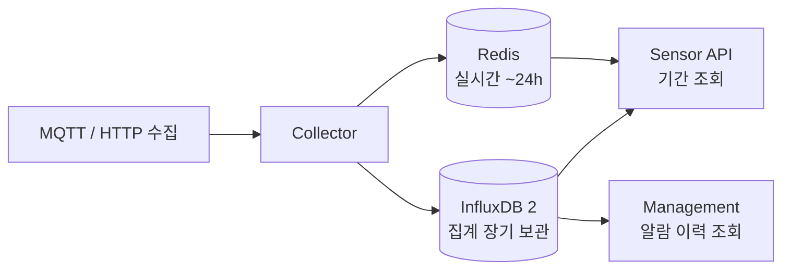

# InfluxDB

### InfluxDB 2란?

**InfluxDB**는 **시계열(Time Series) 데이터베이스**다. 센서처럼 **시간에 따라 계속 쌓이는 숫자 데이터**를 저장하고, 기간·집계 단위로 빠르게 조회하기 위해 설계되었다.

이 프로젝트는 **InfluxDB 2.x**를 사용하며, Node.js에서 `@influxdata/influxdb-client` 패키지로 연결한다.

***

### InfluxDB 2 핵심 개념

#### 1. Organization (Org)

데이터를 묶는 최상위 단위다. 이 프로젝트에서는 `my-org`를 사용한다.

#### 2. Bucket

데이터가 실제로 들어가는 **저장소**다. 이 프로젝트는 센서·채널·집계 단위마다 **버킷을 많이 나눈다**.

예:

```
geocus900_1000_01_ch1_10m   ← 10분 집계
geocus900_1000_01_ch1_1h    ← 1시간 집계
lora_0000063640ca63fffe1e1fdd  ← LoRa 센서
alarm-log                   ← 알람 SMS 이력
```

각 버킷에는 **Retention(보존 기간)** 이 설정되어, 기간이 지나면 데이터가 자동으로 삭제된다.

#### 3. Point (데이터 1건)

Influx에 쓰는 **한 줄의 기록**이다.

```javascript
new Point('sensor_10min_aggregated')  // measurement
  .tag('field_name', 'TEMP')          // tag (색인/필터용)
  .floatField('mean', 25.3)           // field (실제 값)
  .floatField('max', 26.1)
  .floatField('min', 24.8)
  .timestamp(timeDate)
```

#### 4. Measurement / Tag / Field

| 개념              | 역할              | 이 프로젝트 예                                                    |
| --------------- | --------------- | ----------------------------------------------------------- |
| **Measurement** | 데이터 종류          | `sensor_10min_aggregated`, `hourly_aggregated`, `alarm_log` |
| **Tag**         | 필터·그룹용 문자열 (색인) | `field_name=TEMP`, `sensor_id`, `channel`                   |
| **Field**       | 실제 측정값 (숫자/문자)  | `mean`, `max`, `min`                                        |

같은 시각에 `field_name=TEMP`, `field_name=HUMI`처럼 **측정 항목마다 Point를 따로** 쓴다.

#### 5. Flux

Influx 2의 쿼리 언어다. 파이프(`|>`)로 단계를 이어 붙인다.

```flux
from(bucket: "geocus900_1000_01_ch1_10m")
|> range(start: -2h, stop: now())
|> filter(fn: (r) => r._measurement == "sensor_10min_aggregated")
|> filter(fn: (r) => r._field == "mean")
|> aggregateWindow(every: 1h, fn: mean)
```

#### 6. Token

API 접근 인증에 쓰는 키다. `url` + `token` + `org` 조합으로 서버에 연결한다.

***

### 이 프로젝트에서 InfluxDB의 역할



* **Redis**: 최근 원본·실시간 조회
* **InfluxDB**: 10분 / 1시간 / 1일 **집계 데이터** 장기 저장

대시보드에서 "최근 1시간"은 Redis, "지난 1주일 추이"는 Influx를 조회하는 식으로 역할이 나뉜다.

***

### 연결 설정

`config/config.js`에서 공통 설정을 읽는다.

| 설정                         | 기본값                     | 설명                                |
| -------------------------- | ----------------------- | --------------------------------- |
| `influxdb.url`             | `http://localhost:8086` | Influx 서버 주소 (`INFLUX_URL`)       |
| `influxdb.token`           | (환경변수)                  | API 인증 토큰 (`INFLUX_TOKEN`)        |
| `influxdb.org`             | `my-org`                | Organization 이름 (`INFLUX_ORG`)    |
| `influxdb.orgId`           | (환경변수)                  | Organization ID (`INFLUX_ORG_ID`) |
| `influxdb.getBucketName()` | —                       | 버킷명 생성 규칙                         |

버킷명 생성 규칙 (신규 방식):

```
{sensorId}_{channel}_{timeUnit}
```

관련 코드: `config/config.js`, `collector/influx/bucket-utils.js`

***

### 데이터가 Influx에 들어가는 경로 (Collector)

#### 1) MQTT sensdata → Redis → 10분 배치 → Influx

10분마다 Redis 데이터를 모아 10분 집계 후 Influx에 저장한다.

관련 코드: `collector/batch-scheduler.js` → `influxManager.writeBatchData()`

#### 2) bulk\_data\_aggr (FFT 등) → Influx 즉시 저장

고주파 분석 결과는 Redis를 거치지 않고 바로 Influx에 쓴다.

관련 코드: `collector/server.js` → `processBulkData()`

#### 3) LoRa / GDMS → Influx 즉시 저장

* **LoRa**: `lora_{deviceId}` 버킷, `val01~valNN` 각각 Point
* **GDMS**: 같은 버킷에 JSON 문자열로 저장

관련 코드: `collector/influx/data-writer.js` — `processLoRaData()`, `processGdmsData()`

#### 4) 알람 SMS → `alarm-log` 버킷

알람 발송 이력을 `alarm_log` measurement로 저장한다 (90일 보존).

관련 코드: `collector/alarm/alarm-logger.js`

***

### Influx 데이터 모델 (이 프로젝트 규칙)

#### 버킷 네이밍

**신규 일반 센서** (채널별 독립 버킷):

```
{sensorId}_{channel}_{timeUnit}
예: geocus900_1000_01_ch1_10m / _1h / _1d
```

**레거시 센서** (`geocus900_1001_01` 등): 센서당 단일 버킷 + tag로 채널 구분

**LoRa**: `lora_{deviceId}` 단일 버킷

#### Measurement

| timeUnit | measurement               |
| -------- | ------------------------- |
| 10m      | `sensor_10min_aggregated` |
| 1h       | `hourly_aggregated`       |
| 1d       | `daily_aggregated`        |

테스트 보정 데이터는 measurement에 `_test` 접미사가 붙을 수 있다.

#### 저장 필드

모든 집계 Point에 **`mean`, `max`, `min`** 3개 통계 필드를 쓴다.

관련 코드: `collector/influx/data-writer.js` — `createAggregatedPoints()`

***

### 집계 파이프라인 (Influx 내부 롤업)

Influx 안에서 **단계별로 데이터를 압축**한다.

```
원본(Redis) → 10m 버킷 → 1h 버킷 → 1d 버킷
```

| 단계  | 스케줄           | 동작                     |
| --- | ------------- | ---------------------- |
| 10분 | 매 10분 (3분 지연) | Redis → `_10m` 버킷      |
| 1시간 | 매시 정각         | `_10m` Flux 집계 → `_1h` |
| 1일  | 매일 자정         | `_1h` Flux 집계 → `_1d`  |

1시간 집계는 Flux `aggregateWindow(every: 1h, fn: mean/max/min)`로 10분 데이터를 묶는다.

관련 코드: `collector/influx/aggregation.js`, `collector/batch-scheduler.js`, `collector/docs/aggregation.md`

***

### Influx 클라이언트 구조 (Collector)

`collector/influx/client.js`의 **InfluxManager**가 중심이다.

| 모듈                  | 역할                     |
| ------------------- | ---------------------- |
| `client.js`         | 연결·버킷 캐시·통합 API        |
| `data-writer.js`    | 쓰기 (배치/bulk/LoRa/GDMS) |
| `aggregation.js`    | 1h/1d 롤업               |
| `bucket-manager.js` | 설정 기반 버킷 자동 생성         |
| `bucket-utils.js`   | 버킷명 생성                 |

서버 시작 시:

1. `influxManager.init()` — 연결 + 버킷 목록 로드
2. `bucketManager.createAllBuckets()` — 채널별 버킷 생성
3. `ensureAlarmLogBucket()` — 알람 로그 버킷 생성

***

### Influx 데이터를 읽는 곳

#### Sensor API (`sensor-api/`)

| API                           | Influx 사용       |
| ----------------------------- | --------------- |
| `GET /api/sensors/range`      | 10m/1h/1d 집계 조회 |
| `POST /api/sensors/overwrite` | 수동 보정 데이터 직접 기록 |

조회 로직은 `sensor-api/data-access/influx-reader.js`에 있고, **Collector와 같은 버킷 규칙**을 쓴다. 조회 시 UTC → KST 변환(`date.add(d: 9h, ...)`)도 Flux에서 처리한다.

#### Management (`management/`)

| API                                  | Influx 사용                     |
| ------------------------------------ | ----------------------------- |
| `GET /api/alarm-logs/site/:siteCode` | `alarm-log` 버킷에서 SMS 발송 이력 조회 |
| `POST /api/influx/bucket`            | 버킷 생성 테스트 API (운영 보조)         |

***

### 서버별 Influx 책임 정리

| 서버             | Influx 역할                             |
| -------------- | ------------------------------------- |
| **Collector**  | **쓰기** — 센서 집계, LoRa, 알람 로그, 1h/1d 롤업 |
| **Sensor API** | **읽기** + 수동 보정 **쓰기**                 |
| **Management** | **읽기** — 알람 이력만                       |

***

### 한 줄 요약

> **InfluxDB 2 = 이 프로젝트에서 센서 측정값의 장기 저장소**\
> Collector가 MQTT/HTTP로 받은 데이터를 10분 → 1시간 → 1일로 집계해 센서·채널별 버킷에 저장하고, Sensor API가 기간 조회, Management가 알람 이력 조회에 사용한다.
