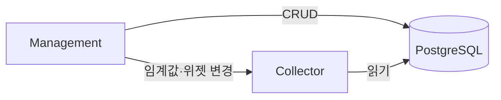

# PostgreSQL

### PostgreSQL이란? (이 프로젝트 기준)

**PostgreSQL**은 **관계형 DB**다. 이 프로젝트에서는 **센서 측정값**이 아니라 **메타데이터·설정**을 저장한다.

| 저장소            | 역할                     | 예시                             |
| -------------- | ---------------------- | ------------------------------ |
| **PostgreSQL** | 현장·장비·위젯·임계값·사용자       | `sensor_thresholds`, `devices` |
| **Redis**      | 최근 센서 원본 + 토큰 + 알람 쿨다운 | `timeseries:센서ID:채널명`          |
| **InfluxDB**   | 장기 시계열 집계              | 10분/1시간/1일 버킷                  |

비유하면 PostgreSQL은 **"현장 설명서 + 알람 설정표 + 사용자 명부"** 이다. 실제 측정 숫자는 InfluxDB·Redis에 있다.

***

### 이 프로젝트에서 PostgreSQL이 하는 일

#### 1. 현장·장비 메타데이터 (Management 전용)

현장, 구역 트리, 장비, 폴더, CCTV, 사용자 계정 등 **관리 화면용 정보**를 CRUD한다.

#### 2. 알람·화면 설정 (Management 쓰기, Collector 읽기)

* **임계값** (`sensor_thresholds`) — 알람 1\~3단계 기준
* **위젯** (`sensor_widgets`) — 대시보드 계산식·표시명
* **연락처** (`projects.alarm_contacts`) — SMS 수신자

Collector는 MQTT 수신 후 위 설정을 **읽어서** 알람 판정·SMS 발송에 사용한다.

#### 3. 인증 (Management)

`users` 테이블에서 로그인 계정을 조회한다.

***

### 연결 설정

`config/config.js` → `postgres` 섹션:

| 설정         | 기본값         | 설명            |
| ---------- | ----------- | ------------- |
| `host`     | `localhost` | `PG_HOST`     |
| `port`     | `5432`      | `PG_PORT`     |
| `database` | `geoverse`  | `PG_DATABASE` |
| `user`     | `postgres`  | `PG_USER`     |
| `password` | —           | `PG_PASSWORD` |
| `max`      | `20`        | 커넥션 풀 크기      |

드라이버: npm 패키지 `pg`

***

### 핵심 코드

| 파일                                   | 역할                                                        |
| ------------------------------------ | --------------------------------------------------------- |
| `management/database/pg-client.js`   | Pool 연결, `query()`, `transaction()`, `initializeTables()` |
| `management/database/repositories/*` | 테이블별 SQL (CRUD)                                           |

서버 기동 시 `connect()` → `initializeTables()`로 테이블·인덱스·트리거를 **멱등하게** 맞춘다.

***

### 주요 테이블

| 테이블                            | 용도                                  |
| ------------------------------ | ----------------------------------- |
| `projects`                     | 현장, `site_code`, 알람 연락처, 마커         |
| `nodes`                        | 구역 트리 (`ltree` path)                |
| `folders`                      | 장비 폴더                               |
| `devices`                      | 장비 등록 (`device_id` = MQTT·Influx 키) |
| `sensor_widgets`               | 대시보드 위젯, 계산식 (`options` JSONB)      |
| `sensor_thresholds`            | 알람 임계값                              |
| `users`                        | 로그인 계정                              |
| `cctv_cameras`                 | CCTV URL                            |
| `device_types`, `sensor_types` | 장비·센서 종류 마스터                        |

상세 스키마·ERD: erd.md

***

### 서버별 PostgreSQL 사용

#### Management (`management/`) — **쓰기 + 조회**

| Repository                 | API                   | 테이블                 |
| -------------------------- | --------------------- | ------------------- |
| `project-repository`       | `/api/projects`       | `projects`          |
| `node-repository`          | `/api/nodes`          | `nodes`             |
| `device-repository`        | `/api/devices`        | `devices`           |
| `folder-repository`        | `/api/folders`        | `folders`           |
| `sensor-widget-repository` | `/api/sensor-widgets` | `sensor_widgets`    |
| `threshold-repository`     | `/api/thresholds`     | `sensor_thresholds` |
| `user-repository`          | `/api/users`          | `users`             |
| `cctv-camera-repository`   | `/api/cctv-cameras`   | `cctv_cameras`      |
| `device-type-repository`   | `/api/device-types`   | `device_types`      |
| `sensor-type-repository`   | `/api/sensor-types`   | `sensor_types`      |

기동: `management/server.js` → `pgClient.connect()` → 위젯 채널 캐시 예열

인증: `management/auth-api/login-v2.js` → `users` 조회

#### Collector (`collector/`) — **읽기 전용**

| 파일                          | PostgreSQL 용도                         |
| --------------------------- | ------------------------------------- |
| `server.js`                 | `pgClient.connect()` / `disconnect()` |
| `alarm/config-loader.js`    | 임계값·위젯 계산식·현장 연락처 조회 (메모리 캐시)         |
| `utils/value-fix-loader.js` | 위젯 보정식 기동 시 전량 로드                     |

Collector가 읽는 테이블:

* `sensor_thresholds` — 알람 임계값
* `sensor_widgets` — 계산식, 표시명, LoRa/GDMS 모드
* `projects` — 현장명, SMS 수신자 (`alarm_contacts`)

연결 실패 시: 서버는 기동하지만 **알람·보정식이 동작하지 않을 수 있다**.

#### Management → Collector 캐시 동기화

| Management 작업                 | Collector 내부 API                         |
| ----------------------------- | ---------------------------------------- |
| 임계값 저장 (`/api/thresholds`)    | `POST /internal/clear-threshold-cache`   |
| 위젯 저장 (`/api/sensor-widgets`) | `POST /internal/reload-correction-cache` |

***

### PostgreSQL을 쓰지 않는 서버

| 서버             | PostgreSQL                 |
| -------------- | -------------------------- |
| **sensor-api** | 사용 안 함 (Redis + InfluxDB만) |
| **management** | CRUD + 인증                  |
| **collector**  | 읽기 전용                      |

***

### 한 줄 요약

> **PostgreSQL = 이 프로젝트에서 "현장·장비·위젯·임계값·사용자" 메타데이터 저장소**\
> Management가 쓰고, Collector가 알람 판정용으로 읽으며, 센서 측정값 자체는 저장하지 않는다.
