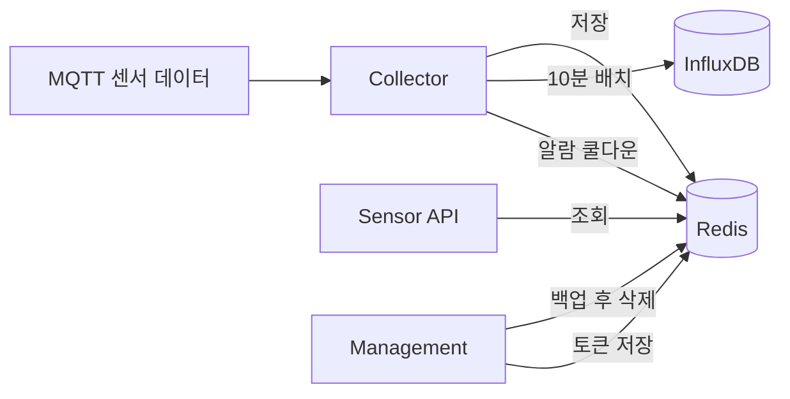

# Redis

### Redis란?

**Redis**는 데이터를 \*\*메모리(RAM)\*\*에 저장하는 **초고속 저장소**다. 일반 DB(PostgreSQL, InfluxDB)처럼 디스크에 쓰는 것보다 훨씬 빠르다.

비유하면:

| 비유       | 설명                             |
| -------- | ------------------------------ |
| **냉장고**  | 자주 쓰는 것(최근 센서값)을 가까이 두고 빠르게 꺼냄 |
| **포스트잇** | 임시로 적어 두었다가 만료되면 자동으로 지워짐      |
| **사전**   | `키 → 값` 형태로 데이터를 저장·조회         |

Redis는 단순한 문자열뿐 아니라 **여러 자료구조**를 지원한다. 이 프로젝트에서는 특히 **Sorted Set(ZSET)** 을 많이 쓴다. ZSET은 "점수(score) + 값(value)" 쌍으로 저장하고, **점수(시간) 기준으로 범위 조회**하기 좋다.

***

### 이 프로젝트에서 Redis가 하는 일 (3가지)



#### 1. 센서 실시간 데이터 버퍼 (핵심)

**Collector**가 MQTT로 받은 센서 데이터를 Redis에 먼저 저장한다. **Sensor API**가 대시보드용 "최근 데이터" 조회에 Redis를 읽는다.

* **InfluxDB** = 장기 보관·집계 (10분/1시간/1일)
* **Redis** = 최근 원본 데이터를 빠르게 읽기 위한 **단기 버퍼**

#### 2. 인증 토큰 관리

**Management** 서버가 로그인 시 Refresh Token, 로그아웃 시 Access Token 블랙리스트를 Redis에 저장한다.

#### 3. 알람 쿨다운

**Collector** 알람 시스템이 같은 알람이 반복 발송되지 않도록, 센서별 쿨다운 상태를 Redis에 저장한다.

***

### 데이터 저장 구조 (센서 데이터)

키 형식:

```
timeseries:{sensorId}:{channelName}
```

예: `timeseries:001e0651485b:ch1`

| 항목        | 내용                    |
| --------- | --------------------- |
| 자료구조      | **ZSET** (Sorted Set) |
| **score** | UTC 타임스탬프 (밀리초)       |
| **value** | JSON 문자열 (측정값 포함)     |

저장 시 **24시간 이전 데이터는 자동 삭제**된다. 백업 성공 후에는 Management가 더 오래된 데이터를 추가로 정리한다.

관련 코드: `collector/redis-storage.js` — `storeSensorData()`에서 `zAdd`와 `zRemRangeByScore`를 파이프라인으로 함께 실행한다.

***

### 서버별 Redis 사용

#### Collector (`collector/`)

| 파일                         | 역할                                      |
| -------------------------- | --------------------------------------- |
| `redis-storage.js`         | 센서 데이터 **저장·조회·삭제**                     |
| `server.js`                | MQTT 수신 → Redis 저장                      |
| `legacy-sensor-handler.js` | 레거시 센서도 동일 ZSET 구조로 저장                  |
| `batch-scheduler.js`       | Redis에서 10분치 데이터 읽어 **InfluxDB로 집계 저장** |
| `alarm/alarm-system.js`    | 알람 쿨다운 키 `alarm:cooldown:...` 관리        |

데이터 흐름:

```
MQTT 수신 → 파싱/보정 → Redis 저장 → 알람 처리 → WebSocket 브로드캐스트
                              ↓
                    10분마다 batch-scheduler
                              ↓
                         InfluxDB 집계
```

#### Sensor API (`sensor-api/`)

| API                         | Redis 사용          |
| --------------------------- | ----------------- |
| `GET /api/latest/:sensorId` | 최신 1건 조회          |
| `GET /api/sensors/realtime` | 최근 N시간 원본 + 구간 통계 |

`data-access/redis-reader.js`가 ZSET에서 시간 범위·최신 N건을 조회한다. **쓰기는 하지 않고 읽기만** 한다.

#### Management (`management/`)

| 파일                                        | 역할                                   |
| ----------------------------------------- | ------------------------------------ |
| `services/token-service.js`               | Refresh Token 저장, Access Token 블랙리스트 |
| `redis-client.js`                         | 백업용 Redis 조회·삭제                      |
| `redis-backup.js` + `backup-scheduler.js` | 매일 백업 후 Redis 데이터 정리                 |

토큰 키 예:

```
refresh_token:{userId}     → Refresh Token (7일 TTL)
blacklist:{token}          → 로그아웃된 Access Token
```

***

### 설정

`config/config.js`:

| 설정                                    | 기본값                      | 설명                              |
| ------------------------------------- | ------------------------ | ------------------------------- |
| `redis.url`                           | `redis://localhost:6379` | Redis 연결 URL (`REDIS_URL` 환경변수) |
| `collector.redisDataRetentionHours`   | `48`                     | 백업 후 보존 기간 (시간)                 |
| `collector.redisBackupOffsetMinutes`  | `30`                     | 매일 00:30 백업                     |
| `collector.redisCleanupIntervalHours` | `24`                     | 정기 정리 주기 (시간)                   |

***

### PostgreSQL / InfluxDB / Redis 비교 (이 프로젝트 기준)

| 저장소            | 역할                       | 예시                             |
| -------------- | ------------------------ | ------------------------------ |
| **PostgreSQL** | 메타데이터 (현장, 장비, 임계값, 사용자) | `sensor_thresholds`, `devices` |
| **Redis**      | 최근 센서 원본 + 토큰 + 알람 쿨다운   | `timeseries:센서ID:채널명`          |
| **InfluxDB**   | 장기 시계열 집계                | 10분/1시간/1일 버킷                  |

***

### 한 줄 요약

> **Redis = 이 프로젝트에서 "방금 들어온 센서값을 빠르게 저장·조회하는 단기 메모리 저장소"**\
> Collector가 쓰고, Sensor API가 읽으며, 10분마다 InfluxDB로 넘긴 뒤, 백업 후 오래된 데이터는 지운다.
