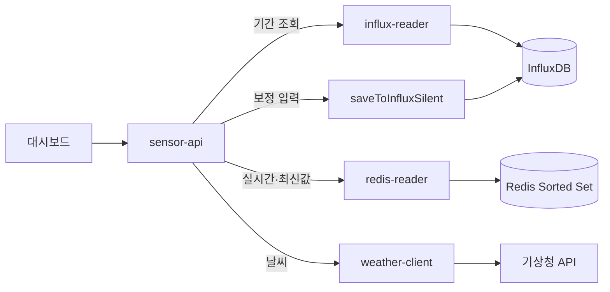
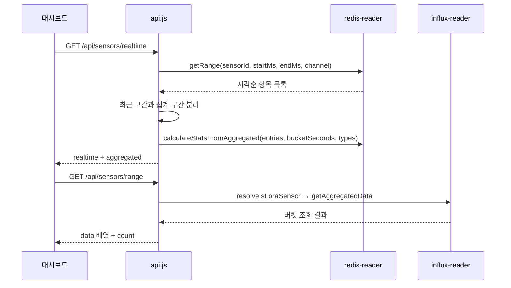
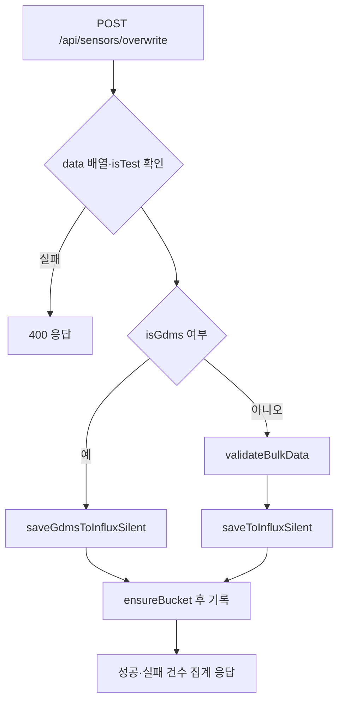

# 센서 조회 서버 — 프로그램 명세

**작성 기준**: `sensor-api/server.js`, `api.js`, `data-access/redis-reader.js`, `data-access/influx-reader.js`, `data-access/weather-client.js`, `utils/*`

***

```
sensor-api/                         
├── data-access/                    # Redis·InfluxDB·기상청 데이터 조회
│   ├── influx-reader.js           # InfluxDB 버킷 조회와 응답 형식 변환
│   ├── redis-reader.js            # Redis 센서 데이터 조회와 구간 통계 계산
│   └── weather-client.js          # 기상청 날씨 조회와 메모리 캐시 관리
├── utils/                          # 시간과 좌표 변환
│   ├── kma-grid.js                # 위경도를 기상청 격자 좌표로 변환
│   └── timestamp.js               # 시각 변환과 10분 구간 반올림
├── api.js                          # 조회·수동 입력·날씨 API 엔드포인트
└── server.js                       # Express 서버 시작과 외부 저장소 연결
```

***

### 1. 데이터 구조와 흐름

#### 1.1 서버 구성



이 서버는 데이터를 직접 수집하지 않는다. 수집 서버가 Redis와 InfluxDB에 넣어 둔 데이터를 읽어 응답하고, 수동 보정 입력만 InfluxDB에 직접 기록한다. PostgreSQL은 사용하지 않는다.

`server.js`는 Redis 클라이언트와 InfluxDB 클라이언트를 만들어 `redisReader.init`, `apiRouter.init`에 주입한 뒤 `/api` 라우터를 연결한다.

#### 1.2 읽는 데이터 구조

| 저장소      | 구조                                                                                                             | 용도         |
| -------- | -------------------------------------------------------------------------------------------------------------- | ---------- |
| Redis    | Redis Sorted Set(ZSET) `timeseries:{sensorId}:{channelName}`, score = UTC 밀리초, member = `{ timestamp, ...필드 }` | 실시간·최신값 조회 |
| InfluxDB | `{sensorId}_{channel}_{10m\|1h\|1d}`, `lora_{key}` 버킷                                                          | 기간 조회      |

버킷 이름은 `influx-reader.js`의 `getBucketName`이 결정하며 수집 서버의 저장 규칙과 동일하다.

| 조회 조건          | 대상 버킷 / measurement                                    |
| -------------- | ------------------------------------------------------ |
| `timeUnit=10m` | `{sensorId}_{channel}_10m` / `sensor_10min_aggregated` |
| `timeUnit=1h`  | `{sensorId}_{channel}_1h` / `hourly_aggregated`        |
| `timeUnit=1d`  | `{sensorId}_{channel}_1d` / `daily_aggregated`         |
| `isLora=true`  | `sensorId`를 버킷 이름으로 사용                                 |
| `isTest=true`  | measurement 이름에 `_test` 접미사                            |
| `isFft=true`   | 채널 번호에 100을 더해 조회 (`ch1` → `ch101`)                    |

Flux 질의에서 `date.add(d: 9h, to: r._time)`로 KST 기준 시각을 만들어 응답한다.

#### 1.3 조회 흐름



실시간 조회는 요청 시각을 기준으로 두 구간으로 나눈다. 현재 집계 구간에 들어온 값은 원본 그대로 `realtime`으로 내려보내고, 그보다 이전 구간은 `aggregateSeconds` 단위로 묶어 `avg`, `min`, `max`를 계산해 `aggregated`로 내려보낸다.

#### 1.4 주요 API

| API 엔드포인트                     | 파라미터                                                                                    | 처리                 |
| ----------------------------- | --------------------------------------------------------------------------------------- | ------------------ |
| `GET /api/sensors/range`      | `sensorId`, `start`, `end`, `channel`, `timeUnit`, `isFft`, `isTest`, `isLora`, `types` | InfluxDB 집계 데이터 조회 |
| `GET /api/sensors/realtime`   | `sensorId`, `hours`, `aggregateSeconds`, `channel`, `types`                             | Redis 원본 + 구간 통계   |
| `GET /api/latest/:sensorId`   | —                                                                                       | Redis 최신 1건        |
| `POST /api/sensors/overwrite` | `{ isTest, isFFT, isLora, isGdms, data[] }`                                             | InfluxDB 수동 보정 입력  |
| `POST /api/weather`           | `{ lat, lon }`                                                                          | 기상청 초단기 실황·예보 조회   |
| `GET /health`                 | —                                                                                       | 상태 확인              |

기본값은 `timeUnit=10m`, `hours=1`, `aggregateSeconds=60`, `types=avg`다. `types`는 `avg,min,max`처럼 쉼표로 여러 개를 지정할 수 있고 `avg`는 InfluxDB의 `mean` 필드에 대응한다.

#### 1.5 응답 구조

`GET /api/sensors/range`

```json
{
  "sensorId": "geocus900_1002_01",
  "timeUnit": "10m",
  "start": "2026-07-28T00:00:00Z",
  "end": "2026-07-29T00:00:00Z",
  "channel": "ch2",
  "data": [
    {
      "sensor_id": "geocus900_1002_01",
      "channel_name": "ch2",
      "time": "2026-07-28 09:00:00",
      "timestamp": 1769000000000,
      "fields": { "TEMP": { "mean": 25.1, "min": 24.8, "max": 25.6 } }
    }
  ],
  "count": 1
}
```

`GET /api/sensors/realtime`

```json
{
  "sensorId": "geocus900_1002_01",
  "channel": null,
  "window": {
    "startMs": 0, "endMs": 0, "hours": 1,
    "currentBucketStart": 0, "currentBucketEnd": 0, "realtimeCutoff": 0
  },
  "realtime": [ { "id": "...", "timestamp": 0, "time": "...", "channels": [] } ],
  "aggregated": { "avg": [], "min": [], "max": [] }
}
```

`GET /api/latest/:sensorId`는 `{ sensorId, timestamp, data }`를 반환하고 데이터가 없으면 404와 `{ error: "no_data_found" }`를 반환한다.

`POST /api/sensors/overwrite`는 항목별 결과를 집계해 `{ success, message, details: { totalItems, processedItems, failedItems, totalFieldsWritten, errors[] } }`를 반환한다. 일부라도 성공하면 200, 전부 실패하면 207을 사용한다.

#### 1.6 수동 보정 입력 처리



`ensureBucket`은 대상 버킷이 없으면 보관 기간 2년으로 생성한다. 이 함수는 수집 서버 `influx/client.js`의 같은 이름 함수와 같은 동작을 별도로 구현한 것이다.

#### 1.7 날씨 조회

| 항목    | 내용                                                                                                    |
| ----- | ----------------------------------------------------------------------------------------------------- |
| 입력    | `{ lat, lon }` (WGS84)                                                                                |
| 좌표 변환 | `utils/kma-grid.js` `latLonToGrid` → 격자 `nx`, `ny`                                                    |
| 캐시    | 프로세스 메모리 Map, 키 `{nx}:{ny}`, 값 `{ data, fetchedAt }`                                                  |
| 캐시 유지 | `config.weather.cacheTtlMs` 기본 30분                                                                    |
| 조회 대상 | 초단기 실황 + 초단기 예보(하늘 상태)                                                                                |
| 응답 필드 | `temperature`, `rain`, `humidity`, `windSpeed`, `rainType`, `sky`, `weatherText`, `location`, `cache` |

***

### 2. 관련 파일과 주요 함수

| 파일                                         | 역할                                |
| ------------------------------------------ | --------------------------------- |
| `sensor-api/server.js`                     | Express 서버 시작, 클라이언트 생성·주입, 종료 처리 |
| `sensor-api/api.js`                        | API 엔드포인트 정의와 수동 보정 기록 보조 함수      |
| `sensor-api/data-access/redis-reader.js`   | Redis Sorted Set 조회와 구간 통계 계산     |
| `sensor-api/data-access/influx-reader.js`  | 버킷 이름 결정과 Flux 질의                 |
| `sensor-api/data-access/weather-client.js` | 기상청 API 호출과 캐시                    |
| `sensor-api/utils/timestamp.js`            | 시각 변환·구간 반올림                      |
| `sensor-api/utils/kma-grid.js`             | 위경도 → 기상청 격자 변환                   |
| `collector/utils/data-validator.js`        | 보정 입력 검증에 재사용                     |

***

### 3. 주요 함수 설명

| 함수                                                            | 위치                   | 설명                                           |
| ------------------------------------------------------------- | -------------------- | -------------------------------------------- |
| `init(client, config)`                                        | `api.js`             | InfluxDB 클라이언트와 설정을 라우터에 주입                  |
| `ensureBucket(client, config, name)`                          | `api.js`             | 버킷 확인 후 없으면 생성하고 캐시에 등록                      |
| `saveToInfluxSilent(...)`                                     | `api.js`             | 보정 항목 1건을 `mean`/`max`/`min` 필드로 기록          |
| `saveGdmsToInfluxSilent(...)`                                 | `api.js`             | GDMS 항목을 문자열 필드로 기록                          |
| `getLatestN(sensorId, n)`                                     | `redis-reader.js`    | 센서의 모든 채널 키에서 최신 n건을 시각으로 병합                 |
| `getRange(sensorId, startMs, endMs, channel)`                 | `redis-reader.js`    | 구간 내 항목을 시각순으로 병합해 반환                        |
| `calculateStatsFromAggregated(entries, bucketSeconds, types)` | `redis-reader.js`    | 지정 초 단위로 묶어 평균·최소·최대 산출                      |
| `getAggregatedData(client, config, options)`                  | `influx-reader.js`   | 버킷·measurement 결정 후 Flux 질의, KST 시각으로 변환해 반환 |
| `resolveIsLoraSensor(sensorId, isLoraQuery)`                  | `influx-reader.js`   | LoRa 버킷 방식 사용 여부 판단                          |
| `getCurrentWeather({ lat, lon })`                             | `weather-client.js`  | 격자 변환 → 캐시 확인 → 기상청 조회                       |
| `latLonToGrid(lat, lon)`                                      | `kma-grid.js`        | 램버트 정각원추 도법 기반 격자 변환                         |
| `toMs`, `roundTo10Minutes`                                    | `utils/timestamp.js` | 시각 파싱과 10분 구간 반올림                            |

***

### 4. 구현 시 주의사항

1. **조회 파라미터는 저장 규칙과 짝을 맞춰야 한다.** `isFft`, `isLora`, `isTest`는 수집 서버가 저장할 때 적용한 채널 보정·버킷 규칙·measurement 이름과 일치해야 한다.
2. **LoRa 조회는 버킷 이름을 그대로 넘긴다.** 저장 측이 `lora_{key}`를 만들기 때문에 `sensorId`에 접두사를 포함해야 한다.
3. **Redis는 24시간만 보관한다.** 그보다 이전 구간은 실시간 조회로 얻을 수 없고 기간 조회를 사용해야 한다.

***

### 5. 관련 문서

| 문서       | 내용                   |
| -------- | -------------------- |
| 수집-서버.md | 저장 구조와 버킷·키 규칙의 원본   |
| 관리-서버.md | 센서·현장 메타데이터와 테이블 스키마 |
