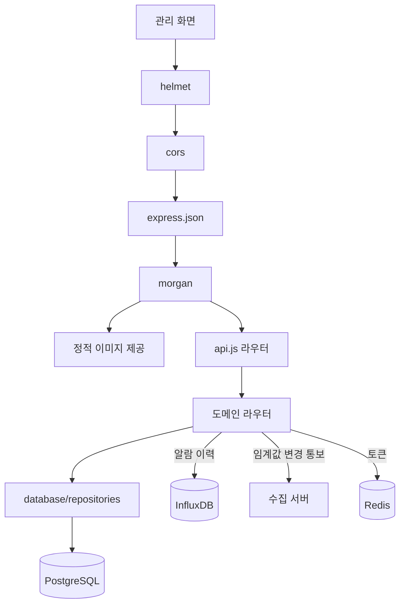
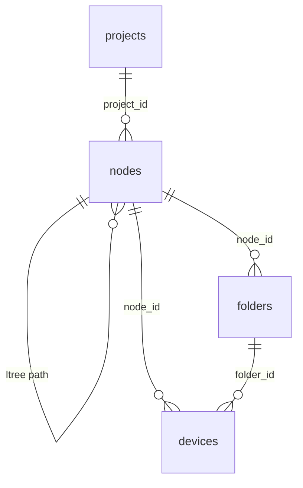
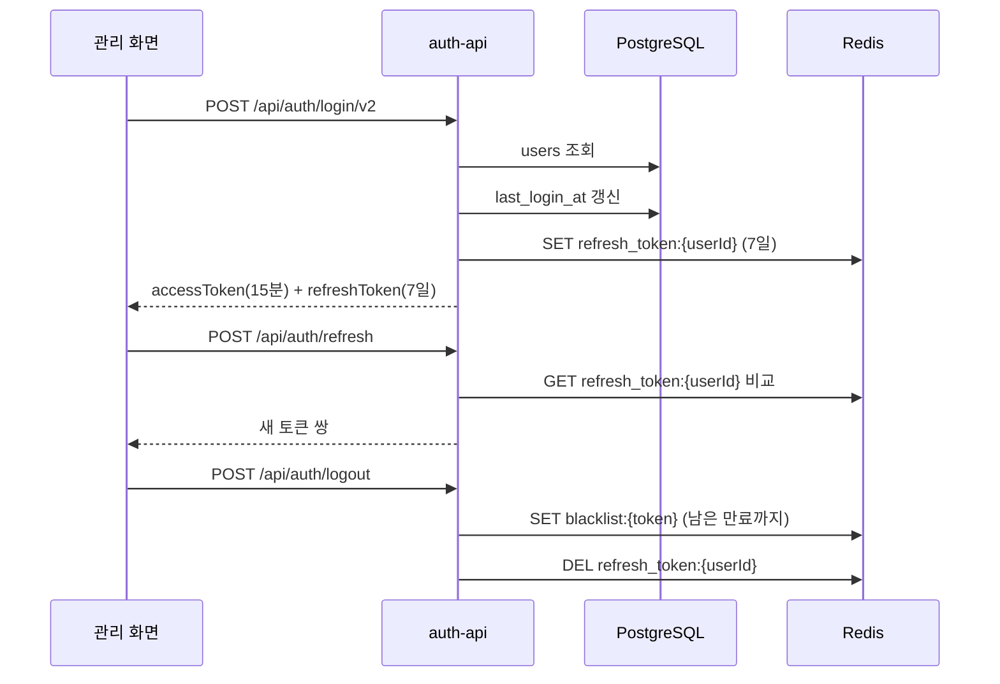
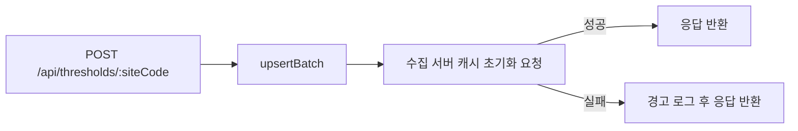
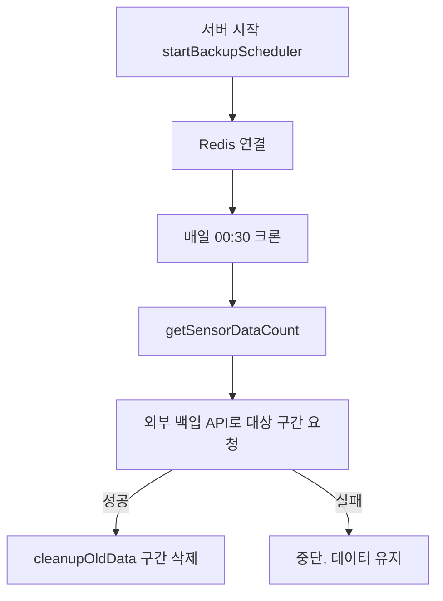

# 관리 서버 — 프로그램 명세

## 관리 서버 — 프로그램 명세

**작성 기준**: `management/server.js`, `api.js`, `database/pg-client.js`, `database/repositories/*`, `auth-api/*`, `middleware/auth.js`, `services/token-service.js`, 도메인별 `*-api/index.js`, `backup-scheduler.js`, `redis-backup.js`

***

### 1. 데이터 구조와 흐름

#### 1.1 요청 흐름



미들웨어는 `helmet` → `cors` → `express.json` → `morgan` → `/images` 정적 제공 → OPTIONS 처리 순서로 등록된다. 서버 시작 시 PostgreSQL에 연결해 `initializeTables()`로 테이블·인덱스·트리거를 확인하고, 위젯 채널 캐시를 예열한 뒤 백업 스케줄러를 시작한다.

#### 1.2 마운트 구성

| 경로                    | 라우터                 | 주 대상 테이블             |
| --------------------- | ------------------- | -------------------- |
| `/api/auth`           | `auth-api`          | `users`              |
| `/api/projects`       | `project-api`       | `projects`           |
| `/api/nodes`          | `node-api`          | `nodes`              |
| `/api/folders`        | `folder-api`        | `folders`            |
| `/api/devices`        | `device-api`        | `devices`            |
| `/api/device-types`   | `device-type-api`   | `device_types`       |
| `/api/sensor-types`   | `sensor-type-api`   | `sensor_types`       |
| `/api/sensor-widgets` | `sensor-widget-api` | `sensor_widgets`     |
| `/api/thresholds`     | `threshold-api`     | `sensor_thresholds`  |
| `/api/cctv-cameras`   | `cctv-camera-api`   | `cctv_cameras`       |
| `/api/users`          | `user-api`          | `users`              |
| `/api/blueprint`      | `blueprint-api`     | `projects` + 파일 시스템  |
| `/api/alarm-logs`     | `alarm-log-api`     | InfluxDB `alarm-log` |

화면 표시 단위는 **`sensor_widgets`(위젯)** 이다. 채널·측정 항목·계산식·표시명은 모두 위젯의 `options` JSONB에 저장한다.

#### 1.3 테이블 관계



`device_types`, `sensor_types`, `sensor_widgets`, `sensor_thresholds`, `cctv_cameras`, `users`는 외래키로 연결되지 않은 독립 테이블이다. `sensor_widgets`는 `site_code`와 `options` JSONB의 `deviceId`·`channel` 문자열로 `devices`·수집 데이터와 논리적으로 연결된다.

구조는 두 계층으로 나뉜다.

| 계층    | 경로                                           | 용도                           |
| ----- | -------------------------------------------- | ---------------------------- |
| 설비 계층 | `projects` → `nodes` → `folders` → `devices` | 현장 구조와 장비 등록                 |
| 표시 계층 | `projects` → `sensor_widgets`                | 대시보드 위젯. 화면 구성·계산식·표시명·알람 연동 |

위젯 개념과 DB/API 대응은 아래와 같다.

| UI 개념      | DB/API                                        | 비고                            |
| ---------- | --------------------------------------------- | ----------------------------- |
| 위젯         | `sensor_widgets` 1행, `/api/sensor-widgets`    | 화면 표시 단위                      |
| 위젯 내 채널    | `options.sensorList[]` 항목                     | `deviceId`, `channel`, `name` |
| 위젯 내 측정 항목 | `sensorList[].values` 또는 `sensorList[].items` | `parseType`에 따라 필드명이 다름       |

수집 서버의 알람 판정은 `sensor_thresholds`, `sensor_widgets.options`, `projects.alarm_contacts`만 읽고 `devices` 테이블은 조회하지 않는다.

#### 1.4 테이블 스키마

DDL은 `management/database/pg-client.js`의 `initializeTables()`가 기준이며 서버가 연결될 때마다 실행된다. `ltree` 확장을 사용하고, 모든 테이블은 `update_updated_at_column()` 트리거로 `updated_at`을 갱신한다.

**projects**

| 컬럼                          | 타입           | 비고                                           |
| --------------------------- | ------------ | -------------------------------------------- |
| `id`                        | SERIAL       | PK                                           |
| `node_id`                   | INTEGER      | FK → `nodes(id)` ON DELETE SET NULL          |
| `name`                      | VARCHAR(255) | NOT NULL                                     |
| `site_code`                 | VARCHAR(50)  | UNIQUE                                       |
| `description`               | TEXT         |                                              |
| `blueprint_image_url`       | TEXT         | 도면 이미지 경로                                    |
| `site_info`                 | JSONB        | DEFAULT `{}`                                 |
| `markers`                   | JSONB        | NOT NULL DEFAULT `[]`                        |
| `sensor_markers`            | JSONB        | NOT NULL DEFAULT `[]`                        |
| `alarm_contacts`            | JSONB        | NOT NULL DEFAULT `{"1차":[],"2차":[],"3차":[]}` |
| `weather`                   | JSONB        | `{ lat, lon }`                               |
| `created_at` / `updated_at` | TIMESTAMP    | DEFAULT CURRENT\_TIMESTAMP                   |

인덱스: `projects_node_id_idx`

**nodes**

| 컬럼                          | 타입           | 비고                                             |
| --------------------------- | ------------ | ---------------------------------------------- |
| `id`                        | SERIAL       | PK                                             |
| `project_id`                | INTEGER      | FK → `projects(id)` ON DELETE CASCADE, NULL 허용 |
| `name`                      | VARCHAR(100) | NOT NULL                                       |
| `path`                      | ltree        | NOT NULL, 계층 경로 (`n42.n43`)                    |
| `type`                      | VARCHAR(50)  |                                                |
| `order_index`               | INTEGER      | DEFAULT 0                                      |
| `site_code`                 | VARCHAR(50)  | 최상위 노드에서만 사용                                   |
| `description`               | TEXT         |                                                |
| `markers`                   | JSONB        | DEFAULT `[]`                                   |
| `created_at` / `updated_at` | TIMESTAMP    |                                                |

인덱스: GiST `nodes_path_idx`, `nodes_project_id_idx`, 부분 UNIQUE `nodes_site_code_top_level_uidx` (`nlevel(path) = 1`인 행만)

**folders**

| 컬럼                          | 타입           | 비고                                           |
| --------------------------- | ------------ | -------------------------------------------- |
| `id`                        | SERIAL       | PK                                           |
| `node_id`                   | INTEGER      | NOT NULL, FK → `nodes(id)` ON DELETE CASCADE |
| `name`                      | VARCHAR(100) | NOT NULL                                     |
| `description`               | TEXT         |                                              |
| `order_index`               | INTEGER      | DEFAULT 0                                    |
| `created_at` / `updated_at` | TIMESTAMP    |                                              |

**devices**

| 컬럼                          | 타입           | 비고                                                    |
| --------------------------- | ------------ | ----------------------------------------------------- |
| `id`                        | SERIAL       | PK                                                    |
| `node_id`                   | INTEGER      | NOT NULL, FK → `nodes(id)` ON DELETE CASCADE          |
| `folder_id`                 | INTEGER      | FK → `folders(id)` ON DELETE SET NULL                 |
| `device_id`                 | VARCHAR(200) | 수집 식별자                                                |
| `name`                      | VARCHAR(100) | NOT NULL                                              |
| `order_index`               | INTEGER      | DEFAULT 0                                             |
| `metadata`                  | JSONB        | NOT NULL DEFAULT `{}`                                 |
| `channels`                  | JSONB        | NOT NULL DEFAULT `[]`, CHECK `jsonb_typeof = 'array'` |
| `device_type`               | VARCHAR(200) | `device_types.code` 참조 (FK 없음)                        |
| `model`                     | VARCHAR(100) |                                                       |
| `communication_method`      | VARCHAR(100) |                                                       |
| `sensor_count`              | INTEGER      | NOT NULL DEFAULT 0                                    |
| `is_active`                 | BOOLEAN      | DEFAULT TRUE                                          |
| `created_at` / `updated_at` | TIMESTAMP    |                                                       |

**device\_types**

| 컬럼                          | 타입           | 비고                    |
| --------------------------- | ------------ | --------------------- |
| `id`                        | SERIAL       | PK                    |
| `model`                     | VARCHAR(100) | NOT NULL              |
| `code`                      | VARCHAR(100) | NOT NULL              |
| `name`                      | VARCHAR(200) | NOT NULL              |
| `default_options`           | JSONB        | NOT NULL DEFAULT `{}` |
| `meta`                      | JSONB        | NOT NULL DEFAULT `{}` |
| `sensor_count`              | INTEGER      | NOT NULL              |
| `communication_method`      | VARCHAR(100) | NOT NULL              |
| `is_active`                 | BOOLEAN      | NOT NULL DEFAULT TRUE |
| `created_at` / `updated_at` | TIMESTAMP    | NOT NULL              |

**sensor\_types**

| 컬럼                          | 타입           | 비고                    |
| --------------------------- | ------------ | --------------------- |
| `id`                        | SERIAL       | PK                    |
| `code`                      | VARCHAR(100) | NOT NULL              |
| `name`                      | VARCHAR(200) | NOT NULL              |
| `default_options`           | JSONB        | NOT NULL DEFAULT `{}` |
| `meta`                      | JSONB        | NOT NULL DEFAULT `{}` |
| `is_active`                 | BOOLEAN      | NOT NULL DEFAULT TRUE |
| `created_at` / `updated_at` | TIMESTAMP    | NOT NULL              |

**sensor\_widgets**

화면 표시 단위. 위젯 1행이 화면의 위젯 1개에 대응하고, 채널·측정 항목·계산식은 `options` JSONB에 담긴다.

| 컬럼                          | 타입           | 비고                                     |
| --------------------------- | ------------ | -------------------------------------- |
| `id`                        | SERIAL       | PK                                     |
| `project_id`                | INTEGER      | FK 없음                                  |
| `site_code`                 | VARCHAR(50)  | 현장 범위                                  |
| `name`                      | VARCHAR(100) | NOT NULL, 위젯 표시명                       |
| `widget_type`               | VARCHAR(50)  | NOT NULL (`cctv` 등)                    |
| `show_hide`                 | BOOLEAN      | DEFAULT TRUE                           |
| `order_index`               | INTEGER      | DEFAULT 0                              |
| `options`                   | JSONB        | NOT NULL DEFAULT `{}`, 채널·측정 항목·계산식 정의 |
| `is_active`                 | BOOLEAN      | DEFAULT TRUE                           |
| `is_sibling`                | BOOLEAN      | DEFAULT FALSE, 시블링 위젯 여부               |
| `created_at` / `updated_at` | TIMESTAMP    |                                        |

인덱스: `sensor_widgets_site_code_idx`, `sensor_widgets_show_hide_order_idx`

서버 시작 시 `initWidgetChannelCache()`가 `options.deviceChannels` 기준으로 위젯을 메모리 Map에 적재한다. 수집 서버 알람은 `options.sensorList`를 `deviceId` 기준으로 조회한다.

**sensor\_thresholds**

| 컬럼                             | 타입           | 비고                                                     |
| ------------------------------ | ------------ | ------------------------------------------------------ |
| `site_code`                    | VARCHAR(50)  | NOT NULL, 인덱스                                          |
| `device_id`                    | VARCHAR(100) | NOT NULL, PK                                           |
| `ch`                           | VARCHAR(20)  | NOT NULL, PK                                           |
| `field_name`                   | VARCHAR(50)  | NOT NULL, PK                                           |
| `data_type`                    | VARCHAR(20)  | NOT NULL DEFAULT `sensor`, PK, CHECK (`sensor`, `fft`) |
| `threshold_type`               | VARCHAR(10)  | NOT NULL DEFAULT `max`, CHECK (`min`, `max`, `both`)   |
| `limit1` / `limit2` / `limit3` | NUMERIC      | 1\~3단계 기준값                                             |
| `duration`                     | INT          | DEFAULT 3 (초)                                          |
| `cooldown`                     | INT          | DEFAULT 1800 (수집 서버는 분으로 해석)                           |
| `updated_at`                   | TIMESTAMP    | DEFAULT CURRENT\_TIMESTAMP                             |

**cctv\_cameras**

| 컬럼                          | 타입           | 비고        |
| --------------------------- | ------------ | --------- |
| `id`                        | SERIAL       | PK        |
| `site_code`                 | VARCHAR(50)  | NOT NULL  |
| `name`                      | VARCHAR(100) | NOT NULL  |
| `url`                       | TEXT         | NOT NULL  |
| `order_index`               | INTEGER      | DEFAULT 0 |
| `created_at` / `updated_at` | TIMESTAMP    |           |

**users**

| 컬럼                          | 타입           | 비고                                                                |
| --------------------------- | ------------ | ----------------------------------------------------------------- |
| `id`                        | SERIAL       | PK                                                                |
| `username`                  | VARCHAR(100) | NOT NULL UNIQUE                                                   |
| `password_hash`             | VARCHAR(255) | NOT NULL                                                          |
| `name`                      | VARCHAR(100) | NOT NULL                                                          |
| `site_code`                 | VARCHAR(50)  | `super_admin`은 NULL                                               |
| `phone`                     | VARCHAR(50)  |                                                                   |
| `email`                     | VARCHAR(255) |                                                                   |
| `role`                      | VARCHAR(30)  | NOT NULL, CHECK (`super_admin`, `site_admin`, `viewer`)           |
| `status`                    | VARCHAR(30)  | NOT NULL DEFAULT `active`, CHECK (`active`, `inactive`, `locked`) |
| `last_login_at`             | TIMESTAMP    |                                                                   |
| `created_at` / `updated_at` | TIMESTAMP    |                                                                   |

제약: `users_site_code_role_check` — `super_admin`은 `site_code`가 NULL이어야 하고 나머지 역할은 NOT NULL이어야 한다.

#### 1.5 JSONB 컬럼 구조

`projects.alarm_contacts`

```json
{ "1차": ["01000000000"], "2차": [{ "name": "담당자", "phone": "01000000000" }], "3차": [] }
```

`devices.channels` — 객체 배열. 각 항목은 비어 있지 않은 `name`을 가져야 하고 이름 중복은 API에서 거부한다.

`sensor_widgets.options` — 위젯 1개에 채널·측정 항목을 모두 담는다.

```json
{
  "parseType": "geocus",
  "deviceChannels": [{ "deviceId": "geocus900_1002_01", "channel": "ch2" }],
  "sensorList": [{
    "deviceId": "geocus900_1002_01",
    "channel": "ch2",
    "name": "표시 이름",
    "values": [{ "name": "풍속", "dataIndex": "WS", "formula": "x * 1" }]
  }],
  "cameras": [{ "id": 1 }]
}
```

| 필드                    | 역할                                                                     |
| --------------------- | ---------------------------------------------------------------------- |
| `parseType`           | 파서 종류 (`geocus`, `fft`, `lora`, `gdms` 등)                              |
| `deviceChannels`      | 관리 서버 위젯 채널 캐시 키. 서버 시작 시 Map 적재에 사용                                   |
| `sensorList`          | 수집 서버 알람·계산식 조회 기준. `deviceId`로 위젯을 찾고 `channel`은 콤마 구분 가능 (`ch1,ch2`) |
| `sensorList[].values` | `parseType=geocus`일 때 측정 항목 정의. 비면 `options.values` 템플릿으로 폴백           |
| `sensorList[].items`  | `fft`, `lora`, `gdms` 등 geocus 외 parseType의 측정 항목 정의                   |
| `cameras`             | `widget_type=cctv`일 때 CCTV 카메라 참조                                      |

#### 1.6 인증 흐름



| Redis 키                  | 자료형    | 값             | TTL         |
| ------------------------ | ------ | ------------- | ----------- |
| `refresh_token:{userId}` | STRING | 갱신 토큰         | 7일          |
| `blacklist:{token}`      | STRING | `blacklisted` | 토큰 남은 만료 시간 |

토큰 검증 미들웨어는 `GET /api/auth/verify`, `GET /api/auth/me`에 `optionalAuthenticateToken`으로 적용된다.

#### 1.7 임계값 변경 통보



| 항목     | 값                                                |
| ------ | ------------------------------------------------ |
| 호출 함수  | `threshold-api/index.js` `clearCollectorCache()` |
| 대상     | `{collector.url}/internal/clear-threshold-cache` |
| 메서드·본문 | `POST`, 빈 JSON                                   |
| 타임아웃   | 3000ms                                           |
| 실패 처리  | 경고만 남기고 API는 성공 응답                               |

호출 시점은 임계값 일괄 저장(`POST /:siteCode`)과 장비 단위 삭제(`DELETE /device/:deviceId`) 직후다.

#### 1.8 백업 스케줄러



대상 구간은 이틀 전 하루 전체(`00:00:00.000` \~ `23:59:59.999`)이고, 외부 백업 API가 성공을 반환한 경우에만 `timeseries:{sensorId}:*` 키에서 해당 점수 범위를 삭제한다.

***

### 2. 관련 파일과 주요 함수

#### 2.1 기반 모듈

| 파일                                     | 역할                                        |
| -------------------------------------- | ----------------------------------------- |
| `management/server.js`                 | 앱 부트스트랩, 정적 이미지 제공, PG 연결, 캐시 예열, 스케줄러 시작 |
| `management/api.js`                    | 도메인 라우터 등록                                |
| `management/database/pg-client.js`     | 커넥션 풀, 스키마 초기화, 트랜잭션                      |
| `management/database/repositories/*`   | 테이블별 SQL 캡슐화                              |
| `management/services/token-service.js` | JWT 발급·검증, 갱신 토큰·블랙리스트                    |
| `management/middleware/auth.js`        | 토큰 검증 미들웨어                                |
| `management/redis-client.js`           | 백업용 ZSET 조회·삭제                            |
| `management/backup-scheduler.js`       | 백업 크론                                     |
| `management/redis-backup.js`           | 백업 요청과 정리 실행                              |

#### 2.2 도메인 라우터와 엔드포인트

**인증 — `auth-api`**

| 메서드·경로                    | 처리                                       |
| ------------------------- | ---------------------------------------- |
| `POST /api/auth/login/v2` | `users` 조회 후 토큰 쌍 발급, `last_login_at` 갱신 |
| `POST /api/auth/logout`   | 접근 토큰 블랙리스트 등록, 갱신 토큰 폐기                 |
| `POST /api/auth/refresh`  | 갱신 토큰 검증 후 새 토큰 쌍 발급                     |
| `GET /api/auth/verify`    | 토큰 유효성 확인                                |
| `GET /api/auth/me`        | 토큰의 사용자 정보 반환                            |

**현장 — `project-api`**

| 메서드·경로                                                                            | 처리                          |
| --------------------------------------------------------------------------------- | --------------------------- |
| `GET /api/projects`                                                               | 목록                          |
| `GET /api/projects/:id`, `GET /api/projects/site/:siteCode`                       | 단건 조회                       |
| `GET /api/projects/:id/statistics`, `GET /api/projects/site/:siteCode/statistics` | 노드·장비 등 구성 통계               |
| `POST`, `PUT /:id`, `DELETE /:id`                                                 | 생성·수정·삭제 (생성 시 현장 노드 함께 생성) |
| `PATCH /:id/markers`, `/sensor-markers`, `/alarm-contacts`, `/blueprint-image`    | JSONB 컬럼 부분 갱신              |

**계층 — `node-api`**

| 메서드·경로                                                                  | 처리                                     |
| ----------------------------------------------------------------------- | -------------------------------------- |
| `GET /api/nodes/top-level`, `/tree/:projectId`                          | 최상위 목록, 트리                             |
| `GET /api/nodes/:id`, `/:id/children`, `/:id/subtree`, `/:id/ancestors` | 단건·자식·하위 전체·조상                         |
| `POST`, `PUT /:id`, `DELETE /:id?force=`                                | 생성·수정·삭제. 이동 시 하위 `path`를 트랜잭션으로 일괄 갱신 |

**장비 — `device-api`, `folder-api`**

| 메서드·경로                                                                     | 처리                                        |
| -------------------------------------------------------------------------- | ----------------------------------------- |
| `GET /api/devices?nodeId=`, `/all`, `/subtree`, `/subtree/:nodeId`, `/:id` | 노드·하위 트리 기준 목록과 단건                        |
| `POST /api/devices`, `PUT /:id`, `PUT /:id/channels`, `DELETE /:id`        | 생성·수정·채널 갱신·삭제                            |
| \`GET /api/folders?nodeId=                                                 | siteCode=`,` /:id\`                       |
| `POST /api/folders`, `PUT /:id`, `DELETE /:id`                             | 폴더 생성·수정·삭제 (삭제 시 장비의 `folder_id`를 NULL로) |

**위젯 — `sensor-widget-api`**

화면 표시 단위. 위젯 CRUD와 수집 서버 연동 설정을 담당한다.

| 메서드·경로                                                           | 처리                                 |
| ---------------------------------------------------------------- | ---------------------------------- |
| `GET /api/sensor-widgets?siteCode`, `/:id`, `/by-device-channel` | 위젯 조회. `/by-device-channel`은 캐시 우선 |
| `PATCH /api/sensor-widgets/reorder`, `/:id/toggle-visibility`    | 순서·표시 여부                           |
| `POST`, `PUT /:id`, `DELETE /:id`                                | 위젯 생성·수정·삭제                        |

**알람 — `threshold-api`, `alarm-log-api`**

| 메서드·경로                                           | 처리                                            |
| ------------------------------------------------ | --------------------------------------------- |
| `GET /api/thresholds/:siteCode`                  | 현장 임계값 목록                                     |
| `POST /api/thresholds/:siteCode`                 | 일괄 저장 후 수집 서버 캐시 초기화 요청                       |
| `GET /api/thresholds/device/:deviceId/:ch`       | 장비·채널 임계값                                     |
| `DELETE /api/thresholds/device/:deviceId`        | 장비 임계값 삭제 후 캐시 초기화 요청                         |
| `GET /api/alarm-logs/site/:siteCode?start=&end=` | InfluxDB `alarm-log` 조회 후 시각·센서·채널 기준으로 묶어 반환 |

**그 외**

| 메서드·경로                                                       | 처리                                             |
| ------------------------------------------------------------ | ---------------------------------------------- |
| `GET/POST/PUT/DELETE /api/device-types`, `/api/sensor-types` | 장비·센서 종류 카탈로그                                  |
| `GET/POST/PUT/DELETE /api/cctv-cameras`, `PATCH /reorder`    | CCTV 목록. 위젯이 참조 중이면 삭제 시 409                   |
| `GET/POST/PATCH/DELETE /api/users`                           | 사용자 관리 (`username` 기준)                         |
| `POST /api/blueprint/upload`                                 | 도면 이미지 업로드 후 `projects.blueprint_image_url` 갱신 |
| `GET /health`, `GET /images/*`                               | 상태 확인, 업로드 이미지 제공                              |

***

### 3. 주요 함수 설명

#### 3.1 기반

| 함수                                 | 위치                   | 설명                                   |
| ---------------------------------- | -------------------- | ------------------------------------ |
| `connect()`                        | `pg-client.js`       | 풀 생성 후 `initializeTables()` 실행       |
| `initializeTables()`               | `pg-client.js`       | 테이블·인덱스·트리거·컬럼 추가를 멱등하게 적용           |
| `query(text, params)`              | `pg-client.js`       | 단건 질의                                |
| `transaction(callback)`            | `pg-client.js`       | BEGIN·COMMIT·ROLLBACK 래퍼             |
| `generateTokens(payload)`          | `token-service.js`   | 접근 토큰 15분, 갱신 토큰 7일 발급               |
| `storeRefreshToken(userId, token)` | `token-service.js`   | `refresh_token:{userId}`에 7일 TTL로 저장 |
| `addToBlacklist(token, expMs)`     | `token-service.js`   | 남은 만료 시간만큼 블랙리스트 등록                  |
| `optionalAuthenticateToken`        | `middleware/auth.js` | 토큰이 있으면 검증해 `req.user`에 넣고, 없으면 통과   |

#### 3.2 도메인 처리

| 함수                                                                                          | 위치                            | 설명                                                     |
| ------------------------------------------------------------------------------------------- | ----------------------------- | ------------------------------------------------------ |
| `ensureSiteNode(...)`                                                                       | `project-repository.js`       | 현장 최상위 노드를 확인·생성하고 프로젝트와 연결                            |
| `create(...)`                                                                               | `project-repository.js`       | 프로젝트 생성 시 현장 노드 함께 생성                                  |
| `getStatistics(...)`                                                                        | `project-repository.js`       | 노드·장비 등 구성 통계                                          |
| `updateMarkers` / `updateSensorMarkers` / `updateAlarmContacts` / `updateBlueprintImageUrl` | `project-repository.js`       | JSONB 컬럼 개별 갱신                                         |
| `getSubtree` / `getChildren` / `getAncestors`                                               | `node-repository.js`          | ltree 경로 기반 계층 조회                                      |
| `getByNodeSubtree(...)`                                                                     | `device-repository.js`        | 노드 하위 전체의 장비 조회                                        |
| `upsertBatch(...)`                                                                          | `threshold-repository.js`     | 임계값 일괄 삽입·갱신                                           |
| `getByDeviceAndChannel(...)`                                                                | `threshold-repository.js`     | 수집 서버 알람 판정이 사용하는 조회                                   |
| `getByDeviceChannel(...)`                                                                   | `sensor-widget-repository.js` | `options.deviceChannels`로 위젯 조회                        |
| `getByDeviceId(...)`                                                                        | `sensor-widget-repository.js` | `options.sensorList`의 `deviceId`로 위젯 조회 (수집 서버 알람·계산식) |
| `getCctvWidgetsUsingCameraId(id)`                                                           | `sensor-widget-repository.js` | CCTV 삭제 가능 여부 확인                                       |
| `initWidgetChannelCache()`                                                                  | `sensor-widget-api/index.js`  | 시작 시 위젯을 `deviceChannels` 기준 메모리 Map에 적재               |
| `getWidgetsByDeviceChannel(deviceId, channel)`                                              | `sensor-widget-api/index.js`  | 캐시 우선 조회                                               |
| `groupAlarmLogs(rows)`                                                                      | `alarm-log-api/index.js`      | InfluxDB 행을 시각·센서·채널 단위로 병합                            |
| `uploadBlueprintImage(req, res)`                                                            | `blueprint-api/index.js`      | multipart 업로드 후 경로를 DB에 반영                             |
| `clearCollectorCache()`                                                                     | `threshold-api/index.js`      | 수집 서버 임계값 캐시 초기화 요청                                    |
| `startRedisBackupProcess()`                                                                 | `redis-backup.js`             | 백업 요청 후 성공 시 Redis 구간 삭제                               |

***

### 4. 구현 시 주의사항

1. **화면 표시·알람 연동은 `sensor_widgets`만 사용한다.** 채널·측정 항목·계산식·표시명은 `options.sensorList`와 `values`/`items`에 저장한다. 위젯 API는 `sensor_widgets` 테이블만 조회한다.
2. **노드 이동은 하위 경로를 함께 갱신해야 한다.** `node-api`가 트랜잭션 안에서 하위 `path`를 직접 수정한다.
3. **위젯 CRUD는 수집 서버·관리 서버 캐시를 자동으로 비우지 않는다.** 임계값 변경과 달리 수집 서버 통보가 없다. 관리 서버의 `deviceChannels` 캐시는 서버 시작 시 1회 적재되며, `/by-device-channel` 조회는 TTL(`WIDGET_CHANNEL_CACHE_TTL_MS`, 기본 60초) 만료 후 DB를 다시 읽는다.

***

### 5. 관련 문서

| 문서          | 내용                           |
| ----------- | ---------------------------- |
| 수집-서버.md    | 임계값·연락처·위젯 설정을 사용하는 알람 판정 흐름 |
| 센서-조회-서버.md | 저장된 측정 데이터 조회 API            |
