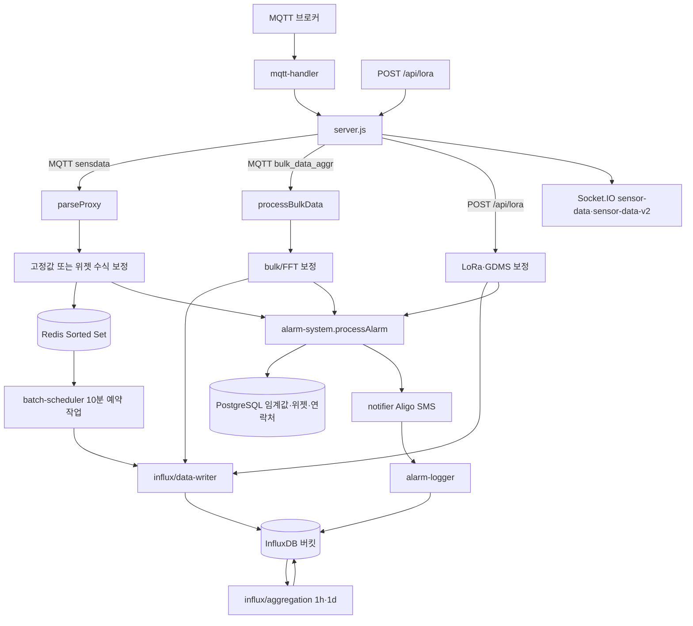
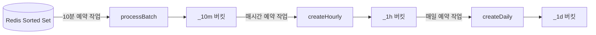
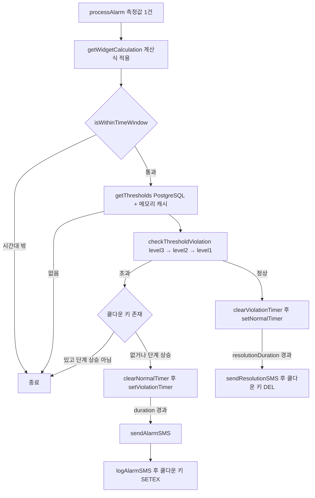

# 수집 서버 — 프로그램 명세

**작성 기준**: `collector/server.js`, `mqtt-handler.js`, `legacy-sensor-handler.js`, `redis-storage.js`, `batch-scheduler.js`, `parse/*`, `correction/*`, `influx/*`, `alarm/*`, `utils/*`

***

```
collector/                              
├── alarm/                              # 임계값 판정과 알람 발송
│   ├── alarm-config.js                 # 알람 발송 시간대와 항목 이름 설정
│   ├── alarm-logger.js                 # 발송한 알람을 InfluxDB에 기록
│   ├── alarm-system.js                 # 일반 센서 알람 판정과 타이머 관리
│   ├── config-loader.js                # 임계값·계산식·연락처 조회와 캐시 관리
│   ├── gdms-alarm.js                   # GDMS 데이터 알람 판정
│   ├── lora-alarm.js                   # LoRa 데이터 알람 판정
│   └── notifier.js                     # 알리고 SMS 발송과 문자 내용 구성
├── correction/                         # 센서 데이터 보정
│   ├── config.js                       # 위젯 보정 규칙 조회와 캐시 관리
│   ├── engine.js                       # 자릿수와 수식에 따른 보정값 계산
│   ├── fft.js                          # bulk/FFT 데이터 보정
│   ├── gdms.js                         # GDMS 행렬 데이터 보정
│   ├── lora.js                         # LoRa 데이터 보정
│   ├── mqtt.js                         # 일반 MQTT 데이터 보정
│   ├── queue.js                        # 장비별 보정 작업 순서 관리
│   └── state.js                        # 이전 보정값을 메모리에 보관
├── influx/                             # InfluxDB 저장과 집계
│   ├── aggregation.js                  # 시간·일 단위 데이터 재집계
│   ├── bucket-manager.js               # 시작할 때 설정된 버킷 생성
│   ├── bucket-utils.js                 # 버킷 이름 생성 규칙
│   ├── client.js                       # InfluxDB 연결과 버킷 관리
│   └── data-writer.js                  # 수집 유형별 데이터 변환과 저장
├── parse/                              # MQTT 메시지 형식 변환
│   ├── data-mapping.js                 # 센서 코드와 출력 항목 이름 연결
│   ├── legacy-sensor-parse.js          # 기존 센서 메시지 형식 변환
│   ├── parseProxy.js                   # 메시지 형식에 맞는 파서 선택
│   ├── sensdata-array-parse.js         # sensdata 배열 형식 변환
│   └── tempDataParse.js                # channels 배열 형식 변환
├── utils/                              # 데이터 검증과 공통 계산
│   ├── data-validator.js               # bulk/FFT 데이터 형식 검증
│   ├── fixed-value-normalizer.js       # 특정 센서의 고정값 보정
│   ├── gdms-data-fields.js             # GDMS 데이터 항목 이름 처리
│   ├── interval-parser.js              # 시간 간격 문자열을 밀리초로 변환
│   ├── lora-data-fields.js             # LoRa 데이터 항목 이름 처리
│   ├── sensor-calculation.js           # 위젯에 설정된 계산식 적용
│   └── timestamp.js                    # 수집 시간 형식 변환
├── batch-scheduler.js                  # 10분·시간·일 단위 예약 작업 실행
├── legacy-sensor-handler.js            # 기존 센서 ID의 별도 처리
├── mqtt-handler.js                     # MQTT 연결·구독과 메시지 전달
├── redis-storage.js                    # Redis 저장·조회와 오래된 데이터 정리
└── server.js                           # Express·Socket.IO 서버와 수집 처리 진입점
```

***

#### 1. 데이터 구조와 흐름

**1.1 전체 파이프라인**



**1.2 수신 인터페이스별 처리 분기**

| MQTT 토픽·API 엔드포인트                | 파서                               | Redis | InfluxDB | Socket.IO 이벤트        |
| -------------------------------- | -------------------------------- | ----- | -------- | -------------------- |
| `/geocus900/+/sensdata`          | `parseSensdataArray` 또는 기존 센서 파서 | 저장    | 10분 배치   | 기존 센서는 v1, 그 외 v1·v2 |
| `/catM1/+/sensdata`              | `parseSensdataArray`             | 저장    | 10분 배치   | v1·v2                |
| `bulk_data_aggr`                 | `parseBulkData` (통과)             | 없음    | 즉시 저장    | v1·v2                |
| `POST /api/lora`                 | 없음                               | 없음    | 즉시 저장    | v1·v2                |
| `POST /api/lora` (`isGdms=true`) | 없음                               | 없음    | 즉시 저장    | v1·v2                |

일반 MQTT 메시지는 파싱 후 위젯 수식 보정이 설정된 항목에는 해당 보정을 적용하고, 설정되지 않은 일부 센서 항목에는 고정값 보정을 적용한 뒤 Redis에 저장한다.

수집 서버는 `GET /health`, `POST /internal/clear-threshold-cache`, `POST /internal/reload-correction-cache` API 엔드포인트도 제공한다.

**1.3 수신 원본 형식**

**sensdata 배열형 — `/geocus900/+/sensdata`, `/catM1/+/sensdata`**

`parseSensdataArray`가 `data[]` 항목을 채널별로 묶어 `ch{N}` 형태로 변환한다.

```json
{
  "id": "geocus900_1002_01",
  "time": "2026-07-29 15:20:00",
  "data": [
    {
      "code": "WS",
      "channel": 2,
      "data": { "TEMP": 25.1, "WS": 3.2 }
    }
  ]
}
```

| 필드               | 비고                                          |
| ---------------- | ------------------------------------------- |
| `id`             | 장비 ID (필수)                                  |
| `time` / `date`  | KST 시간 문자열. `time` 우선, 없으면 `date` 사용        |
| `data[]`         | 필수 배열                                       |
| `data[].code`    | 센서 코드. `data`가 숫자면 `{ [code]: value }` 로 변환 |
| `data[].channel` | 채널 번호 → `ch{N}`                             |
| `data[].data`    | 객체 또는 숫자                                    |

날짜 문자열은 `YYYY-MM-DD HH:mm:ss`, `YYYY-MM-DD-HH:mm:ss`, `YYYY:MM:DD:HH:mm:ss` 등 구분자 `:` / `-` 혼용을 허용한다.

**bulk/FFT — MQTT `bulk_data_aggr`**

MQTT 메시지가 곧 `processBulkData` 입력이다. `validateBulkData`로 검증한다.

```json
{
  "id": "geocus900_1002_01",
  "channel": "ch1",
  "timestamp": "2026-07-29T06:20:00.000Z",
  "data": {
    "Z": { "mean": 123.4, "max": 130.0, "min": 120.0 },
    "naturalFreq": { "mean": 1.2, "max": 1.3, "min": 1.1, "naturalFreq": 2.5 }
  }
}
```

| 필드          | 비고                                                |
| ----------- | ------------------------------------------------- |
| `id`        | 장비 ID (필수, 문자열)                                   |
| `channel`   | 채널명 (필수, 문자열)                                     |
| `timestamp` | ISO 8601 (필수)                                     |
| `data`      | 필드명 → `{ mean, max, min }` 또는 `naturalFreq` 포함 객체 |

Socket.IO v2는 bulk `data` 객체를 그대로 전송한다. 채널 번호가 100 미만이면 원래 채널과 100을 더한 채널을 모두 전송하며, InfluxDB에는 100을 더한 채널로 저장한다.

**LoRa — `POST /api/lora`**

```json
{
  "key": "device_01",
  "isGdms": false,
  "data": {
    "time": 1722230400,
    "val01": "1.23",
    "val02": "4.56",
    "val03": "7.89",
    "val04": "0.12"
  }
}
```

| 필드           | 비고                                   |
| ------------ | ------------------------------------ |
| `key`        | 장비 ID. Influx 버킷은 `lora_{key}`       |
| `isGdms`     | `false` 또는 생략                        |
| `siteCode`   | 보정 규칙과 임계값을 조회할 현장 코드 (선택)           |
| `data.time`  | Unix epoch **초**                     |
| `data.valNN` | 각 항목을 별도 Point로 저장 (`field_name` 태그) |

**GDMS — `POST /api/lora` (`isGdms=true`)**

```json
{
  "key": "device_02",
  "isGdms": true,
  "data": {
    "time": 1722230400,
    "val01": [[1.1, 2.2], [3.3, 4.4]]
  }
}
```

| 필드           | 비고                                                                 |
| ------------ | ------------------------------------------------------------------ |
| `siteCode`   | 보정 규칙과 임계값을 조회할 현장 코드 (선택)                                         |
| `data.val01` | 2차원 배열. Influx `field_name=gdms`, `data=JSON.stringify(val01)`로 저장 |
| Socket.IO    | `sensor-data`, `sensor-data-v2` 이벤트로 전송                            |

**1.4 파싱 결과 공통 구조**

일반 MQTT 메시지는 `parseProxy.parseData`가 형식을 판별해 아래 구조로 통일한다. 기존 센서 ID는 전용 파서를 사용한다. Redis 저장, 알람 판정, Socket.IO 전송이 이 구조를 사용한다.

```json
{
  "id": "geocus900_1002_01",
  "time": "2026-07-29 15:20:00",
  "channels": [
    { "name": "ch2", "type": "real", "data": { "TEMP": 25.1, "WS": 3.2 } }
  ]
}
```

| 판별 조건         | 선택되는 파서              |
| ------------- | -------------------- |
| `data`가 배열    | `parseSensdataArray` |
| `channels` 배열 | `parseTempData`      |

`time`은 KST 문자열이며, Redis·배치 저장 시 UTC로 변환한다 (`Date.UTC(y, m-1, d, hour - 9, ...)`).

**1.5 Redis 저장 구조**

| 항목           | 값                                             |
| ------------ | --------------------------------------------- |
| 키            | `timeseries:{sensorId}:{channelName}`         |
| 자료형          | Redis Sorted Set(ZSET)                        |
| score        | UTC epoch **밀리초**                             |
| member       | JSON 문자열 `{ timestamp, ...필드 }`               |
| 키 유효 기간(TTL) | 없음                                            |
| 정리           | 저장과 같은 트랜잭션에서 `score <= timestampMs - 24h` 삭제 |

`storeSensorData`는 `zAdd`와 `zRemRangeByScore`를 `multi()` 트랜잭션으로 함께 실행한다.

알람 재알림 차단용 키도 Redis에 둔다.

| 키                                                          | 자료형    | 값     | TTL                  |
| ---------------------------------------------------------- | ------ | ----- | -------------------- |
| `alarm:cooldown:{sensorId}:{channel}:{dataKey}:{dataType}` | STRING | `'1'` | `cooldownDuration` 초 |

**1.6 InfluxDB 버킷 구조**

버킷 이름 규칙은 `influx/bucket-utils.js` `getBucketName(sensorId, channel, timeUnit)`에 있다.

| 대상         | 버킷 이름                                       | measurement                                                          |
| ---------- | ------------------------------------------- | -------------------------------------------------------------------- |
| 일반 MQTT 센서 | `{sensorId}_{channel}_{10m\|1h\|1d}`        | `sensor_10min_aggregated` / `hourly_aggregated` / `daily_aggregated` |
| 기존 MQTT 센서 | `{sensorId}_{10m\|1h\|1d}`                  | `sensor_10min_aggregated` / `hourly_aggregated` / `daily_aggregated` |
| bulk/FFT   | `{sensorId}_{channel}_{10m}` (채널 +100 보정 후) | `sensor_10min_aggregated`                                            |
| LoRa·GDMS  | `lora_{key}`                                | `sensor_10min_aggregated`                                            |
| 보정 전 원본    | 보정된 데이터와 같은 버킷                              | `sensor_raw`                                                         |
| 알람 이력      | `alarm-log`                                 | `alarm_log`                                                          |

기존 MQTT 센서는 `geocus900_1001_01`, `geocus900_1002_01`, `geocus900_1003_01`이며 채널별 버킷 대신 센서별 버킷을 사용한다. `sensor_id`, `channel_name` 태그로 센서와 채널을 구분한다.

측정 데이터의 태그·필드 구성이다.

| 구분          | 태그                                  | 필드                                                                                           |
| ----------- | ----------------------------------- | -------------------------------------------------------------------------------------------- |
| MQTT 10분 집계 | `field_name`                        | `mean`, `max`, `min`                                                                         |
| bulk/FFT    | `field_name`                        | `mean`, `max`, `min`, `naturalFreq`(있을 때)                                                    |
| LoRa        | `field_name` = `valNN`              | `mean`, `max`, `min` (동일값)                                                                   |
| GDMS        | `field_name` = `gdms`               | `data` (문자열)                                                                                 |
| 알람 이력       | `sensor_id`, `channel`, `site_code` | `data_key`, `alarm_level`, `value`, `receivers`, `message`, `threshold_min`, `threshold_max` |

보관 기간은 `alarm-log`가 90일, 그 외 자동 생성 버킷은 2년(`ensureBucket` 기본값)이며, `config/channel-aggregation-config.js`에 등록된 채널은 730일로 시작 시 생성된다.

bulk/FFT는 같은 10분 구간에 같은 `field_name`이 이미 있으면 건너뛴다(`getExistingFields` 조회 후 판단).

보정 규칙이 적용된 bulk/FFT와 LoRa 항목은 보정 전 값을 `sensor_raw`에도 저장한다. GDMS는 보정 규칙이 있거나 보정에 실패한 경우 보정 전 행렬 전체를 저장한다.

**1.7 집계 스케줄**



| 작업     | 실행 시각(cron 표현식)                         | 호출 함수                                                  | 처리                                                 |
| ------ | --------------------------------------- | ------------------------------------------------------ | -------------------------------------------------- |
| 10분 배치 | `3,13,23,33,43,53 * * * *` (Asia/Seoul) | `processBatch` → `influxManager.writeBatchData`        | Redis 최근 10분 구간을 읽어 센서·채널·10분 단위로 평균·최대·최소 계산 후 기록 |
| 시간 집계  | `{offset} * * * *` (기본 매시 05분)          | `createHourlyAggregation` → `aggregation.createHourly` | `_10m` 버킷을 Flux로 1시간 단위 재집계                        |
| 일 집계   | `{offset} 0 * * *` (기본 00:10)           | `createDailyAggregation` → `aggregation.createDaily`   | `_1h` 버킷을 Flux로 1일 단위 재집계                          |

10분 배치를 정각이 아니라 3분씩 밀어서 실행하는 이유는 늦게 도착한 데이터를 포함시키기 위한 것이다. 재집계 시 평균은 하위 단위 `mean`의 평균, 최대는 `max`의 최대, 최소는 `min`의 최소를 취한다.

**1.8 알람 판정 흐름**



판정 기준 데이터는 `sensor_thresholds` 테이블에서 읽는다.

| 컬럼                   | 의미                     | 알람 시스템에서의 해석                                     |
| -------------------- | ---------------------- | ------------------------------------------------ |
| `threshold_type`     | `min` / `max` / `both` | `max`는 초과, `min`은 미만, `both`는 범위 이탈              |
| `limit1` \~ `limit3` | 1\~3단계 기준값             | 높은 단계부터 검사                                       |
| `duration`           | 지속 시간                  | `violationDuration` (초)                          |
| `cooldown`           | 재알림 대기                 | `cooldownDuration`, `resolutionDuration` (분 → 초) |

상태는 메모리 Map에 `{sensorId}:{channel}:{dataKey}:{dataType}` 키로 보관하며 `violationTimer`, `normalTimer`, `lastAlarmSent`, `currentLevel`, `maxLevel`을 담는다.

| 상황         | 동작                                           |
| ---------- | -------------------------------------------- |
| 기준 초과 시작   | `setViolationTimer` — 기존 타이머는 교체된다           |
| 지속 중 정상 복귀 | `clearViolationTimer` — 통지하지 않는다             |
| 지속 중 단계 상승 | 타이머 재시작, 쿨다운 키 삭제 후 즉시 진행                    |
| 지속 시간 충족   | SMS 발송 → 이력 기록 → 쿨다운 키 `SETEX`               |
| 정상 지속      | `setNormalTimer` — `lastAlarmSent`가 있을 때만 설정 |
| 해제 시간 충족   | 해제 SMS → 쿨다운 키 삭제, 상태 초기화                    |

발송 시간대는 `alarm-config.js` `ALARM_CONFIG.global.alarmTimeWindow` 기준이며 기본값은 KST 06시\~18시다.

**1.9 통지 대상 결정**

`config-loader.getReceivers(siteCode, level)`가 `projects.alarm_contacts` JSONB에서 단계에 대응하는 차수를 읽는다.

| 알람 단계    | 연락처 키 | 문자 표기 |
| -------- | ----- | ----- |
| `level1` | `1차`  | 주의    |
| `level2` | `2차`  | 경고    |
| `level3` | `3차`  | 위험    |

`alarm_contacts` 구조는 `{ "1차": [...], "2차": [...], "3차": [...] }`이며 항목은 전화번호 문자열 또는 `{ name, phone }` 객체를 허용한다. 센서 이름·항목 이름은 `getSensorInfo`가 `sensor_widgets.options`에서 읽고, 없으면 `getDataKeyDisplayName`의 정적 표를 사용한다.

**1.10 Socket.IO 이벤트**

| 이벤트              | 시점       | 페이로드                                                                            |
| ---------------- | -------- | ------------------------------------------------------------------------------- |
| `latest-data`    | 접속 직후    | 센서 ID별 기존 형식의 최신 데이터 객체                                                         |
| `latest-data-v2` | 접속 직후    | `{ [sensorId]: { id, channels: [{ name, data: { field: { mean, time } } }] } }` |
| `sensor-data`    | 데이터 수신마다 | `{ id, time, channels: [{ name, type, data }] }`                                |
| `sensor-data-v2` | 데이터 수신마다 | `{ id, time, channels: [{ name, type, data: { field: { mean } \| bulk객체 } }] }` |

최신값은 v1과 v2 형식으로 각각 관리한다. v2는 센서별 채널 Map을 유지하고 필드 단위로 `time` 문자열을 비교해 더 최신 값만 갱신한다. 일반 MQTT 메시지는 숫자 값을 `{ mean: number }`로 감싼 뒤 v2로 전송한다.

***

#### 2. 관련 파일과 주요 함수

| 파일                                          | 역할                                             |
| ------------------------------------------- | ---------------------------------------------- |
| `collector/server.js`                       | Express + Socket.IO 진입점, MQTT·HTTP 분기, 최신값 Map |
| `collector/mqtt-handler.js`                 | 브로커 연결·구독·JSON 파싱 후 콜백 전달                      |
| `collector/redis-storage.js`                | ZSET 저장·조회, 24시간 정리                            |
| `collector/batch-scheduler.js`              | 10분·시간·일 단위 예약 작업                              |
| `collector/legacy-sensor-handler.js`        | 기존 센서 ID의 메시지를 별도 형식으로 처리                      |
| `collector/parse/parseProxy.js`             | 형식 판별 후 파서 선택                                  |
| `collector/parse/legacy-sensor-parse.js`    | 기존 센서 메시지 파싱                                   |
| `collector/parse/sensdata-array-parse.js`   | 배열형 sensdata 파싱                                |
| `collector/parse/tempDataParse.js`          | `channels` 배열 파싱                               |
| `collector/utils/fixed-value-normalizer.js` | 특정 센서·채널 수신값 보정                                |
| `collector/correction/*`                    | MQTT·bulk/FFT·LoRa·GDMS 데이터의 위젯 기반 보정          |
| `collector/influx/client.js`                | InfluxDB 연결, 버킷 확인·생성                          |
| `collector/influx/data-writer.js`           | 포인트 생성, 10분 집계, bulk·LoRa·GDMS 기록              |
| `collector/influx/aggregation.js`           | Flux 기반 시간·일 재집계                               |
| `collector/influx/bucket-utils.js`          | 버킷 이름 규칙                                       |
| `collector/influx/bucket-manager.js`        | 시작 시 설정 기준 버킷 생성                               |
| `collector/alarm/alarm-system.js`           | 판정 엔진, 타이머·쿨다운                                 |
| `collector/alarm/config-loader.js`          | 임계값·계산식·연락처 조회와 캐시                             |
| `collector/alarm/notifier.js`               | Aligo SMS 발송, 문자 본문 구성                         |
| `collector/alarm/alarm-logger.js`           | `alarm-log` 버킷 기록                              |
| `collector/alarm/alarm-config.js`           | 발송 시간대, 항목 이름 기본값                              |
| `collector/utils/interval-parser.js`        | `10m` 같은 문자열을 밀리초로 변환                          |
| `collector/utils/sensor-calculation.js`     | 위젯 계산식 적용                                      |
| `collector/utils/data-validator.js`         | bulk 데이터 검증                                    |

***

#### 3. 주요 함수 설명

**3.1 수신과 저장**

| 함수                                            | 위치                                | 설명                                                 |
| --------------------------------------------- | --------------------------------- | -------------------------------------------------- |
| `initMqttHandler(onMessage)`                  | `mqtt-handler.js`                 | 브로커 연결, 토픽 구독, 메시지 JSON 파싱 후 `(data, topic)` 콜백 호출 |
| `parseData(rawData)`                          | `parse/parseProxy.js`             | 형식 판별 후 파서 위임. 실패 시 `null`                         |
| `normalizeFixedValues(parsed)`                | `utils/fixed-value-normalizer.js` | `VALUE_FIX_RULES`에 따라 특정 센서 값 보정                   |
| `storeSensorData(parsed)`                     | `redis-storage.js`                | 채널별 ZSET에 저장하고 24시간 이전 member 삭제                   |
| `getAllSensorDataByTimeRange(startMs, endMs)` | `redis-storage.js`                | 전체 센서의 구간 데이터를 배치 입력용 배열로 반환                       |

**3.2 InfluxDB 기록**

| 함수                                           | 위치                       | 설명                                         |
| -------------------------------------------- | ------------------------ | ------------------------------------------ |
| `processBatch(client, list)`                 | `influx/data-writer.js`  | Redis 배치 목록을 10분 단위로 집계해 버킷별로 기록           |
| `processBulkData(client, bulkData)`          | `influx/data-writer.js`  | 검증 → 채널 보정 → 중복 필드 제외 후 기록                 |
| `processLoRaData(client, key, data)`         | `influx/data-writer.js`  | `valNN`을 항목별 포인트로 `lora_{key}`에 기록         |
| `processGdmsData(client, key, data)`         | `influx/data-writer.js`  | `val01`을 문자열 필드 하나로 기록                     |
| `aggregateSensorData(list)`                  | `influx/data-writer.js`  | 센서·채널·10분 구간으로 묶어 평균·최대·최소 산출              |
| `ensureBucket(name)`                         | `influx/client.js`       | 버킷이 없으면 생성하고 목록 캐시에 추가                     |
| `createHourly(client, endTime)`              | `influx/aggregation.js`  | `_10m` 데이터를 `_1h`로 재집계                     |
| `createDaily(client, endTime)`               | `influx/aggregation.js`  | `_1h` 데이터를 `_1d`로 재집계                      |
| `getBucketName(sensorId, channel, timeUnit)` | `influx/bucket-utils.js` | `{sensorId}_{channel}_{timeUnit}` 버킷 이름 생성 |

**3.3 알람**

| 함수                                           | 위치                       | 설명                                                                                  |
| -------------------------------------------- | ------------------------ | ----------------------------------------------------------------------------------- |
| `processAlarm(sensorData, dataType)`         | `alarm/alarm-system.js`  | 채널·항목별로 판정 절차 전체를 수행                                                                |
| `checkThresholdViolation(value, thresholds)` | `alarm/alarm-system.js`  | 높은 단계부터 검사해 `{ level, threshold }` 또는 `null` 반환                                     |
| `isWithinTimeWindow()`                       | `alarm/alarm-system.js`  | KST 기준 발송 허용 시간대 여부                                                                 |
| `setViolationTimer(...)`                     | `alarm/alarm-system.js`  | 지속 시간 타이머 설정, 만료 시 SMS·이력·쿨다운 처리                                                    |
| `setNormalTimer(...)`                        | `alarm/alarm-system.js`  | 해제 타이머 설정, 이전 경보가 있을 때만 동작                                                          |
| `getThresholds(...)`                         | `alarm/config-loader.js` | 임계값을 `{ level1..3: { min, max } }`로 변환. 캐시 키는 `siteCode:deviceId:ch:field:dataType` |
| `getAlarmTiming(...)`                        | `alarm/config-loader.js` | `violationDuration`, `cooldownDuration`, `resolutionDuration` 반환                    |
| `getWidgetCalculation(...)`                  | `alarm/config-loader.js` | 위젯 계산식과 표시 이름 조회 (TTL 60초)                                                          |
| `getReceivers(siteCode, level)`              | `alarm/config-loader.js` | 단계에 대응하는 차수의 전화번호 목록                                                                |
| `clearThresholdCache()`                      | `alarm/config-loader.js` | 임계값 캐시 초기화. `POST /internal/clear-threshold-cache`에서 호출                             |
| `sendAlarmSMS(...)`                          | `alarm/notifier.js`      | 문자 본문 구성, Aligo 발송, 이력 기록                                                           |
| `logAlarmSMS(...)`                           | `alarm/alarm-logger.js`  | `alarm-log` 버킷에 발송 내역 기록                                                            |

***

#### 4. 구현 시 주의사항

1. **bulk/FFT 채널 번호는 100이 더해진다.** 저장·조회 양쪽에서 같은 규칙을 적용해야 한다. 조회 측은 `isFft=true`로 같은 보정을 한다.
2. **LoRa 버킷 이름과 조회 식별자.** `key=device_01`로 수집했다면 버킷과 조회용 센서 ID는 모두 `lora_device_01`이다.
3. **타임스탬프 정밀도가 수집 유형별로 다르다.** MQTT 배치·bulk·재집계는 나노초, LoRa·GDMS는 밀리초 정밀도로 InfluxDB에 기록한다.
4. **보정 설정은 메모리에 캐시된다.** 위젯의 보정 설정을 변경한 뒤에는 `POST /internal/reload-correction-cache` API 엔드포인트를 호출해야 한다.

***

#### 5. 관련 문서

| 문서          | 내용                     |
| ----------- | ---------------------- |
| 관리-서버.md    | 임계값·연락처·위젯 설정과 테이블 스키마 |
| 센서-조회-서버.md | 저장된 데이터 조회 API         |
