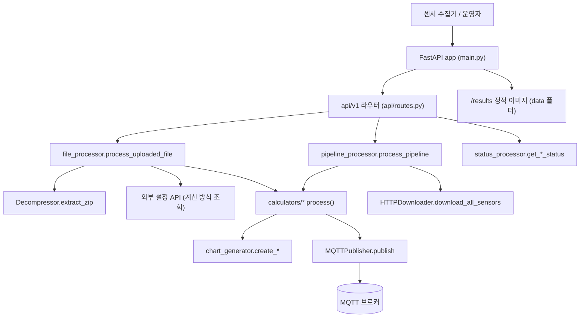
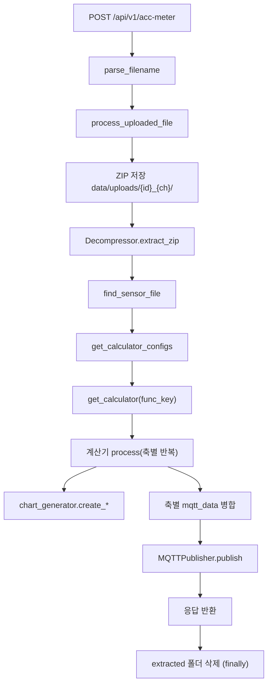
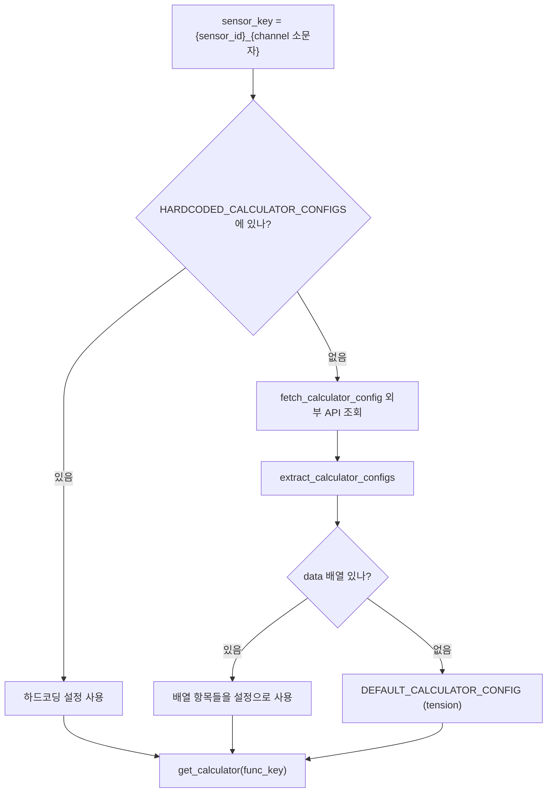
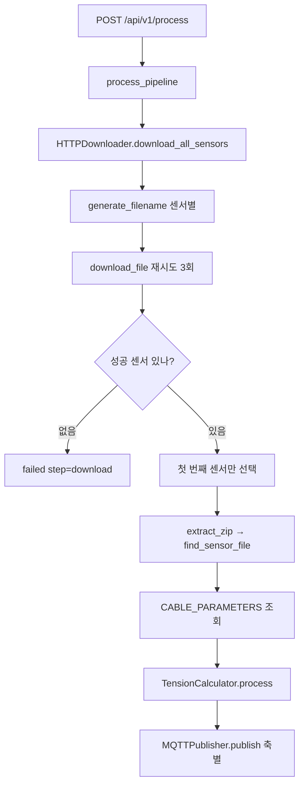

# 고주파 분석 서버 — 프로그램 명세

**작성 기준**: `app/main.py`, `app/api/routes.py`, `app/core/config.py`, `app/core/scheduler.py`, `app/utils/filename_parser.py`, `app/processors/{file_processor,pipeline_processor,status_processor,calculator_registry}.py`, `app/calculators/{tension,acceleration,raw_acceleration,demo}_calculator.py`, `app/services/{http_downloader,decompressor,mqtt_publisher,chart_generator,chart_plots}.py`

---

## 1. 데이터 구조와 흐름

### 1.1 요청 흐름



미들웨어는 등록하지 않는다. `main.py`가 하는 일은 라우터 등록(`prefix="/api/v1"`)과 `data` 폴더를 `/results`로 정적 제공하는 것뿐이다. `lifespan`에는 스케줄러 시작·정지 코드가 있으나 주석 처리되어 있어 실제로는 아무 것도 하지 않는다.

### 1.2 엔드포인트 구성

| 메서드·경로 | 라우터 함수 | 실제 처리 |
| --- | --- | --- |
| `POST /api/v1/acc-meter` | `upload_and_process_file` | `filename_parser.parse_filename` → `file_processor.process_uploaded_file` |
| `POST /api/v1/process` | `run_pipeline` | `pipeline_processor.process_pipeline` |
| `GET /api/v1/health` | `health_check` | `status_processor.get_health_status` |
| `GET /api/v1/status` | `get_status` | `status_processor.get_cable_status` |
| `GET /api/v1/system-status` | `get_system_status_endpoint` | `status_processor.get_system_status` |
| `GET /results/*` | — | `StaticFiles(directory="data")` |

### 1.3 업로드 처리 단계별 담당 함수



| 단계 | 사용 함수 | 위치 |
| --- | --- | --- |
| 파일명 해석 | `parse_filename()` | `utils/filename_parser.py` |
| 업로드 저장 | `process_uploaded_file()` 내부 | `processors/file_processor.py` |
| 압축 해제 | `Decompressor.extract_zip()` | `services/decompressor.py` |
| 데이터 파일 선별 | `find_sensor_file()` | `processors/file_processor.py` |
| 계산 방식 결정 | `get_calculator_configs()`, `get_calculator()` | `file_processor.py`, `calculator_registry.py` |
| 계산 실행 | `TensionCalculator.process()` 등 | `calculators/*.py` |
| 차트 생성 | `create_*_chart()` | `services/chart_generator.py` |
| 결과 발행 | `MQTTPublisher.publish()` | `services/mqtt_publisher.py` |
| 임시 폴더 정리 | `process_uploaded_file()`의 `finally` | `file_processor.py` |

같은 계산기의 여러 축 결과는 `merged_mqtt_data["data"].update()`로 한 메시지에 합쳐 **계산기 단위로 한 번** 발행한다.

### 1.4 계산 방식 결정 규칙



| 상황 | 사용 함수·상수 |
| --- | --- |
| 센서별 고정 설정을 쓸 때 | `core/config.py`의 `HARDCODED_CALCULATOR_CONFIGS` |
| 외부 설정 서버에 물어볼 때 | `file_processor.fetch_calculator_config()` (2회 재시도) |
| 채널 표기를 외부 규격으로 바꿀 때 | `file_processor.to_config_api_channel()` (`ch1` → `ch101`) |
| 응답에서 설정 목록만 뽑을 때 | `file_processor.extract_calculator_configs()` |
| `func_key`를 실제 함수로 바꿀 때 | `calculator_registry.get_calculator()` |

외부 설정 API: `http://34.57.227.15:3001/api/sensor-widgets/by-device-channel?deviceId=&channel=`, 타임아웃 10초.

`func_key` 매핑(`CALCULATOR_MAP`):

| `func_key` | 실행 클래스 | 산출 |
| --- | --- | --- |
| `tension_calculator` (기본값) | `TensionCalculator` | 장력 (kN) |
| `acceleration_calculator` | `AccelerationCalculator` | 고유진동수 + 가속도 통계 |
| `raw_acceleration_calculator` | `RawAccelerationCalculator` | 가속도 통계 |
| `demo_calculator` | `demo_calculator()` | 고정값 1.0 (설명용) |

현재 하드코딩된 센서 설정:

| `sensor_key` | 계산기 | 파라미터 |
| --- | --- | --- |
| `geocus900_1000_01_ch1` | `tension_calculator` | `CL11R`, L=16.775m, w=0.056kN/m |
| `geocus900_1000_01_ch2` | `tension_calculator` | `CL08R`, L=16.752m |
| `geocus900_1000_03_ch1` | `tension_calculator` | `CL05R`, L=16.824m |
| `geocus900_1000_03_ch2` | `tension_calculator` | `CL02R`, L=16.747m |
| `geocus900_1000_02_ch1`, `_ch2` | `acceleration_calculator` | 없음 |
| `geocus900_1003_01_ch1` | `raw_acceleration_calculator` | 없음 |

`CABLE_PARAMETERS`는 위 표에서 `tension_calculator` 항목만 추려낸 파생 상수로, `pipeline_processor`와 `test_user_zips.py`만 사용한다.

### 1.5 입력 파일명 규칙

```
{sensor_id}_{sensor_type}_{axes}_{channel}_{timestamp}.zip
예) geocus900_1000_01_tension_z_ch1_202603311450.zip
```

`parse_filename()`이 뒤에서부터 고정 위치로 잘라 내고, 남은 앞부분 전체를 `sensor_id`로 본다.

| 항목 | 검증 내용 | 실패 시 |
| --- | --- | --- |
| 필드 개수 | 언더스코어 분리 후 5개 이상 | `ValueError` → 400 |
| `timestamp` | 12자리 숫자 `YYYYMMDDHHMM` | `ValueError` → 400 |
| `channel` | `^ch\d+$` | `ValueError` → 400 |
| `sensor_type` | `acc` 또는 `tension` | `ValueError` → 400 |
| `axes` | `X`,`Y`,`Z` 조합 | 경고 로그만, 처리 계속 |
| `sensor_id` | 빈 문자열 아님 | `ValueError` → 400 |

반환값은 `sensor_id`, `channel`, `axes`, `is_tension_sensor`, `sensor_type`, `timestamp`, `data_format`(항상 `"auto"`)이다.

### 1.6 데이터 형식과 읽기 함수

ZIP 안에서 `find_sensor_file()`이 `.txt` 또는 `.json` 확장자 첫 파일을 고른다. 읽기는 계산기마다 별도 구현이며 `data_format` 값으로 분기한다.

| `data_format` | 호출 함수 |
| --- | --- |
| `"array"` | `parse_new_array_format()` |
| `"object"` | `_load_axis_from_file_original()` / `_load_acceleration_data_from_file_original()` |
| `"auto"` (기본) | `parse_new_array_format()` 시도 → 실패 시 `_..._original()` |

| 계산기 | 진입 함수 | 대체 경로 |
| --- | --- | --- |
| `TensionCalculator` | `load_axis_from_file()` | 줄 단위 JSON → pandas CSV |
| `AccelerationCalculator` | `load_acceleration_data_from_file()` | 전체 파일 JSON (x·y·z 키 필수) |
| `RawAccelerationCalculator` | `load_acceleration_data_from_file()` | 전체 파일 JSON (x·y·z 키 필수) |

데이터 형태:

```json
[{ "time": "...", "data": [[x, y, z], ...] }]
[{ "time": "...", "data": [{ "x": 0.1, "y": 0.2, "z": 0.3 }, ...] }]
```

`parse_new_array_format()`은 `json.loads()` 전에 `re.sub(r'(\d+)\s+(\d+)', r'\1\2', txt)`로 숫자 사이 공백을 붙여 깨진 JSON을 복구한다.

### 1.7 산출물 구조

| 계산기 | 차트 키 | 생성 함수 | 저장 폴더 |
| --- | --- | --- | --- |
| `TensionCalculator` | `time_plot` | `create_time_domain_chart` | `data/raw/{id}_{ch}/` |
| `TensionCalculator` | `fft_plot` | `create_yc_fft_summary_chart` | `data/fft/{id}_{ch}/` |
| `AccelerationCalculator` | `raw_plot` | `create_raw_time_chart` | `data/raw_acceleration/{id}_{ch}/` |
| `AccelerationCalculator` | `fft_plot` | `create_fft_chart` | `data/acceleration/{id}_{ch}/` |
| `RawAccelerationCalculator` | `raw_time_plot` | `create_raw_time_chart` | `data/raw_acceleration/{id}_{ch}/` |

| 항목 | 담당 함수 | 규칙 |
| --- | --- | --- |
| 파일명 생성 | 각 계산기의 `generate_result_filename()` | `{id}_{ch}_{timestamp}_{종류}_{축}.png` |
| 저장 경로 조립 | `TensionCalculator._build_plot_paths()`, 각 계산기 `_save_results_and_plots()` | 센서별 하위 폴더 |
| URL 변환 | 각 계산기 `_convert_chart_paths()` | `data/` → `/results/`, 실제 존재하는 파일만 |

`timestamp`는 압축 해제된 센서 파일명에서 12자리 숫자를 먼저 찾고, 없으면 ZIP 파일명의 마지막 토큰을 쓴다.

차트 공통 규격은 `chart_generator.generate_chart()`가 결정한다. `figsize=(10,2)`, `dpi=150`(=1500×300px), 제목·축 이름·범례 제거, 가로 눈금선만, 하단 테두리만 표시, `subplots_adjust(left=0.06, right=0.98, top=0.85, bottom=0.15)`. 실제 선 그리기는 `chart_plots._plot_*()`가 담당한다.

`create_yc_fft_summary_chart()`만 `generate_chart()`를 거치지 않고 `_plot_yc_fft_summary()`를 직접 호출한다(0~25Hz 확대, 회색 점=전체 피크, 빨간 점+라벨=회귀 채택 모드, 주황 삼각형=미채택 배음, 파란 점선=배음 위치).

### 1.8 MQTT 발행 규격

```json
{
  "id": "geocus900_1000_01",
  "channel": "ch1",
  "timestamp": "2026-03-31T14:50:00+09:00",
  "data": { "Z": { "max": 0.0, "min": 0.0, "mean": 0.0 } },
  "unit": "kN"
}
```

| 항목 | 값 |
| --- | --- |
| 브로커 | `34.57.227.15:1883` (코드 기본값) |
| 토픽 | `bulk_data_aggr` |
| 인증 | `MQTTPublisher.__init__`의 기본 인자 |
| 재시도 | 3회, 2초 간격 |
| 시각 생성 | 각 계산기 `_get_mqtt_timestamp()` — ZIP 파일명 시각을 KST로 변환, 실패 시 처리 시각 |

| 계산기 | `data` 내용 | `unit` |
| --- | --- | --- |
| `TensionCalculator` | `max`·`min`·`mean` 모두 장력값 동일 | `kN` |
| `AccelerationCalculator` | `naturalFreq`, `max`, `min`, `mean` | `Hz/g` |
| `RawAccelerationCalculator` | `max`, `min`, `mean` | `g` |

### 1.9 자동 수집 경로



| 상황 | 사용 함수 |
| --- | --- |
| 전체 센서를 훑어 내려받을 때 | `HTTPDownloader.download_all_sensors()` |
| 대상 파일명을 만들 때 | `HTTPDownloader.generate_filename()` (10분 내림 후 −10분) |
| 단건 다운로드·재시도 | `download_file()` → `_download_single_file()` |
| 중복 수신을 막을 때 | `_is_already_downloaded()`, `_update_sensor_last_download()` |
| 주기 실행을 걸 때 | `BackgroundScheduler.start()` (현재 호출 안 함) |

자동 다운로드 파일명은 `{id}_{type}_{channel}_{timestamp}.zip`로, 업로드 규칙과 달리 **축 필드가 없다.** 그래서 이 경로는 `parse_filename()`을 쓰지 않고 `settings.sensors`의 `axes` 값을 사용한다.

### 1.10 설정 기본값

| 구분 | 항목 | 기본값 | 정의 위치 |
| --- | --- | --- | --- |
| 수집 | `base_url` | `http://14.58.82.209:44000/zip_data/` | `Settings` |
| 수집 | 재시도·지연·타임아웃 | 3회 / 2초 / 30초 | `Settings` |
| 수집 | `cron_schedule` | `2,7,...,57 * * * *` | `Settings` |
| 장력 | 케이블 길이·단위중량 | 210.6m / 0.513kN/m | `CableParameters` |
| 장력 | 샘플링·필터 대역 | 50Hz / 0.5~22Hz | `CableParameters` |
| 장력 | 기본진동수 탐색·최대 배음 | 2~8Hz / 12차 | `CableParameters` |
| 가속도 | 필터 대역·차수 | 0.5~24.5Hz / 4차 | `AccelerationParameters` |
| 공통 | 중력 상수 | 9.80665 | 각 파라미터 dataclass |

외부·하드코딩 설정의 `params`는 `_normalize_params()` → `_coerce_param_value()`가 dataclass 필드에 맞게 덮어쓴다. 정의에 없는 키는 무시되고, 변환 실패는 `ValueError`가 된다.

---

## 2. 관련 파일과 주요 함수

### 2.1 기반 모듈

| 파일 | 역할 |
| --- | --- |
| `app/main.py` | FastAPI 앱 생성, 라우터 등록, `/results` 정적 제공, `lifespan` |
| `app/api/routes.py` | 엔드포인트 정의, 파일명 검증, 오류 코드 매핑 |
| `app/core/config.py` | `Settings`, `HARDCODED_CALCULATOR_CONFIGS`, `CABLE_PARAMETERS` |
| `app/core/scheduler.py` | `BackgroundScheduler` (cron 기반 주기 실행) |
| `app/utils/filename_parser.py` | 파일명 → 센서 파라미터 |
| `app/processors/file_processor.py` | 업로드 처리 전체 조립, 계산기 설정 조회 |
| `app/processors/pipeline_processor.py` | 자동 수집 처리 전체 조립 |
| `app/processors/status_processor.py` | 상태 조회 응답 구성 |
| `app/processors/calculator_registry.py` | `func_key` → 계산 함수 매핑 |
| `app/services/http_downloader.py` | 수집 서버 파일 다운로드 |
| `app/services/decompressor.py` | ZIP 검증·해제 |
| `app/services/mqtt_publisher.py` | MQTT 발행·재시도 |
| `app/services/chart_generator.py` | 차트 공통 스타일과 종류별 래퍼 |
| `app/services/chart_plots.py` | 차트별 실제 그리기 |

### 2.2 계산기

| 파일 | 클래스 | 공통 진입점 | 산출 |
| --- | --- | --- | --- |
| `calculators/tension_calculator.py` | `TensionCalculator` | `process()` → `calculate_tension()` | `tension_N`, `tension_kN`, `r_squared`, `modes_count` |
| `calculators/acceleration_calculator.py` | `AccelerationCalculator` | `process()` → `analyze_acceleration()` | `natural_freq`, `max_acc`, `min_acc`, `mean_acc` |
| `calculators/raw_acceleration_calculator.py` | `RawAccelerationCalculator` | `process()` → `analyze_raw_acceleration()` | `max_acc`, `min_acc`, `mean_acc` |
| `calculators/demo_calculator.py` | — | `demo_calculator()` | 고정값 |

세 계산기 모두 `process()`가 `{success, error_message, result, mqtt_data}` 형태를 돌려주므로, `file_processor`는 어떤 계산기든 같은 방식으로 다룬다. 새 계산기를 붙일 때 맞춰야 할 규약이 이 반환 형태다.

### 2.3 상황별 사용 함수

| 이런 경우 | 이 파일·함수를 쓴다 |
| --- | --- |
| 업로드 한 건을 처음부터 끝까지 처리 | `file_processor.process_uploaded_file()` |
| 파일명에서 센서 정보 얻기 | `filename_parser.parse_filename()` |
| 파일명 유효성만 확인 | `filename_parser.validate_filename()` |
| ZIP 풀기 | `Decompressor.extract_zip()` |
| 풀린 파일 중 데이터 파일 고르기 | `file_processor.find_sensor_file()` |
| 어떤 계산을 할지 결정 | `file_processor.get_calculator_configs()` |
| 외부 설정 서버 조회 | `file_processor.fetch_calculator_config()` |
| `func_key`로 함수 얻기 | `calculator_registry.get_calculator()` |
| 장력 구하기 | `TensionCalculator.process()` |
| 고유진동수 구하기 | `AccelerationCalculator.process()` |
| 가속도 통계만 구하기 | `RawAccelerationCalculator.process()` |
| 축 데이터 배열 얻기 | 각 계산기 `load_*_from_file()` |
| 시간 그래프 만들기 | `create_time_domain_chart()` / `create_raw_time_chart()` |
| FFT 그래프 만들기 | `create_fft_chart()` / `create_yc_fft_summary_chart()` |
| 차트 스타일 바꾸기 | `chart_generator.generate_chart()`, `chart_plots._plot_*()` |
| 차트 경로를 화면용 URL로 바꾸기 | 각 계산기 `_convert_chart_paths()` |
| 발행용 시각 만들기 | 각 계산기 `_get_mqtt_timestamp()` |
| 결과 발행 | `MQTTPublisher.publish()` |
| 수집 서버에서 파일 받기 | `HTTPDownloader.download_all_sensors()` |
| 자동 수집 한 바퀴 돌리기 | `pipeline_processor.process_pipeline()` |
| 서버·수집 상태 확인 | `status_processor.get_health_status()` / `get_cable_status()` / `get_system_status()` |
| 주기 실행 켜기 | `main.lifespan`의 `scheduler.start()` 주석 해제 |
| **새 계산 방식 추가** | `calculators/`에 `process()` 규약을 지키는 클래스 추가 → `calculator_registry.CALCULATOR_MAP`에 `func_key` 등록 |
| **새 차트 종류 추가** | `chart_plots._plot_*()` 추가 → `generate_chart()`에 분기 추가 → `create_*_chart()` 래퍼 추가 |
| **센서별 파라미터 변경** | `core/config.HARDCODED_CALCULATOR_CONFIGS` 수정, 또는 외부 설정 API 값 변경 |
| **수집 대상 센서 변경** | `core/config.Settings.sensors` 수정 |
| **MQTT 접속 정보 변경** | `MQTTPublisher.__init__` 기본 인자 수정 |
| 실제 흐름을 MQTT 없이 시험 | `scripts/test_upload_processor.py` |
| 장력 계산만 파일로 시험 | `test_user_zips.py` |

---

## 3. 주요 함수 설명

### 3.1 진입·조립

| 함수 | 위치 | 설명 |
| --- | --- | --- |
| `upload_and_process_file()` | `api/routes.py` | 파일명 파싱 실패는 400, 처리 결과의 오류 문구에 데이터 품질 키워드가 있으면 400, 나머지는 500으로 매핑 |
| `process_uploaded_file()` | `file_processor.py` | 저장 → 해제 → 계산기 결정 → 축별 계산 → 병합 발행 → 응답 조립. `finally`에서 `extracted` 폴더 삭제 |
| `process_pipeline()` | `pipeline_processor.py` | 전체 센서 다운로드 후 성공한 첫 센서 하나만 장력 계산·발행 |
| `run_scheduled_pipeline()` | `main.py` | `httpx`로 자기 자신의 `/api/v1/process`를 호출 |
| `get_cable_status()` / `get_system_status()` / `get_health_status()` | `status_processor.py` | 기본 케이블 파라미터, 센서·스케줄러 상태, 헬스체크 |

### 3.2 설정·파싱

| 함수 | 위치 | 설명 |
| --- | --- | --- |
| `parse_filename()` | `filename_parser.py` | 역순 고정 위치 파싱. 앞부분 전체를 `sensor_id`로 결합 |
| `to_config_api_channel()` | `file_processor.py` | `ch{n}` → `ch{n+100}` 변환 |
| `fetch_calculator_config()` | `file_processor.py` | `urlopen` 2회 시도, 최종 실패는 예외 전파 |
| `extract_calculator_configs()` | `file_processor.py` | 응답의 `data` 배열 우선, 없으면 응답 자체, 그것도 아니면 기본 설정 |
| `get_calculator_configs()` | `file_processor.py` | 하드코딩 우선, 없으면 외부 조회 |
| `get_calculator()` | `calculator_registry.py` | 미등록 `func_key`는 `tension_calculator`로 대체 |
| `_normalize_params()` / `_coerce_param_value()` | 각 계산기 | 외부 dict를 파라미터 dataclass로 정규화 |

### 3.3 데이터·계산

| 함수 | 위치 | 설명 |
| --- | --- | --- |
| `extract_zip()` | `decompressor.py` | `testzip()` 검증 후 `data/extracted/{파일명}/`에 해제, 파일 목록 반환 |
| `load_axis_from_file()` | `tension_calculator.py` | 배열형 → 줄 단위 JSON → CSV 순서로 시도 |
| `load_acceleration_data_from_file()` | 가속도 계산기 2종 | 배열형 → 전체 JSON 순서로 시도 |
| `calculate_tension()` | `tension_calculator.py` | 장력 산출. 실패해도 `_save_time_plot()`으로 시간 그래프는 남긴다 |
| `analyze_acceleration()` | `acceleration_calculator.py` | 고유진동수와 가속도 통계 산출 |
| `analyze_raw_acceleration()` | `raw_acceleration_calculator.py` | 가속도 통계만 산출 |
| `process()` | 각 계산기 | 공통 응답 형태(`result` + `mqtt_data`)로 감싸 반환 |

### 3.4 출력

| 함수 | 위치 | 설명 |
| --- | --- | --- |
| `generate_chart()` | `chart_generator.py` | 크기·눈금·테두리·여백 등 공통 스타일 적용 후 저장 |
| `create_*_chart()` | `chart_generator.py` | 종류별 `config` 구성 래퍼 |
| `_plot_*()` | `chart_plots.py` | 종류별 실제 그리기 |
| `generate_result_filename()` | 각 계산기 | 센서·시각·종류·축을 담은 PNG 파일명 생성 |
| `_build_plot_paths()` | `tension_calculator.py` | `raw`·`fft` 폴더 경로 조립 및 생성 |
| `publish()` | `mqtt_publisher.py` | 접속 → 발행 → 종료를 3회까지 재시도 |
