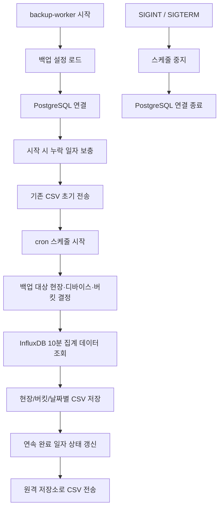
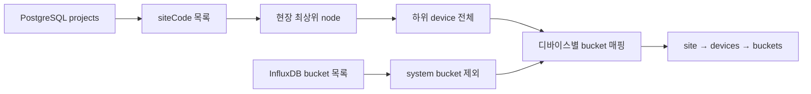
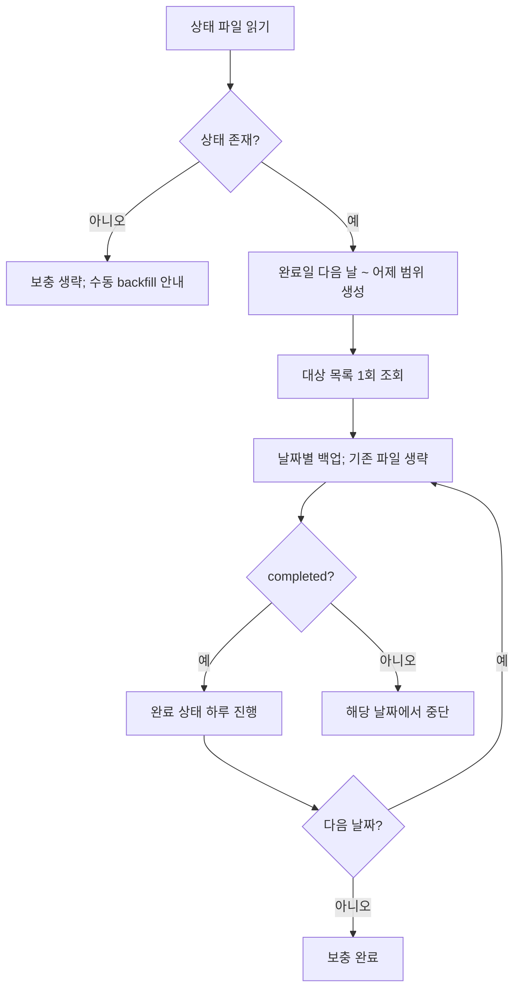

# 백업 워커 — 프로그램 명세

**작성 기준**: `backup-worker/index.js`, `config.js`, `scheduler.js`, `backup-runner.js`, `target-resolver.js`, `influx-data-reader.js`, `csv-file-writer.js`, `backup-state.js`, `catch-up.js`, `date-range.js`, `backfill.js`, `rsync-transfer.js`

***

### 1. 데이터 구조와 흐름

#### 1.1 전체 실행 흐름



백업 워커는 HTTP 요청을 받는 서버가 아니라 독립 실행되는 배치 프로세스다. PostgreSQL의 현장·디바이스 메타데이터와 InfluxDB 버킷 목록을 결합해 백업 대상을 결정하고, InfluxDB의 `sensor_10min_aggregated` 데이터를 CSV로 저장한 뒤 `rsync`로 원격 저장소에 전송한다.

#### 1.2 기본 설정

| 항목            | 현재 동작           |
| ------------- | --------------- |
| 실행 여부         | 활성화             |
| 백업 주기         | 일 단위            |
| 정기 실행 시각      | 매일 00:12        |
| 기준 시간대        | `Asia/Seoul`    |
| 출력 형식         | CSV             |
| 로컬 출력 경로      | `/data/backups` |
| 원격 전송         | 활성화             |
| 전송 방식         | SSH 기반 `rsync`  |
| 전송 후 로컬 파일 삭제 | 비활성화            |

`buildCron(period, hour, minute)`은 다음 주기를 지원한다.

| 주기        | cron 규칙      |
| --------- | ------------ |
| `daily`   | 매일 지정 시각     |
| `weekly`  | 매주 월요일 지정 시각 |
| `monthly` | 매월 1일 지정 시각  |

현재 설정은 `daily`이며, 누락분 보충과 완료 상태 관리는 일 단위 백업을 전제로 한다.

#### 1.3 백업 대상 결정



1. `projectRepo.getAll()`을 100개 단위로 반복 호출해 전체 프로젝트를 읽는다.
2. 프로젝트의 `site_code`를 중복 제거해 현장 목록을 만든다.
3. 현장별 최상위 노드를 조회한다.
4. 최상위 노드의 전체 하위 디바이스를 조회한다.
5. InfluxDB 버킷을 100개 단위로 조회하고 시스템 버킷을 제외한다.
6. 디바이스 ID와 채널 설정을 기준으로 백업 버킷을 연결한다.

최종 대상 구조는 다음과 같다.

```json
[
  {
    "siteCode": "현장 코드",
    "devices": [
      {
        "deviceId": "디바이스 ID",
        "buckets": ["백업 대상 버킷"]
      }
    ]
  }
]
```

#### 1.4 디바이스별 버킷 규칙

| 디바이스 유형       | 버킷 결정 규칙                                       |
| ------------- | ---------------------------------------------- |
| `geocus900_*` | 활성 채널의 socket마다 `{deviceId}_ch{socket}_10m` 생성 |
| `catm1_*`     | 활성 채널의 socket마다 `{deviceId}_ch{socket}_10m` 생성 |
| 일반 디바이스       | 버킷명이 `deviceId`와 같은 경우 연결                      |
| LoRa 디바이스     | 버킷명이 `lora_{deviceId}`인 경우 연결                  |

채널 기반 디바이스는 숫자 socket만 사용하며, 비활성 채널과 중복 socket은 제외한다. 일반 디바이스에 버킷을 연결할 때는 ID 접두사가 겹치는 경우 더 긴 디바이스 ID를 우선한다.

#### 1.5 백업 기간과 파일 구조

정기 일일 백업은 실행일 자정 직전까지의 이전 하루를 대상으로 한다.

예를 들어 `Asia/Seoul` 기준 2026-09-28 00:12에 실행하면 다음 구간을 조회한다.

```
startTime: 2026-09-27 00:00:00 KST
endTime:   2026-09-28 00:00:00 KST
fileName:  20260927.csv
```

출력 파일은 다음 구조로 저장한다.

```
/data/backups/
├─ {siteCode}/
│  ├─ {bucketName}/
│  │  ├─ 20260926.csv
│  │  ├─ 20260927.csv
│  │  └─ ...
│  └─ ...
└─ .daily-backup-state.json
```

`siteCode`, `bucketName`, `fileName`은 경로 구분자, `.`·`..`, NUL 문자를 허용하지 않는다.

#### 1.6 InfluxDB 조회와 CSV 생성

버킷마다 다음 조건으로 Flux 질의를 실행한다.

```flux
from(bucket: bucketName)
  |> range(start: startTime, stop: endTime)
  |> filter(fn: (r) => r._measurement == "sensor_10min_aggregated")
```

InfluxDB 클라이언트의 CSV line iterator를 스트림으로 받아 파일에 순차 기록한다. 전체 결과를 메모리에 적재하지 않는다.

파일 생성 절차는 다음과 같다.

1. 대상 디렉터리를 재귀적으로 생성한다.
2. UUID가 포함된 임시 파일을 `wx` 모드로 생성한다.
3. 각 CSV line 뒤에 줄바꿈을 붙여 스트림으로 기록한다.
4. 결과가 0줄이면 임시 파일을 삭제하고 `empty`로 처리한다.
5. 결과가 있으면 임시 파일을 최종 파일명으로 rename한다.
6. 실패 시 임시 파일을 삭제한다.

`skipExisting=true`인 보충 실행에서는 최종 파일이 이미 존재하면 내용을 검증하거나 덮어쓰지 않고 `skipped`로 처리한다.

#### 1.7 실행 결과 상태

버킷별 결과 상태는 다음과 같다.

| 상태        | 의미                   |
| --------- | -------------------- |
| `success` | CSV 파일 저장 성공         |
| `empty`   | 조회 결과가 없어 파일을 만들지 않음 |
| `skipped` | 기존 CSV가 있어 생략        |
| `failed`  | 조회 또는 파일 저장 실패       |

전체 실행 상태는 버킷별 결과에서 계산한다.

| 전체 상태       | 조건                     |
| ----------- | ---------------------- |
| `completed` | 대상 결과가 있고 `failed`가 없음 |
| `partial`   | 일부 버킷만 실패              |
| `failed`    | 모든 버킷이 실패              |
| `skipped`   | 백업 대상 결과가 없음           |

`empty`와 `skipped`는 실패로 계산하지 않으므로, 실패 버킷이 없으면 전체 실행은 `completed`가 된다.

#### 1.8 완료 상태와 시작 시 누락분 보충

마지막 연속 완료 일자는 출력 루트의 `.daily-backup-state.json`에 저장한다.

```json
{
  "lastCompletedDate": "2026-09-27",
  "updatedAt": "ISO 8601 시각"
}
```

상태 파일은 임시 파일을 먼저 쓴 뒤 rename하는 방식으로 갱신한다. 기존 완료일보다 이전 날짜는 무시하고, 기존 완료일의 바로 다음 날짜가 아니면 `date-gap`으로 상태를 진행하지 않는다.

프로세스 시작 시 누락분 보충은 다음과 같이 동작한다.



상태 파일이 없으면 자동 보충을 시작하지 않는다. 먼저 수동 backfill을 실행해 기준 완료일을 만들어야 한다.

#### 1.9 원격 CSV 전송

원격 전송은 `rsync`를 별도 셸 없이 인자 배열로 실행한다. 전송 대상은 CSV 파일만 포함하며 상태 파일과 그 외 파일은 제외한다.

주요 옵션은 다음과 같다.

| 옵션                                               | 목적                   |
| ------------------------------------------------ | -------------------- |
| `-rt`                                            | 디렉터리 재귀 전송과 수정시각 보존  |
| `--partial-dir=.rsync-partial`                   | 중단된 파일의 부분 전송 데이터 보존 |
| `--prune-empty-dirs`                             | 빈 디렉터리 제외            |
| `--include=*/`, `--include=*.csv`, `--exclude=*` | CSV 파일만 전송           |
| `BatchMode=yes`                                  | 비대화형 SSH 실행          |
| `StrictHostKeyChecking=yes`                      | 등록된 호스트 키 검증         |

프로세스 시작 시 기존 CSV를 한 번 전송하고, 이후 정기 백업 실행이 끝날 때마다 다시 전송한다. 로컬 파일 삭제 옵션은 현재 꺼져 있으므로 전송 성공 후에도 CSV가 남는다.

#### 1.10 수동 backfill

수동 backfill은 날짜 범위를 일 단위로 나누고 동일한 백업 runner를 재사용한다.

```bash
npm run backfill:backup -- --start=YYYY-MM-DD [--end=YYYY-MM-DD] [--transfer] [--overwrite]
```

| 옵션            | 설명                           |
| ------------- | ---------------------------- |
| `--start`     | 첫 백업 날짜. 필수                  |
| `--end`       | 마지막 백업 날짜. 생략하면 백업 시간대 기준 어제 |
| `--transfer`  | 전체 작업 후 CSV 원격 전송            |
| `--overwrite` | 기존 CSV를 덮어씀                  |
| `--help`      | 사용법 출력                       |

대상 현장·버킷은 backfill 시작 시 한 번만 조회한다. 날짜별 실행이 `completed`이면 완료 상태를 진행하지만, 한 날짜라도 실패하면 이후 날짜의 상태는 진행하지 않는다. 백업 파일 생성 자체는 남은 날짜까지 계속 수행한다.

***

### 2. 관련 파일과 주요 함수

| 파일                                       | 역할                                   |
| ---------------------------------------- | ------------------------------------ |
| `backup-worker/index.js`                 | 의존성 조립, 시작 시 보충·초기 전송, 스케줄 시작, 종료 처리 |
| `backup-worker/config.js`                | 백업 주기·시간대·출력·원격 전송 설정                |
| `backup-worker/scheduler.js`             | cron 등록과 프로세스 내 중복 실행 방지             |
| `backup-worker/backup-runner.js`         | 대상 버킷 순회, 조회·CSV 저장, 결과 집계           |
| `backup-worker/target-resolver.js`       | PostgreSQL 현장·디바이스와 InfluxDB 버킷 연결   |
| `backup-worker/influx-data-reader.js`    | 10분 집계 measurement의 Flux 조회          |
| `backup-worker/csv-file-writer.js`       | CSV 스트림 파일 저장과 원자적 rename            |
| `backup-worker/date-range.js`            | 시간대 기준 일·주·월 백업 구간 계산                |
| `backup-worker/backup-state.js`          | 마지막 연속 완료일 조회·갱신                     |
| `backup-worker/catch-up.js`              | 프로세스 시작 시 누락된 일일 백업 보충               |
| `backup-worker/backfill.js`              | 수동 날짜 범위 백업 CLI                      |
| `backup-worker/rsync-transfer.js`        | SSH 기반 원격 CSV 전송                     |
| `backup-worker/adapters/placeholders.js` | 초기 골격용 미사용 placeholder adapter       |

***

### 3. 주요 함수 설명

#### 3.1 진입과 스케줄

| 함수                                | 위치             | 설명                                          |
| --------------------------------- | -------------- | ------------------------------------------- |
| `main()`                          | `index.js`     | PostgreSQL 연결, 구성요소 조립, 시작 시 보충·전송, cron 시작 |
| `loadBackupConfig()`              | `config.js`    | 백업과 원격 전송 설정 객체 생성                          |
| `buildCron(period, hour, minute)` | `config.js`    | 일·주·월 주기를 cron 문자열로 변환                      |
| `createBackupScheduler(...)`      | `scheduler.js` | 스케줄 객체 생성                                   |
| `execute(trigger)`                | `scheduler.js` | 실행 중 플래그를 확인한 뒤 백업 실행                       |
| `start()` / `stop()`              | `scheduler.js` | cron 작업 등록·종료                               |

#### 3.2 대상·조회·파일

| 함수                              | 위치                      | 설명                                    |
| ------------------------------- | ----------------------- | ------------------------------------- |
| `resolveTargets()`              | `target-resolver.js`    | 현장별 디바이스와 백업 버킷 목록 구성                 |
| `listAllProjects(...)`          | `target-resolver.js`    | 프로젝트를 페이지 단위로 전체 조회                   |
| `createInfluxBucketLister(...)` | `target-resolver.js`    | 시스템 버킷을 제외한 InfluxDB 버킷 목록 조회기 생성     |
| `assignBucketsToDevices(...)`   | `target-resolver.js`    | 디바이스 종류와 ID 규칙으로 버킷 연결                |
| `createChannelBucketNames(...)` | `target-resolver.js`    | 채널 기반 디바이스의 `_ch{socket}_10m` 버킷명 생성  |
| `buildBucketRangeQuery(...)`    | `influx-data-reader.js` | 버킷·기간·measurement Flux 질의 생성          |
| `iterateCsvLines(...)`          | `influx-data-reader.js` | InfluxDB CSV line async iterator 반환   |
| `run(...)`                      | `backup-runner.js`      | 모든 대상 버킷을 순차 백업하고 실행 상태 반환            |
| `writeCsvFile(...)`             | `csv-file-writer.js`    | async iterable을 임시 파일에 기록 후 최종 경로로 이동 |
| `validatePathSegment(...)`      | `csv-file-writer.js`    | 파일 경로 segment 검증                      |

#### 3.3 날짜·상태·보충

| 함수                                | 위치                | 설명                           |
| --------------------------------- | ----------------- | ---------------------------- |
| `createBackupDateRange(...)`      | `date-range.js`   | 실행 시각과 주기로 백업 구간·파일명 생성      |
| `createDailyBackupDateRange(...)` | `date-range.js`   | 지정 날짜 하루의 백업 구간 생성           |
| `parseCalendarDate(...)`          | `date-range.js`   | `YYYY-MM-DD` 형식과 실제 달력 날짜 검증 |
| `addCalendarDays(...)`            | `date-range.js`   | 달력 날짜를 일 단위 이동               |
| `readBackupState(...)`            | `backup-state.js` | 완료 상태 파일 조회·검증               |
| `advanceBackupState(...)`         | `backup-state.js` | 날짜 연속성을 확인해 상태 파일 원자적 갱신     |
| `runStartupCatchUp(...)`          | `catch-up.js`     | 완료일 다음 날부터 어제까지 순차 보충        |
| `parseBackfillArgs(...)`          | `backfill.js`     | 수동 backfill CLI 옵션 파싱·검증     |
| `enumerateDailyRanges(...)`       | `backfill.js`     | 시작·종료 날짜를 일일 백업 구간으로 전개      |
| `runBackfill(...)`                | `backfill.js`     | 전체 날짜 백업, 상태 갱신, 선택적 전송 실행   |

#### 3.4 전송

| 함수                            | 위치                  | 설명                      |
| ----------------------------- | ------------------- | ----------------------- |
| `validateTransferConfig(...)` | `rsync-transfer.js` | 호스트·사용자·경로·SSH 키 설정 검증  |
| `buildRsyncArgs(...)`         | `rsync-transfer.js` | CSV 전용 rsync·SSH 인자 생성  |
| `createRsyncTransfer(...)`    | `rsync-transfer.js` | 소스 경로 확인 후 rsync 실행기 생성 |
| `run()`                       | `rsync-transfer.js` | CSV 전송과 결과 상태 반환        |

***

### 4. 실행 명령

| 명령                                              | 용도                |
| ----------------------------------------------- | ----------------- |
| `npm run dev:backup-worker`                     | nodemon 기반 개발 실행  |
| `npm run start:backup-worker`                   | 백업 워커 실행          |
| `npm run backfill:backup -- --start=YYYY-MM-DD` | 지정 날짜부터 수동 백필     |
| `npm run test:backup-worker`                    | 백업 워커 Node 테스트 실행 |

***

### 5. 구현·운영 시 주의사항

1. **자동 누락분 보충은 상태 파일이 있어야 시작된다.** 최초 운영 또는 기존 백업 이관 시 수동 backfill로 `.daily-backup-state.json`을 먼저 만들어야 한다.
2. **완료 상태는 날짜가 연속될 때만 진행한다.** 중간 날짜가 빠지면 이후 백업이 성공해도 `date-gap`으로 상태가 유지된다.
3. **빈 조회와 기존 파일 생략은 성공으로 취급한다.** 실제 데이터가 있어야 하는 버킷이 `empty`여도 전체 상태가 `completed`가 될 수 있으므로 운영 모니터링에서 경고 로그를 확인해야 한다.
4. **기존 파일의 완전성은 검사하지 않는다.** `skipExisting`은 파일 존재 여부만 확인한다. 불완전한 파일을 다시 만들려면 수동 backfill에 `--overwrite`를 사용해야 한다.
5. **중복 실행 방지는 단일 프로세스 범위다.** 정기 스케줄의 겹침은 막지만, 별도 워커 프로세스나 수동 backfill과의 동시 실행은 막지 않는다.
6. **일일 상태·보충 로직과 주기 설정을 함께 변경해야 한다.** 날짜 범위 함수는 주·월 단위를 지원하지만 상태 파일과 catch-up은 일일 백업을 전제로 한다.
7. **원격 전송 실패와 백업 완료 상태는 별개다.** CSV 생성 후 상태를 먼저 갱신하고 rsync를 실행한다. 전송이 실패해도 로컬 CSV가 유지되며 다음 시작 또는 정기 실행에서 다시 전송된다.
8. **상태 파일은 원격 전송 대상이 아니다.** rsync 필터가 CSV만 포함하므로 장애 복구 시 상태 파일은 별도로 복원하거나 backfill 기준일을 다시 설정해야 한다.
9. **설정은 코드 상수다.** 실행 주기, 출력 경로, 전송 대상과 SSH 설정을 바꾸려면 `config.js`를 변경하고 프로세스를 재시작해야 한다.
10. **외부 실행 환경이 필요하다.** 로컬 출력 경로 쓰기 권한, PostgreSQL·InfluxDB 연결, `rsync`와 `ssh`, 원격 호스트 키 및 SSH 키 파일이 준비되어야 한다.

***

### 6. 관련 문서

| 문서                 | 내용                                           |
| ------------------ | -------------------------------------------- |
| 관리 서버 — 프로그램 명세    | 현장·노드·디바이스 메타데이터와 PostgreSQL Repository      |
| 수집 서버 — 프로그램 명세    | `sensor_10min_aggregated` 생성과 InfluxDB 버킷 규칙 |
| 센서 조회 서버 — 프로그램 명세 | 저장된 InfluxDB 센서 데이터 조회 방식                    |
| 서버 개요              | 전체 서버 구성과 데이터 저장소 관계                         |
