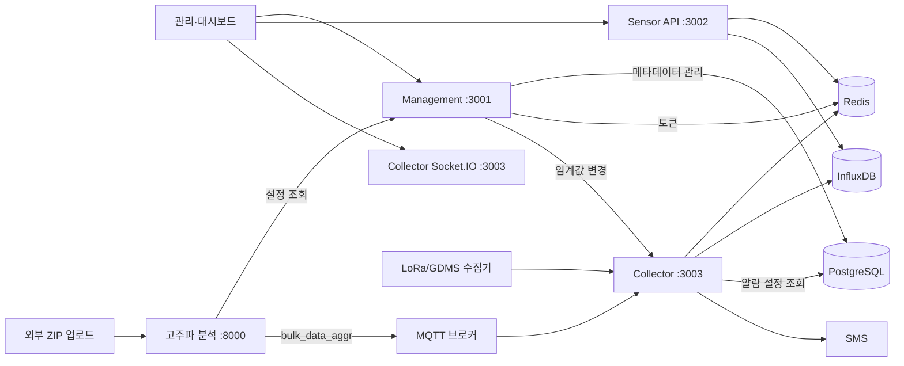

# 서버 개요

### 서버 구성

| 서버         | 폴더            | 기본 포트 | 비고                |
| ---------- | ------------- | ----- | ----------------- |
| Management | `management/` | 3001  |                   |
| Sensor API | `sensor-api/` | 3002  |                   |
| Collector  | `collector/`  | 3003  |                   |
| 고주파 분석     | `fft`         | 8000  | **별도 호스트**에서 운영 중 |

***

### Management (관리 서버)

관리 화면용 **메타데이터·인증·알람 설정** API다. 현장·노드·장비·위젯·임계값·사용자를 PostgreSQL에 등록·조회·수정·삭제하고, 알람 이력은 InfluxDB에서 조회한다. **측정값은 저장·수집하지 않는다.**

**주요 API 엔드포인트**

| 영역       | API 엔드포인트                                     | 용도                                |
| -------- | --------------------------------------------- | --------------------------------- |
| 인증       | `/api/auth`                                   | 로그인·토큰 갱신·로그아웃 (JWT + Redis)      |
| 현장·계층    | `/api/projects`, `/api/nodes`, `/api/folders` | 현장, PostgreSQL ltree 기반 노드 트리, 폴더 |
| 장비       | `/api/devices`                                | 노드·폴더에 연결된 장비·채널 등록·조회·수정·삭제      |
| 장비·센서 유형 | `/api/device-types`, `/api/sensor-types`      | 장비·센서 유형 관리                       |
| 화면       | `/api/sensor-widgets`, `/api/cctv-cameras`    | 대시보드 위젯, CCTV                     |
| 알람       | `/api/thresholds`, `/api/alarm-logs`          | 임계값 등록·조회·수정·삭제, 발송 이력 조회         |
| 기타       | `/api/users`, `/api/blueprint`                | 계정, 조감도 이미지                       |

**하는 일**

* PostgreSQL 메타데이터 **쓰기·조회** (데이터 접근 계층)
* Access/Refresh Token 발급, Redis에 Refresh Token·로그아웃 토큰 목록 관리
* 임계값 변경·삭제 후 Collector `POST /internal/clear-threshold-cache` 호출
* InfluxDB `alarm-log` 버킷에서 알람 이력 조회
* 고주파 분석 서버가 위젯 **설정 조회** (`/api/sensor-widgets/by-device-channel`)

**하지 않는 일**

* MQTT·LoRa **수집** (Collector)
* 센서 측정값 Redis/Influx **저장** (Collector)
* 실시간·기간 **조회 API**(Sensor API), Socket.IO 데이터 전송(Collector)
* 알람 **SMS 발송** (Collector)
* 고주파 ZIP **계산·발행** (고주파 분석)

**알아두면 좋은 것**

* 화면 표시 단위는 **`sensor_widgets` 1행, 즉 위젯 1개**다. 채널·계산식·측정 항목은 `options` JSONB에 있다.
* \*\*`sensor_thresholds`\*\*가 Collector 알람 판정의 기준이다. 임계값을 변경·삭제하면 Collector의 임계값 캐시를 비운다. 위젯을 등록·수정·삭제하면 보정식 캐시를 다시 불러온다.
* 설비 계층(`projects`→`devices`)과 표시 계층(`sensor_widgets`)은 외래 키(FK) 없이 `site_code`·`device_id`·`channel`로 맞춘다. 상세는 관리-서버.md, erd.md.

***

### Collector (수집 서버)

센서 데이터가 들어오는 **수집 서버**다. MQTT·HTTP로 측정값을 받아 Redis에 실시간 저장하고, InfluxDB에 집계 기록하며, 임계값 초과 시 SMS를 보내고 Socket.IO로 대시보드에 전송한다.

**데이터 수집 인터페이스**

| 수집 방식 | MQTT 토픽·API 엔드포인트                            | 처리                                                       |
| ----- | -------------------------------------------- | -------------------------------------------------------- |
| MQTT  | `/geocus900/+/sensdata`, `/catM1/+/sensdata` | 파싱 → 값 보정 → Redis → 알람 → Socket.IO                       |
| MQTT  | `bulk_data_aggr`                             | InfluxDB 즉시 저장 → 알람(FFT) → Socket.IO                     |
| HTTP  | `POST /api/lora`                             | LoRa/GDMS → InfluxDB. LoRa와 GDMS는 알람·Socket.IO 처리 규칙이 다름 |

**하는 일**

* 수신 데이터 파싱·특정 센서 값 보정(`normalizeFixedValues`)
* PostgreSQL에서 임계값·위젯·연락처 **읽어** 알람 판정, SMS 발송, `alarm-log` 버킷 기록
* Socket.IO로 연결 시 `latest-data`·`latest-data-v2`, 수집 시 `sensor-data`·`sensor-data-v2` 전송
* 고주파 분석 서버가 MQTT `bulk_data_aggr`로 보낸 **집계 결과** 수신·저장

**하지 않는 일**

* 현장·장비·위젯·임계값 **등록·조회·수정·삭제** (Management)
* 기간·실시간 **조회 API** (Sensor API)
* 사용자 **인증**, PostgreSQL **쓰기**
* 고주파 ZIP **계산** (고주파 분석)

**알아두면 좋은 것**

* 알람은 `sensor_thresholds`, `sensor_widgets.options`, `projects.alarm_contacts`만 사용한다. `devices` 테이블은 조회하지 않는다.
* 일반 센서 데이터(sensdata)·고주파 집계 데이터(bulk/FFT)·LoRa·GDMS마다 Redis 저장·알람 처리 여부가 다르다. 상세는 수집-서버.md.

***

### Sensor API (센서 조회 서버)

대시보드용 **조회·보정·날씨** API다. Collector가 Redis·InfluxDB에 넣어 둔 데이터를 읽어 응답하고, 수동 보정 입력만 InfluxDB에 직접 기록한다. **데이터를 수집하지 않는다.**

**주요 API 엔드포인트**

| API 엔드포인트                     | 저장소      | 용도                         |
| ----------------------------- | -------- | -------------------------- |
| `GET /api/sensors/range`      | InfluxDB | 기간별 집계 조회 (10분 / 1시간 / 1일) |
| `GET /api/sensors/realtime`   | Redis    | 최근 N시간 원본 + 구간 통계          |
| `GET /api/latest/:sensorId`   | Redis    | 센서 최신 1건                   |
| `POST /api/sensors/overwrite` | InfluxDB | 수동 보정(데이터 덮어쓰기)            |
| `POST /api/weather`           | 기상청 API  | 위·경도 기준 날씨 (메모리 캐시)        |

**하는 일**

* Redis Sorted Set(ZSET)·InfluxDB 버킷 **읽기** (Collector 저장 규칙과 동일한 파라미터 사용)
* 보정 API로 InfluxDB에 mean/max/min(또는 GDMS 문자열) **쓰기**
* 한국 표준시(KST) 변환, LoRa·FFT·테스트 데이터에 따른 버킷 선택

**하지 않는 일**

* MQTT·HTTP **수집** (Collector)
* 현장·장비·위젯·임계값 **등록·조회·수정·삭제** (Management)
* PostgreSQL 접근, **알람 발송**, WebSocket
* 고주파 ZIP **계산** (고주파 분석)

**알아두면 좋은 것**

* `isFft`, `isLora`, `isTest`, `isGdms` 등은 Collector가 **저장할 때** 쓴 규칙과 짝을 맞춰야 한다. 틀리면 빈 결과나 잘못된 버킷을 조회한다.
* Redis는 일반 센서 데이터를 약 24시간 보관한다. 그 이전 구간은 InfluxDB를 사용하는 `range` API로 조회한다.
* 상세는 센서-조회-서버.md.

***

### 고주파 분석 (고주파 분석 서버)

외부 수집기가 HTTP로 올린 **고주파 ZIP**을 받아 장력·가속도·FFT를 계산하고, 결과를 MQTT로 Collector에 넘긴다. Python FastAPI로 동작하며 **Management·Collector·Sensor API와 다른 호스트**에서 운영한다.

**주요 API 엔드포인트**

| 영역  | API 엔드포인트                                                       | 용도                            |
| --- | --------------------------------------------------------------- | ----------------------------- |
| 업로드 | `POST /api/v1/acc-meter`                                        | ZIP 수신 → 압축 해제 → 계산 → MQTT 발행 |
| 상태  | `GET /api/v1/health`, `/api/v1/status`, `/api/v1/system-status` | 헬스·케이블·시스템 상태                 |
| 차트  | `GET /results/*`                                                | 계산 과정에서 생성한 PNG 정적 제공         |

**하는 일**

* 외부에서 API로 전달된 ZIP 파일명 파싱·검증
* Management `/api/sensor-widgets/by-device-channel`에서 **계산 방식 설정 조회** (하드코딩 설정이 없을 때)
* 장력(`tension_calculator`)·가속도(`acceleration_calculator`)·원시 가속도(`raw_acceleration_calculator`) 계산
* 시간·FFT 차트 PNG를 로컬 `data/`에 저장
* 계산 결과를 MQTT 토픽 `bulk_data_aggr`로 발행 → Collector bulk/FFT 경로로 유입

**하지 않는 일**

* 현장·장비·위젯·임계값 **등록·조회·수정·삭제** (Management)
* PostgreSQL·Redis·InfluxDB **직접 접근**
* MQTT sensdata·LoRa **수신**, 알람 **SMS**, WebSocket
* 대시보드용 기간·실시간 **조회 API** (Sensor API)

**알아두면 좋은 것**

* 입력 ZIP 파일명 규칙: `{sensor_id}_{sensor_type}_{axes}_{channel}_{timestamp}.zip` (예: `geocus900_1000_01_tension_z_ch1_202603311450.zip`).
* Management는 **설정 조회만** 사용한다. 위젯 `options`의 `func_key`로 계산기를 고르고, 조회 실패 시 기본값(`tension_calculator`) 또는 `HARDCODED_CALCULATOR_CONFIGS`를 쓴다.
* MQTT 메시지는 Collector `bulk_data_aggr` 수신 규격과 같다. Sensor API에서 조회할 때는 `isFft=true` 등 Collector 저장 규칙과 맞춰야 한다.
* 차트는 이 서버 로컬 디스크에만 있으며, 대시보드 시계열과는 별개다.

***

### 서버 간 관계

설정·수집·조회·고주파 계산이 서버별로 나뉜다. **측정값은 Management를 거치지 않는다.** 일반 센서 데이터는 MQTT → Collector → Redis·InfluxDB로 흐르고, 고주파 집계 데이터는 MQTT → Collector → InfluxDB로 흐른다. Sensor API 또는 Socket.IO를 통해 이 데이터를 조회한다.

| 방향                            | 내용                                                                  |
| ----------------------------- | ------------------------------------------------------------------- |
| Management → Collector        | 임계값 저장·삭제 후 `POST /internal/clear-threshold-cache`로 알람 캐시 무효화       |
| Management → PostgreSQL       | 현장·장비·위젯·임계값·사용자 등 **쓰기**                                           |
| 고주파 분석 → Management           | 위젯 설정 **조회** (`/api/sensor-widgets/by-device-channel`)              |
| Collector → PostgreSQL        | `sensor_thresholds`, `sensor_widgets`, `projects` 등 **읽기만** (알람 판정) |
| 고주파 분석 → MQTT → Collector     | 계산 결과 `bulk_data_aggr` 발행 → InfluxDB 즉시 저장·알람(FFT)·Socket.IO 전송     |
| Collector → Redis / InfluxDB  | 수집 데이터 **쓰기**, 10분·1h·1d 집계                                         |
| Sensor API → Redis / InfluxDB | **읽기** 중심. 수동 보정만 Influx에 쓰기                                        |
| Sensor API ↔ Collector        | HTTP 호출 없음. **같은 Redis·Influx 규칙**을 공유                              |
| Sensor API ↔ 고주파 분석           | HTTP 호출 없음. **Collector가 저장한 bulk/FFT 데이터**를 InfluxDB에서 조회          |

저장소별 키·버킷·테이블 상세는 아래 저장소 역할 참고.

***

### 저장소 역할

| 저장소              | 이 프로젝트에서 담당하는 것                      | 주로 쓰는 서버                                   |
| ---------------- | ------------------------------------ | ------------------------------------------ |
| PostgreSQL       | 현장·장비·위젯·임계값 등 **메타데이터**             | Management (쓰기·읽기), Collector (읽기)         |
| Redis            | MQTT 수신 직후 **실시간 캐시**, 인증 토큰, 알람 쿨다운 | Collector, Management, Sensor API          |
| InfluxDB         | 센서 **시계열 집계 저장**, 알람 발송 이력           | Collector (쓰기), Sensor API·Management (읽기) |
| 로컬 디스크 (`data/`) | 고주파 계산 **차트 PNG**, 업로드 ZIP 임시 보관     | 고주파 분석                                     |

센서 **측정값 본문**은 PostgreSQL에 두지 않는다. 메타데이터는 PostgreSQL, 최근 원본은 Redis, 장기·집계 데이터는 InfluxDB, 고주파 차트는 분석 서버 로컬 디스크에 저장한다.

#### PostgreSQL

관계형 DB다. 테이블·외래 키(FK)·JSONB 컬럼으로 **현장 구조와 화면·알람 설정**을 저장한다. 트랜잭션과 스키마가 필요한 관리 데이터에 적합하다.

**이 프로젝트에서의 사용**

* **Management** — 등록·조회·수정·삭제의 기준 저장소. `management/database/pg-client.js`가 연결·스키마 초기화(`initializeTables`)를 담당하고, 기능별 데이터 접근 계층이 SQL을 실행한다.
* **Collector** — 알람 판정 시 **읽기 전용**. `sensor_thresholds`, `sensor_widgets`, `projects`(연락처 등)를 조회한다. 측정값은 저장하지 않는다.
* **고주파 분석** — Management API를 통해 위젯 설정 **조회만**. DB 직접 연결 없음.
* **Sensor API** — 사용하지 않는다.

**주요 데이터**

| 구분    | 테이블 예                                                   | 용도                             |
| ----- | ------------------------------------------------------- | ------------------------------ |
| 설비 계층 | `projects`, `nodes`, `folders`, `devices`               | 현장 트리, 장비 등록, MQTT `device_id` |
| 표시·알람 | `sensor_widgets`, `sensor_thresholds`                   | 위젯·계산식, 1\~3단계 임계값             |
| 기타    | `users`, `cctv_cameras`, `device_types`, `sensor_types` | 계정, CCTV, 종류 마스터               |

설비 계층과 표시 계층(`sensor_widgets`)은 외래 키(FK)로 직접 연결되지 않고, `site_code`·`device_id`·`channel` 문자열로 수집 데이터와 맞춘다. 상세 스키마는 erd.md 참고.

#### Redis

메모리 기반 키-값 저장소. 디스크 DB보다 **빠른 읽기·쓰기**에 맞고, TTL·Sorted Set(ZSET) 등으로 **최근 데이터 캐시·순위·시간 범위 조회**에 쓴다. 이 프로젝트는 `config/config.js`의 `REDIS_URL`(기본 `redis://localhost:6379`) 하나를 공유한다.

**이 프로젝트에서의 사용**

| 용도              | 키 패턴                                                       | 서버                     | 설명                                                                   |
| --------------- | ---------------------------------------------------------- | ---------------------- | -------------------------------------------------------------------- |
| 센서 실시간 캐시       | `timeseries:{sensorId}:{channel}`                          | Collector → Sensor API | ZSET. score는 UTC 밀리초, member는 측정 JSON. MQTT 파싱 직후 저장하며 **약 24시간** 유지 |
| 알람 재발송 차단       | `alarm:cooldown:{sensorId}:{channel}:{dataKey}:{dataType}` | Collector              | STRING, TTL=쿨다운 시간(초)                                                |
| Refresh Token   | `refresh_token:{userId}`                                   | Management             | STRING, TTL 7일                                                       |
| Access Token 폐기 | `blacklist:{token}`                                        | Management             | 로그아웃 시 남은 만료까지 블랙리스트                                                 |

* **Collector** (`collector/redis-storage.js`) — 수집 데이터 저장·10분 배치 입력용 구간 조회·보존 기간 정리.
* **Sensor API** (`sensor-api/data-access/redis-reader.js`) — `/api/sensors/realtime`, `/api/latest/:sensorId` 등 **읽기만**.
* **Management** (`management/services/token-service.js`) — 인증 토큰.
* **고주파 분석** — 사용하지 않는다.

Redis에 없는 **24시간 이전** 구간은 Sensor API의 InfluxDB 기간 조회 API를 이용한다.

#### InfluxDB 2.x

시계열(time-series) DB다. InfluxDB **2.x**는 조직(Org)·버킷(Bucket)·토큰(Token) 인증과 **Flux** 쿼리를 사용한다. 측정값을 시간 축으로 쌓고, 구간별 평균·최대·최소 같은 **집계 데이터 보관**에 적합하다.

**이 프로젝트에서의 사용**

| 구분          | 버킷·측정값(measurement)                                                | 쓰기                                                       | 읽기                              |
| ----------- | ------------------------------------------------------------------ | -------------------------------------------------------- | ------------------------------- |
| MQTT 센서 집계  | `{sensorId}_{channel}_{10m\|1h\|1d}` / `sensor_10min_aggregated` 등 | Collector (10분 배치 → 시간·일 단위 재집계)                         | Sensor API `/api/sensors/range` |
| bulk/FFT    | 위와 동일 (채널 +100 보정)                                                 | **고주파 분석** → MQTT `bulk_data_aggr` → **Collector 즉시 저장** | Sensor API (`isFft=true`)       |
| LoRa / GDMS | `lora_{key}`                                                       | Collector (`POST /api/lora`)                             | Sensor API (`isLora`, `isGdms`) |
| 알람 이력       | `alarm-log` / `alarm_log` (보관 90일)                                 | Collector (`alarm/alarm-logger.js`)                      | Management `/api/alarm-logs`    |
| 수동 보정       | 위 센서 버킷과 동일                                                        | Sensor API `POST /api/sensors/overwrite`                 | —                               |

bulk/FFT 데이터는 고주파 분석 서버가 ZIP을 계산한 뒤 MQTT로 보내고, Collector가 `bulk_data_aggr` 토픽에서 받아 Influx에 기록한다. 이후 Sensor API는 Collector와 동일한 버킷·채널 규칙(`isFft=true`, 채널 +100)으로 조회한다.

* **Collector** — Redis 10분 배치 집계, bulk/LoRa/GDMS 즉시 기록, Flux 기반 1시간·1일 단위 재집계(`collector/influx/`). 버킷이 없으면 생성한다(기본 보관 약 2년).
* **Sensor API** — 기간 조회·보정 쓰기. 조회 시 `isFft`·`isLora`·`isTest` 등은 Collector **저장 규칙과 동일**해야 한다.
* **Management** — 알람 로그 조회만 InfluxDB 사용. 메타데이터는 PostgreSQL.
* **고주파 분석** — InfluxDB에 직접 쓰지 않는다. MQTT 발행만 한다.

연결 설정은 `config/config.js`의 `influxdb`(url, token, org, orgId)를 따른다.

***

### 상세 문서

| 문서          | 내용                 |
| ----------- | ------------------ |
| 관리-서버.md    | Management 프로그램 명세 |
| 수집-서버.md    | Collector 프로그램 명세  |
| 센서-조회-서버.md | Sensor API 프로그램 명세 |
| erd.md      | PostgreSQL ERD     |
