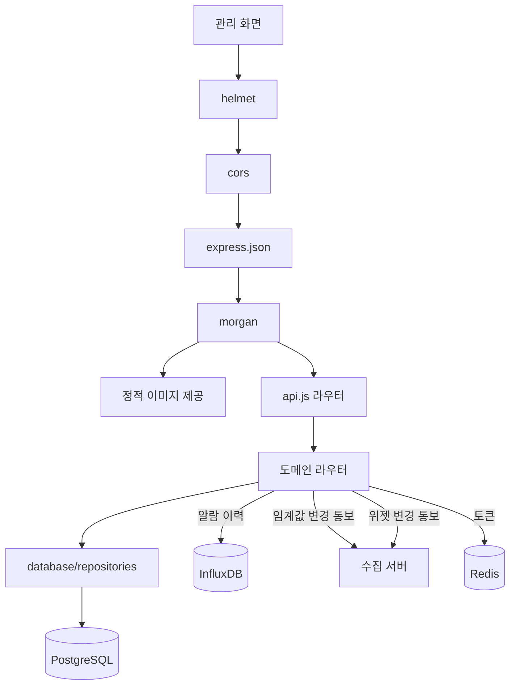
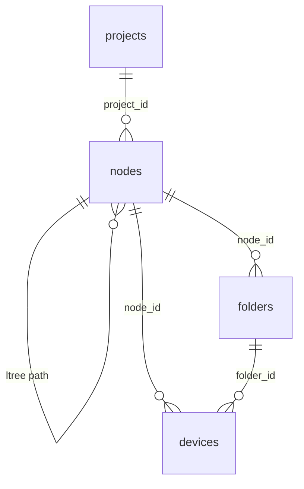
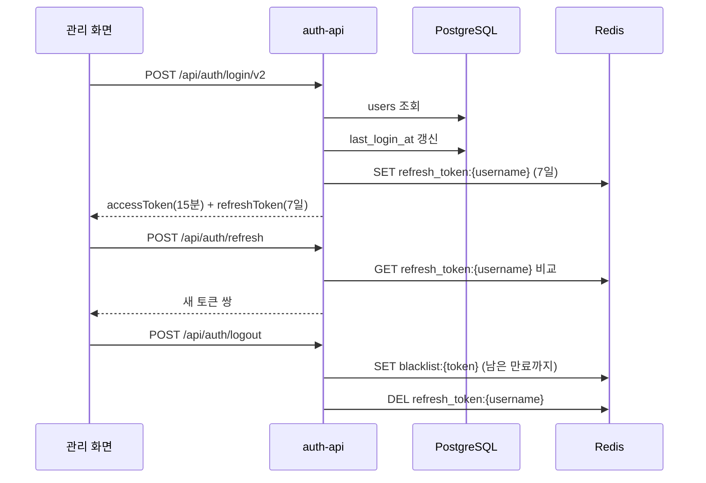
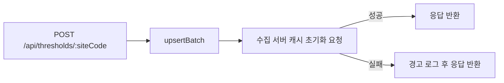

# 관리 서버 — 프로그램 명세

**작성 기준**: `management/server.js`, `api.js`, `database/pg-client.js`, `database/repositories/*`, `auth-api/*`, `middleware/auth.js`, `services/token-service.js`, 도메인별 `*-api/index.js`

```
management/
├── alarm-log-api/                              # 알람 이력 조회 API
│   └── index.js                                # InfluxDB 알람 로그 조회·응답 변환
├── auth-api/                                   # 로그인·로그아웃·토큰 API
│   ├── index.js                                # 인증 엔드포인트 등록
│   ├── login-v2.js                             # PostgreSQL 사용자 로그인
│   └── login.js                                # 코드에 등록된 기존 사용자 로그인
├── blueprint-api/                              # 조감도 이미지 API
│   └── index.js                                # 이미지 업로드와 프로젝트 경로 갱신
├── cctv-camera-api/                            # CCTV 카메라 관리 API
│   └── index.js                                # 카메라 등록·조회·수정·삭제·순서 변경
├── database/                                   # PostgreSQL 연결과 데이터 접근
│   ├── repositories/                           # 테이블별 SQL 처리
│   │   ├── cctv-camera-repository.js           # CCTV 카메라 데이터 처리
│   │   ├── device-repository.js                # 장비 데이터 처리
│   │   ├── device-type-repository.js           # 장비 유형 데이터 처리
│   │   ├── folder-repository.js                # 폴더 데이터 처리
│   │   ├── index.js                            # Repository 모듈 모음
│   │   ├── node-repository.js                  # 노드 계층 데이터 처리
│   │   ├── project-repository.js               # 현장 데이터 처리
│   │   ├── sensor-type-repository.js           # 센서 유형 데이터 처리
│   │   ├── sensor-widget-repository.js         # 센서 위젯 데이터 처리
│   │   ├── threshold-repository.js             # 임계값 데이터 처리
│   │   └── user-repository.js                  # 사용자 데이터 처리
│   └── pg-client.js                            # DB 연결 풀·스키마 초기화·트랜잭션
├── device-api/                                 # 장비 관리 API
│   └── index.js                                # 장비·채널 등록·조회·수정·삭제
├── device-type-api/                            # 장비 유형 관리 API
│   └── index.js                                # 장비 유형 등록·조회·수정·삭제
├── folder-api/                                 # 장비 분류용 폴더 API
│   └── index.js                                # 폴더 등록·조회·수정·삭제
├── influx-bucket-api/                          # InfluxDB 버킷 관리 API
│   └── index.js                                # 버킷 생성·조회·삭제
├── middleware/                                 # Express 요청 처리 미들웨어
│   └── auth.js                                 # JWT 검증과 역할 확인
├── node-api/                                   # 현장 노드 계층 API
│   └── index.js                                # 노드 트리 조회·등록·이동·삭제
├── project-api/                                # 현장 관리 API
│   └── index.js                                # 현장 정보와 화면 설정 관리
├── sensor-type-api/                            # 센서 유형 관리 API
│   └── index.js                                # 센서 유형 등록·조회·수정·삭제
├── sensor-widget-api/                          # 대시보드 위젯 관리 API
│   └── index.js                                # 위젯 관리와 수집 서버 캐시 갱신 요청
├── services/                                   # 인증 관련 공통 로직
│   ├── password-service.js                     # 비밀번호 해시 생성·검증
│   └── token-service.js                        # JWT 발급·검증과 Redis 토큰 관리
├── threshold-api/                              # 센서 임계값 관리 API
│   └── index.js                                # 임계값 관리와 수집 서버 캐시 초기화 요청
├── user-api/                                   # 사용자 관리 API
│   └── index.js                                # 사용자 등록·조회·수정·삭제
├── api.js                                      # 도메인별 API 라우터 연결
└── server.js                                   # 관리 서버 시작과 공통 미들웨어 설정
```

***

#### 1. 데이터 구조와 흐름

**1.1 요청 흐름**



미들웨어는 `helmet` → `cors` → `express.json` → `morgan` → `/images/blueprint` 정적 이미지 제공 → OPTIONS 처리 순서로 등록된다. 서버 시작 시 PostgreSQL에 연결해 `initializeTables()`로 테이블·인덱스·트리거를 확인하고, 위젯 채널 캐시를 미리 적재한다.

**1.2 API 라우터 구성**

| API 엔드포인트             | 라우터                 | 주 대상 테이블             |
| --------------------- | ------------------- | -------------------- |
| `/api/auth`           | `auth-api`          | `users`              |
| `/api/projects`       | `project-api`       | `projects`           |
| `/api/nodes`          | `node-api`          | `nodes`              |
| `/api/folders`        | `folder-api`        | `folders`            |
| `/api/devices`        | `device-api`        | `devices`            |
| `/api/device-types`   | `device-type-api`   | `device_types`       |
| `/api/sensor-types`   | `sensor-type-api`   | `sensor_types`       |
| `/api/sensor-widgets` | `sensor-widget-api` | `sensor_widgets`     |
| `/api/thresholds`     | `threshold-api`     | `sensor_thresholds`  |
| `/api/cctv-cameras`   | `cctv-camera-api`   | `cctv_cameras`       |
| `/api/users`          | `user-api`          | `users`              |
| `/api/blueprint`      | `blueprint-api`     | `projects` + 파일 시스템  |
| `/api/alarm-logs`     | `alarm-log-api`     | InfluxDB `alarm-log` |
| `/api/influx`         | `influx-bucket-api` | InfluxDB 버킷          |

화면 표시 단위는 \*\*`sensor_widgets`(위젯)\*\*이다. 채널·측정 항목·계산식·표시명은 모두 위젯의 `options` JSONB에 저장한다.

**1.3 테이블 관계**



`device_types`, `sensor_types`, `sensor_widgets`, `sensor_thresholds`, `cctv_cameras`, `users`는 외래 키로 연결되지 않은 독립 테이블이다. `sensor_widgets`는 `site_code`와 `options` JSONB의 `deviceId`·`channel` 문자열로 `devices`·수집 데이터와 논리적으로 연결된다.

구조는 두 계층으로 나뉜다.

| 계층    | 경로                                           | 용도                           |
| ----- | -------------------------------------------- | ---------------------------- |
| 설비 계층 | `projects` → `nodes` → `folders` → `devices` | 현장 구조와 장비 등록                 |
| 표시 계층 | `projects` → `sensor_widgets`                | 대시보드 위젯. 화면 구성·계산식·표시명·알람 연동 |

위젯 개념과 DB/API 대응은 아래와 같다.

| UI 개념      | DB/API                                     | 비고                                 |
| ---------- | ------------------------------------------ | ---------------------------------- |
| 위젯         | `sensor_widgets` 1행, `/api/sensor-widgets` | 화면 표시 단위                           |
| 위젯 내 채널    | `options.sensorList[]` 항목                  | `deviceId`, `channel`, `name`      |
| 위젯 내 측정 항목 | `sensorList[].items`                       | geocus는 비어 있으면 `options.values` 사용 |

수집 서버의 알람 판정은 `sensor_thresholds`, `sensor_widgets.options`, `projects.alarm_contacts`만 읽고 `devices` 테이블은 조회하지 않는다.

**1.4 테이블 스키마**

기본 DDL은 `management/database/pg-client.js`의 `initializeTables()`가 기준이며 서버가 연결될 때마다 실행된다. 별도 마이그레이션으로 변경되는 항목도 있다. `ltree` 확장을 사용하고, 모든 테이블은 `update_updated_at_column()` 트리거로 `updated_at`을 갱신한다.

**projects**

| 컬럼                          | 타입           | 비고                                           |
| --------------------------- | ------------ | -------------------------------------------- |
| `id`                        | SERIAL       | PK                                           |
| `node_id`                   | INTEGER      | FK → `nodes(id)` ON DELETE SET NULL          |
| `name`                      | VARCHAR(255) | NOT NULL                                     |
| `site_code`                 | VARCHAR(50)  | UNIQUE                                       |
| `description`               | TEXT         |                                              |
| `blueprint_image_url`       | TEXT         | 도면 이미지 경로                                    |
| `site_info`                 | JSONB        | DEFAULT `{}`                                 |
| `markers`                   | JSONB        | NOT NULL DEFAULT `[]`                        |
| `sensor_markers`            | JSONB        | NOT NULL DEFAULT `[]`                        |
| `alarm_contacts`            | JSONB        | NOT NULL DEFAULT `{"1차":[],"2차":[],"3차":[]}` |
| `weather`                   | JSONB        | `{ lat, lon }`                               |
| `dashboard_layout`          | JSONB        | 대시보드 위젯 위치·크기 배열                             |
| `created_at` / `updated_at` | TIMESTAMP    | DEFAULT CURRENT\_TIMESTAMP                   |

인덱스: `projects_node_id_idx`

**nodes**

| 컬럼                          | 타입           | 비고                                             |
| --------------------------- | ------------ | ---------------------------------------------- |
| `id`                        | SERIAL       | PK                                             |
| `project_id`                | INTEGER      | FK → `projects(id)` ON DELETE CASCADE, NULL 허용 |
| `name`                      | VARCHAR(100) | NOT NULL                                       |
| `path`                      | ltree        | NOT NULL, 계층 경로 (`n42.n43`)                    |
| `type`                      | VARCHAR(50)  |                                                |
| `order_index`               | INTEGER      | DEFAULT 0                                      |
| `site_code`                 | VARCHAR(50)  | 최상위 노드에서만 사용                                   |
| `description`               | TEXT         |                                                |
| `markers`                   | JSONB        | DEFAULT `[]`                                   |
| `created_at` / `updated_at` | TIMESTAMP    |                                                |

인덱스: GiST `nodes_path_idx`, `nodes_project_id_idx`, 부분 UNIQUE `nodes_site_code_top_level_uidx` (`nlevel(path) = 1`인 행만)

**folders**

| 컬럼                          | 타입           | 비고                                           |
| --------------------------- | ------------ | -------------------------------------------- |
| `id`                        | SERIAL       | PK                                           |
| `node_id`                   | INTEGER      | NOT NULL, FK → `nodes(id)` ON DELETE CASCADE |
| `name`                      | VARCHAR(100) | NOT NULL                                     |
| `description`               | TEXT         |                                              |
| `order_index`               | INTEGER      | DEFAULT 0                                    |
| `created_at` / `updated_at` | TIMESTAMP    |                                              |

**devices**

| 컬럼                          | 타입           | 비고                                                    |
| --------------------------- | ------------ | ----------------------------------------------------- |
| `id`                        | SERIAL       | PK                                                    |
| `node_id`                   | INTEGER      | NOT NULL, FK → `nodes(id)` ON DELETE CASCADE          |
| `folder_id`                 | INTEGER      | FK → `folders(id)` ON DELETE SET NULL                 |
| `device_id`                 | VARCHAR(200) | 수집 식별자                                                |
| `name`                      | VARCHAR(100) | NOT NULL                                              |
| `order_index`               | INTEGER      | DEFAULT 0                                             |
| `metadata`                  | JSONB        | NOT NULL DEFAULT `{}`                                 |
| `channels`                  | JSONB        | NOT NULL DEFAULT `[]`, CHECK `jsonb_typeof = 'array'` |
| `device_type`               | VARCHAR(200) | `device_types.code` 참조 (FK 없음)                        |
| `model`                     | VARCHAR(100) |                                                       |
| `communication_method`      | VARCHAR(100) |                                                       |
| `sensor_count`              | INTEGER      | NOT NULL DEFAULT 0                                    |
| `is_active`                 | BOOLEAN      | DEFAULT TRUE                                          |
| `created_at` / `updated_at` | TIMESTAMP    |                                                       |

**device\_types**

| 컬럼                          | 타입           | 비고                    |
| --------------------------- | ------------ | --------------------- |
| `id`                        | SERIAL       | PK                    |
| `model`                     | VARCHAR(100) | NOT NULL              |
| `code`                      | VARCHAR(100) | NOT NULL              |
| `name`                      | VARCHAR(200) | NOT NULL              |
| `default_options`           | JSONB        | NOT NULL DEFAULT `{}` |
| `meta`                      | JSONB        | NOT NULL DEFAULT `{}` |
| `sensor_count`              | INTEGER      | NOT NULL              |
| `communication_method`      | VARCHAR(100) | NOT NULL              |
| `parse_type`                | VARCHAR(100) | 장비 데이터 파싱 유형          |
| `is_active`                 | BOOLEAN      | NOT NULL DEFAULT TRUE |
| `created_at` / `updated_at` | TIMESTAMP    | NOT NULL              |

**sensor\_types**

| 컬럼                          | 타입           | 비고                    |
| --------------------------- | ------------ | --------------------- |
| `id`                        | SERIAL       | PK                    |
| `code`                      | VARCHAR(100) | NOT NULL              |
| `name`                      | VARCHAR(200) | NOT NULL              |
| `default_options`           | JSONB        | NOT NULL DEFAULT `{}` |
| `meta`                      | JSONB        | NOT NULL DEFAULT `{}` |
| `is_active`                 | BOOLEAN      | NOT NULL DEFAULT TRUE |
| `created_at` / `updated_at` | TIMESTAMP    | NOT NULL              |

**sensor\_widgets**

화면 표시 단위. 위젯 1행이 화면의 위젯 1개에 대응하고, 채널·측정 항목·계산식은 `options` JSONB에 담긴다.

| 컬럼                          | 타입           | 비고                                     |
| --------------------------- | ------------ | -------------------------------------- |
| `id`                        | SERIAL       | PK                                     |
| `project_id`                | INTEGER      | FK 없음                                  |
| `site_code`                 | VARCHAR(50)  | 현장 범위                                  |
| `name`                      | VARCHAR(100) | NOT NULL, 위젯 표시명                       |
| `widget_type`               | VARCHAR(50)  | NOT NULL (`cctv` 등)                    |
| `show_hide`                 | BOOLEAN      | DEFAULT TRUE                           |
| `order_index`               | INTEGER      | DEFAULT 0                              |
| `options`                   | JSONB        | NOT NULL DEFAULT `{}`, 채널·측정 항목·계산식 정의 |
| `is_active`                 | BOOLEAN      | DEFAULT TRUE                           |
| `is_sibling`                | BOOLEAN      | DEFAULT FALSE, 시블링 위젯 여부               |
| `created_at` / `updated_at` | TIMESTAMP    |                                        |

인덱스: `sensor_widgets_site_code_idx`, `sensor_widgets_show_hide_order_idx`

서버 시작 시 `initWidgetChannelCache()`가 `options.deviceChannels` 기준으로 위젯을 메모리 Map에 적재한다. 수집 서버 알람은 `options.sensorList`를 `deviceId` 기준으로 조회한다.

**sensor\_thresholds**

| 컬럼                             | 타입           | 비고                                                     |
| ------------------------------ | ------------ | ------------------------------------------------------ |
| `site_code`                    | VARCHAR(50)  | NOT NULL, 기본 키(PK, 현장별 PK 마이그레이션 적용 기준)                |
| `device_id`                    | VARCHAR(100) | NOT NULL, PK                                           |
| `ch`                           | VARCHAR(20)  | NOT NULL, PK                                           |
| `field_name`                   | VARCHAR(50)  | NOT NULL, PK                                           |
| `data_type`                    | VARCHAR(20)  | NOT NULL DEFAULT `sensor`, PK, CHECK (`sensor`, `fft`) |
| `threshold_type`               | VARCHAR(10)  | NOT NULL DEFAULT `max`, CHECK (`min`, `max`, `both`)   |
| `limit1` / `limit2` / `limit3` | NUMERIC      | 1\~3단계 기준값                                             |
| `duration`                     | INT          | DEFAULT 3 (초)                                          |
| `cooldown`                     | INT          | DB 스키마 기본값 1800, API 요청에서 생략하면 30 저장. 수집 서버는 분으로 해석    |
| `updated_at`                   | TIMESTAMP    | DEFAULT CURRENT\_TIMESTAMP                             |

**cctv\_cameras**

| 컬럼                          | 타입           | 비고        |
| --------------------------- | ------------ | --------- |
| `id`                        | SERIAL       | PK        |
| `site_code`                 | VARCHAR(50)  | NOT NULL  |
| `name`                      | VARCHAR(100) | NOT NULL  |
| `url`                       | TEXT         | NOT NULL  |
| `order_index`               | INTEGER      | DEFAULT 0 |
| `created_at` / `updated_at` | TIMESTAMP    |           |

**users**

| 컬럼                          | 타입           | 비고                                                                |
| --------------------------- | ------------ | ----------------------------------------------------------------- |
| `id`                        | SERIAL       | PK                                                                |
| `username`                  | VARCHAR(100) | NOT NULL UNIQUE                                                   |
| `password_hash`             | VARCHAR(255) | NOT NULL                                                          |
| `name`                      | VARCHAR(100) | NOT NULL                                                          |
| `site_code`                 | VARCHAR(50)  | `super_admin`은 NULL                                               |
| `phone`                     | VARCHAR(50)  |                                                                   |
| `email`                     | VARCHAR(255) |                                                                   |
| `role`                      | VARCHAR(30)  | NOT NULL, CHECK (`super_admin`, `site_admin`, `viewer`)           |
| `status`                    | VARCHAR(30)  | NOT NULL DEFAULT `active`, CHECK (`active`, `inactive`, `locked`) |
| `last_login_at`             | TIMESTAMP    |                                                                   |
| `created_at` / `updated_at` | TIMESTAMP    |                                                                   |

제약: `users_site_code_role_check` — `super_admin`은 `site_code`가 NULL이어야 하고 나머지 역할은 NOT NULL이어야 한다.

**1.5 JSONB 컬럼 구조**

`projects.alarm_contacts`

```json
{ "1차": ["01000000000"], "2차": [{ "name": "담당자", "phone": "01000000000" }], "3차": [] }
```

`devices.channels` — 객체 배열. 각 항목은 비어 있지 않은 `name`을 가져야 하고 이름 중복은 API에서 거부한다.

`sensor_widgets.options` — 위젯 1개에 채널·측정 항목을 모두 담는다.

```json
{
  "parseType": "geocus",
  "deviceChannels": [{ "deviceId": "geocus900_1002_01", "channel": "ch2" }],
  "sensorList": [{
    "deviceId": "geocus900_1002_01",
    "channel": "ch2",
    "name": "표시 이름",
    "items": [{ "name": "풍속", "dataIndex": "WS", "formula": "x * 1" }]
  }],
  "cameras": [{ "id": 1 }]
}
```

| 필드                   | 역할                                                                     |
| -------------------- | ---------------------------------------------------------------------- |
| `parseType`          | 파서 종류 (`geocus`, `fft`, `lora`, `gdms` 등)                              |
| `deviceChannels`     | 관리 서버 위젯 채널 캐시 키. 서버 시작 시 Map 적재에 사용                                   |
| `sensorList`         | 수집 서버 알람·계산식 조회 기준. `deviceId`로 위젯을 찾고 `channel`은 콤마 구분 가능 (`ch1,ch2`) |
| `sensorList[].items` | 채널별 측정 항목 정의. geocus에서 비어 있으면 `options.values`를 대신 사용                  |
| `cameras`            | `widget_type=cctv`일 때 CCTV 카메라 참조                                      |

**1.6 인증 흐름**



| Redis 키                    | 자료형    | 값             | 유효 기간(TTL)  |
| -------------------------- | ------ | ------------- | ----------- |
| `refresh_token:{username}` | STRING | 갱신 토큰         | 7일          |
| `blacklist:{token}`        | STRING | `blacklisted` | 토큰 남은 만료 시간 |

선택적 토큰 검증 미들웨어 `optionalAuthenticateToken`은 `GET /api/auth/verify`, `GET /api/auth/me`에 적용된다. 토큰이 없거나 유효하지 않아도 요청을 거부하지 않고, 유효한 토큰이 있을 때만 사용자 정보를 반환한다.

**1.7 임계값 변경 통보**



| 항목     | 값                                                |
| ------ | ------------------------------------------------ |
| 호출 함수  | `threshold-api/index.js` `clearCollectorCache()` |
| 대상     | `{collector.url}/internal/clear-threshold-cache` |
| 메서드·본문 | `POST`, 빈 JSON                                   |
| 타임아웃   | 3000ms                                           |
| 실패 처리  | 경고만 남기고 API는 성공 응답                               |

호출 시점은 임계값 일괄 저장(`POST /:siteCode`)과 장비 단위 삭제(`DELETE /device/:deviceId`) 직후다.

***

#### 2. 관련 파일과 주요 함수

**2.1 기반 모듈**

| 파일                                     | 역할                                         |
| -------------------------------------- | ------------------------------------------ |
| `management/server.js`                 | 서버 초기화, 정적 이미지 제공, PostgreSQL 연결, 캐시 사전 적재 |
| `management/api.js`                    | 도메인 라우터 등록                                 |
| `management/database/pg-client.js`     | 커넥션 풀, 스키마 초기화, 트랜잭션                       |
| `management/database/repositories/*`   | 테이블별 SQL 실행                                |
| `management/services/token-service.js` | JWT 발급·검증, 갱신 토큰·블랙리스트                     |
| `management/middleware/auth.js`        | 토큰 검증 미들웨어                                 |

**2.2 도메인 라우터와 엔드포인트**

**인증 — `auth-api`**

| API 엔드포인트                 | 처리                                       |
| ------------------------- | ---------------------------------------- |
| `POST /api/auth/login`    | 코드에 등록된 기존 사용자로 로그인 후 토큰 쌍 발급            |
| `POST /api/auth/login/v2` | `users` 조회 후 토큰 쌍 발급, `last_login_at` 갱신 |
| `POST /api/auth/logout`   | 접근 토큰 블랙리스트 등록, 갱신 토큰 폐기                 |
| `POST /api/auth/refresh`  | 갱신 토큰 검증 후 새 토큰 쌍 발급                     |
| `GET /api/auth/verify`    | 토큰 유효성 확인                                |
| `GET /api/auth/me`        | 토큰의 사용자 정보 반환                            |

**현장 — `project-api`**

| API 엔드포인트                                                                                                                                                        | 처리                          |
| ---------------------------------------------------------------------------------------------------------------------------------------------------------------- | --------------------------- |
| `GET /api/projects`                                                                                                                                              | 목록                          |
| `GET /api/projects/:id`, `GET /api/projects/site/:siteCode`                                                                                                      | 단건 조회                       |
| `GET /api/projects/:id/statistics`, `GET /api/projects/site/:siteCode/statistics`                                                                                | 노드·장비 등 구성 통계               |
| `POST /api/projects`, `PUT /api/projects/:id`, `DELETE /api/projects/:id`                                                                                        | 생성·수정·삭제 (생성 시 현장 노드 함께 생성) |
| `PATCH /api/projects/:id/markers`, `PATCH /api/projects/:id/sensor-markers`, `PATCH /api/projects/:id/alarm-contacts`, `PATCH /api/projects/:id/blueprint-image` | JSONB 컬럼 부분 갱신              |
| `PATCH /api/projects/:id/dashboard-layout`                                                                                                                       | 대시보드 배치 저장(슈퍼 관리자만 가능)      |

**계층 — `node-api`**

| API 엔드포인트                                                                                                         | 처리                                     |
| ----------------------------------------------------------------------------------------------------------------- | -------------------------------------- |
| `GET /api/nodes/top-level`, `GET /api/nodes/tree/:projectId`                                                      | 최상위 목록, 트리                             |
| `GET /api/nodes/:id`, `GET /api/nodes/:id/children`, `GET /api/nodes/:id/subtree`, `GET /api/nodes/:id/ancestors` | 단건·자식·하위 전체·조상                         |
| `POST /api/nodes`, `PUT /api/nodes/:id`, `DELETE /api/nodes/:id?force=`                                           | 생성·수정·삭제. 이동 시 하위 `path`를 트랜잭션으로 일괄 갱신 |

**장비 — `device-api`, `folder-api`**

| API 엔드포인트                                                                                                                                  | 처리                                        |
| ------------------------------------------------------------------------------------------------------------------------------------------ | ----------------------------------------- |
| `GET /api/devices?nodeId=`, `GET /api/devices/all`, `GET /api/devices/subtree`, `GET /api/devices/subtree/:nodeId`, `GET /api/devices/:id` | 노드·하위 트리 기준 목록과 단건                        |
| `POST /api/devices`, `PUT /api/devices/:id`, `PUT /api/devices/:id/channels`, `DELETE /api/devices/:id`                                    | 생성·수정·채널 갱신·삭제                            |
| `GET /api/folders?nodeId=`, `GET /api/folders?siteCode=`, `GET /api/folders/:id`                                                           | 노드·현장 기준 목록과 단건                           |
| `POST /api/folders`, `PUT /api/folders/:id`, `DELETE /api/folders/:id`                                                                     | 폴더 생성·수정·삭제 (삭제 시 장비의 `folder_id`를 NULL로) |

**위젯 — `sensor-widget-api`**

화면 표시 단위다. 위젯 등록·조회·수정·삭제와 수집 서버 연동 설정을 담당한다.

| API 엔드포인트                                                                                                      | 처리                                 |
| -------------------------------------------------------------------------------------------------------------- | ---------------------------------- |
| `GET /api/sensor-widgets?siteCode`, `GET /api/sensor-widgets/:id`, `GET /api/sensor-widgets/by-device-channel` | 위젯 조회. `/by-device-channel`은 캐시 우선 |
| `PATCH /api/sensor-widgets/reorder`, `PATCH /api/sensor-widgets/:id/toggle-visibility`                         | 순서·표시 여부                           |
| `POST /api/sensor-widgets`, `PUT /api/sensor-widgets/:id`, `DELETE /api/sensor-widgets/:id`                    | 위젯 생성·수정·삭제 후 수집 서버 보정식 캐시 재적재 요청  |

**알람 — `threshold-api`, `alarm-log-api`**

| API 엔드포인트                                        | 처리                                            |
| ------------------------------------------------ | --------------------------------------------- |
| `GET /api/thresholds/:siteCode`                  | 현장 임계값 목록                                     |
| `POST /api/thresholds/:siteCode`                 | 일괄 저장 후 수집 서버 캐시 초기화 요청                       |
| `GET /api/thresholds/device/:deviceId/:ch`       | 장비·채널 임계값                                     |
| `DELETE /api/thresholds/device/:deviceId`        | 장비 임계값 삭제 후 캐시 초기화 요청                         |
| `GET /api/alarm-logs/site/:siteCode?start=&end=` | InfluxDB `alarm-log` 조회 후 시각·센서·채널 기준으로 묶어 반환 |

**그 외**

| API 엔드포인트                                                                                                                                  | 처리                                             |
| ------------------------------------------------------------------------------------------------------------------------------------------ | ---------------------------------------------- |
| `GET/POST /api/device-types`, `GET/PUT/DELETE /api/device-types/:id`, `GET/POST /api/sensor-types`, `GET/PUT/DELETE /api/sensor-types/:id` | 장비·센서 유형 관리                                    |
| `GET/POST /api/cctv-cameras`, `PUT/DELETE /api/cctv-cameras/:id`, `PATCH /api/cctv-cameras/reorder`                                        | CCTV 관리. 위젯이 참조 중이면 삭제 시 409                   |
| `GET/POST /api/users`, `GET/PATCH/DELETE /api/users/:username`                                                                             | 사용자 관리 (`username` 기준)                         |
| `POST /api/blueprint/upload`                                                                                                               | 도면 이미지 업로드 후 `projects.blueprint_image_url` 갱신 |
| `POST /api/influx/bucket`, `GET /api/influx/buckets`, `DELETE /api/influx/bucket/:bucketName`                                              | InfluxDB 버킷 생성·조회·삭제                           |
| `GET /health`, `GET /images/blueprint/*`                                                                                                   | 상태 확인, 업로드 이미지 제공                              |

***

#### 3. 주요 함수 설명

**3.1 기반**

| 함수                                 | 위치                   | 설명                                                          |
| ---------------------------------- | -------------------- | ----------------------------------------------------------- |
| `connect()`                        | `pg-client.js`       | 풀 생성 후 `initializeTables()` 실행                              |
| `initializeTables()`               | `pg-client.js`       | 여러 번 실행해도 같은 결과가 되도록 테이블·인덱스·트리거·컬럼 적용                      |
| `query(text, params)`              | `pg-client.js`       | 단건 질의                                                       |
| `transaction(callback)`            | `pg-client.js`       | BEGIN·COMMIT·ROLLBACK 트랜잭션 처리                               |
| `generateTokens(payload)`          | `token-service.js`   | 접근 토큰 15분, 갱신 토큰 7일 발급                                      |
| `storeRefreshToken(userId, token)` | `token-service.js`   | 전달받은 식별자(현재 `username`)로 `refresh_token:{username}`에 7일간 저장 |
| `addToBlacklist(token, expMs)`     | `token-service.js`   | 남은 만료 시간만큼 블랙리스트 등록                                         |
| `optionalAuthenticateToken`        | `middleware/auth.js` | 유효한 토큰만 `req.user`에 넣고, 토큰이 없거나 유효하지 않으면 그대로 통과             |

**3.2 도메인 처리**

| 함수                                                                                          | 위치                            | 설명                                                     |
| ------------------------------------------------------------------------------------------- | ----------------------------- | ------------------------------------------------------ |
| `ensureSiteNode(...)`                                                                       | `project-repository.js`       | 현장 최상위 노드를 확인·생성하고 프로젝트와 연결                            |
| `create(...)`                                                                               | `project-repository.js`       | 프로젝트 생성 시 현장 노드 함께 생성                                  |
| `getStatistics(...)`                                                                        | `project-repository.js`       | 노드·장비 등 구성 통계                                          |
| `updateMarkers` / `updateSensorMarkers` / `updateAlarmContacts` / `updateBlueprintImageUrl` | `project-repository.js`       | JSONB 컬럼 개별 갱신                                         |
| `getSubtree` / `getChildren` / `getAncestors`                                               | `node-repository.js`          | ltree 경로 기반 계층 조회                                      |
| `getByNodeSubtree(...)`                                                                     | `device-repository.js`        | 노드 하위 전체의 장비 조회                                        |
| `upsertBatch(...)`                                                                          | `threshold-repository.js`     | 임계값 일괄 삽입·갱신                                           |
| `getByDeviceAndChannel(...)`                                                                | `threshold-repository.js`     | 수집 서버 알람 판정이 사용하는 조회                                   |
| `getByDeviceChannel(...)`                                                                   | `sensor-widget-repository.js` | `options.deviceChannels`로 위젯 조회                        |
| `getByDeviceId(...)`                                                                        | `sensor-widget-repository.js` | `options.sensorList`의 `deviceId`로 위젯 조회 (수집 서버 알람·계산식) |
| `getCctvWidgetsUsingCameraId(id)`                                                           | `sensor-widget-repository.js` | CCTV 삭제 가능 여부 확인                                       |
| `initWidgetChannelCache()`                                                                  | `sensor-widget-api/index.js`  | 시작 시 위젯을 `deviceChannels` 기준 메모리 캐시에 적재                |
| `getWidgetsByDeviceChannel(deviceId, channel)`                                              | `sensor-widget-api/index.js`  | 캐시 우선 조회                                               |
| `groupAlarmLogs(rows)`                                                                      | `alarm-log-api/index.js`      | InfluxDB 행을 시각·센서·채널 단위로 병합                            |
| `uploadBlueprintImage(req, res)`                                                            | `blueprint-api/index.js`      | `multipart/form-data` 업로드 후 경로를 DB에 반영                 |
| `clearCollectorCache()`                                                                     | `threshold-api/index.js`      | 수집 서버 임계값 캐시 초기화 요청                                    |

***

#### 4. 구현 시 주의사항

1. **화면 표시 설정과 알람 계산식은 `sensor_widgets`를 사용한다.** 채널·표시명은 `options.sensorList`, 측정 항목·계산식은 `sensorList[].items`에 저장한다. geocus에서 `items`가 비어 있으면 `options.values`를 사용한다. 임계값은 별도의 `sensor_thresholds`에 저장한다.
2. **노드 이동은 하위 경로를 함께 갱신해야 한다.** `node-api`가 트랜잭션 안에서 하위 `path`를 직접 수정한다.
3. **위젯 생성·수정·삭제 후 수집 서버의 보정식 캐시를 다시 불러온다.** 수집 서버 호출에 실패해도 위젯 API는 성공으로 응답한다. 관리 서버의 `deviceChannels` 캐시는 서버 시작 시 적재되며, `/by-device-channel` 조회는 TTL(`WIDGET_CHANNEL_CACHE_TTL_MS`, 기본 60초) 만료 후 DB를 다시 읽는다.

***

#### 5. 관련 문서

| 문서          | 내용                           |
| ----------- | ---------------------------- |
| 수집-서버.md    | 임계값·연락처·위젯 설정을 사용하는 알람 판정 흐름 |
| 센서-조회-서버.md | 저장된 측정 데이터 조회 API            |
