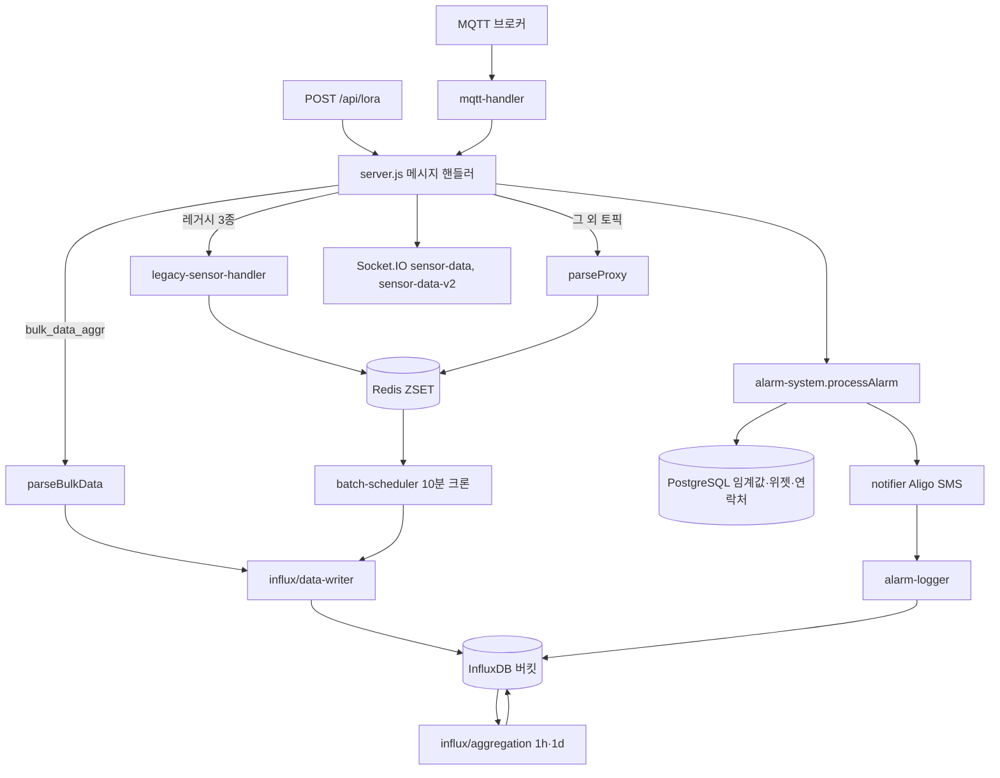
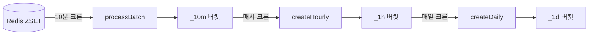
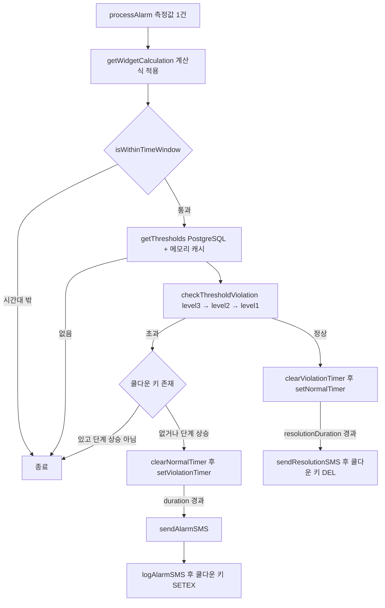

# 수집 서버 — 프로그램 명세

**작성 기준**: `collector/server.js`, `mqtt-handler.js`, `redis-storage.js`, `batch-scheduler.js`, `legacy-sensor-handler.js`, `parse/*`, `influx/*`, `alarm/*`, `utils/*`

---

## 1. 데이터 구조와 흐름

### 1.1 전체 파이프라인



### 1.2 수신 경로별 처리 분기

| 수신 경로 | 파서 | Redis | InfluxDB | 알람 | WebSocket |
| --- | --- | --- | --- | --- | --- |
| `/geocus900/+/sensdata` (일반) | `parseSensdataArray` | 저장 | 10분 배치 | `sensor` | v1 + v2 |
| `/geocus900/+/sensdata` (레거시 3종) | `parseLegacySensorData` | 저장 | 10분 배치 | `sensor` | v1만 |
| `/catM1/+/sensdata` | `parseSensdataArray` | 저장 | 10분 배치 | `sensor` | v1 + v2 |
| `bulk_data_aggr` | `parseBulkData` (통과) | 없음 | 즉시 저장 | `fft` | v1 + v2 |
| `POST /api/lora` | 없음 | 없음 | 즉시 저장 | 없음 | v1 + v2 |
| `POST /api/lora` (`isGdms=true`) | 없음 | 없음 | 즉시 저장 | 없음 | 없음 |

레거시 대상은 `geocus900_1001_01`, `geocus900_1002_01`, `geocus900_1003_01` (`legacy-sensor-handler.js` `LEGACY_SENSOR_IDS`). 이 중 `geocus900_1001_01`은 `mergeChannelsForLegacy`로 채널을 하나로 합친다.

### 1.3 파싱 결과 공통 구조

`parseProxy.parseData`가 형식을 판별해 아래 구조로 통일한다. 이후 Redis 저장, 알람 판정, WebSocket 전송이 모두 이 구조를 사용한다.

```json
{
  "id": "geocus900_1002_01",
  "time": "2026-07-29 15:20:00",
  "channels": [
    { "name": "ch2", "type": "real", "data": { "TEMP": 25.1, "WS": 3.2 } }
  ]
}
```

| 판별 조건 | 선택되는 파서 |
| --- | --- |
| `data`가 배열 | `parseSensdataArray` |
| `channel` 단일 값 | `parseBulkData` |
| `channels` 배열 | `parseTempData` |

`time`은 KST 문자열이며, 저장 시점에 UTC로 변환한다 (`Date.UTC(y, m-1, d, hour - 9, ...)`).

### 1.4 Redis 저장 구조

| 항목 | 값 |
| --- | --- |
| 키 | `timeseries:{sensorId}:{channelName}` |
| 자료형 | ZSET |
| score | UTC epoch **밀리초** |
| member | JSON 문자열 `{ timestamp, ...필드 }` |
| 키 TTL | 없음 |
| 정리 | 저장과 같은 파이프라인에서 `score <= timestampMs - 24h` 삭제 |

`storeSensorData`는 `zAdd`와 `zRemRangeByScore`를 `multi()` 파이프라인으로 함께 실행한다. 레거시 경로(`legacy-sensor-handler.storeToRedis`)도 같은 키 규칙을 사용한다.

알람 재알림 차단용 키도 Redis에 둔다.

| 키 | 자료형 | 값 | TTL |
| --- | --- | --- | --- |
| `alarm:cooldown:{sensorId}:{channel}:{dataKey}:{dataType}` | STRING | `'1'` | `cooldownDuration` 초 |

### 1.5 InfluxDB 버킷 구조

버킷 이름 규칙은 `influx/bucket-utils.js` `getBucketName()`에 있다.

| 대상 | 버킷 이름 | measurement |
| --- | --- | --- |
| 일반 센서 | `{sensorId}_{channel}_{10m\|1h\|1d}` | `sensor_10min_aggregated` / `hourly_aggregated` / `daily_aggregated` |
| 레거시 3종 | `{sensorId}_{10m\|1h\|1d}` | 위와 동일 |
| LoRa·GDMS | `lora_{key}` | `sensor_10min_aggregated` |
| 알람 이력 | `alarm-log` | `alarm_log` |

측정 데이터의 태그·필드 구성이다.

| 구분 | 태그 | 필드 |
| --- | --- | --- |
| 일반 10분 집계 | `field_name` | `mean`, `max`, `min` |
| 레거시 10분 집계 | `field_name`, `sensor_id`, `channel_name` | `mean`, `max`, `min` |
| bulk/FFT | `field_name` | `mean`, `max`, `min`, `naturalFreq`(있을 때) |
| LoRa | `field_name` = `val01`~`val04` | `mean`, `max`, `min` (동일값) |
| GDMS | `field_name` = `gdms` | `data` (문자열) |
| 알람 이력 | `sensor_id`, `channel`, `site_code` | `data_key`, `alarm_level`, `value`, `receivers`, `message`, `threshold_min`, `threshold_max` |

보관 기간은 `alarm-log`가 90일, 그 외 자동 생성 버킷은 2년(`ensureBucket` 기본값)이며, `config/channel-aggregation-config.js`에 등록된 채널은 730일로 시작 시 생성된다.

bulk/FFT는 채널 번호가 100보다 작으면 `chN` → `ch(N+100)`으로 바꿔 저장한다(`data-writer.js` `processBulkData`). 같은 10분 구간에 같은 `field_name`이 이미 있으면 건너뛴다(`getExistingFields` 조회 후 판단).

### 1.6 집계 스케줄



| 작업 | 크론 | 호출 함수 | 처리 |
| --- | --- | --- | --- |
| 10분 배치 | `3,13,23,33,43,53 * * * *` (Asia/Seoul) | `processBatch` → `influxManager.writeBatchData` | Redis 최근 10분 구간을 읽어 센서·채널·10분 단위로 평균·최대·최소 계산 후 기록 |
| 시간 집계 | `{offset} * * * *` (기본 매시 05분) | `createHourlyAggregation` → `aggregation.createHourly` | `_10m` 버킷을 Flux로 1시간 롤업 |
| 일 집계 | `{offset} 0 * * *` (기본 00:10) | `createDailyAggregation` → `aggregation.createDaily` | `_1h` 버킷을 Flux로 1일 롤업 |

10분 배치를 정각이 아니라 3분씩 밀어서 실행하는 이유는 늦게 도착한 데이터를 포함시키기 위한 것이다. 롤업 시 평균은 하위 단위 `mean`의 평균, 최대는 `max`의 최대, 최소는 `min`의 최소를 취한다.

### 1.7 알람 판정 흐름



판정 기준 데이터는 `sensor_thresholds` 테이블에서 읽는다.

| 컬럼 | 의미 | 알람 시스템에서의 해석 |
| --- | --- | --- |
| `threshold_type` | `min` / `max` / `both` | `max`는 초과, `min`은 미만, `both`는 범위 이탈 |
| `limit1` ~ `limit3` | 1~3단계 기준값 | 높은 단계부터 검사 |
| `duration` | 지속 시간 | `violationDuration` (초) |
| `cooldown` | 재알림 대기 | `cooldownDuration`, `resolutionDuration` (분 → 초) |

상태는 메모리 Map에 `{sensorId}:{channel}:{dataKey}:{dataType}` 키로 보관하며 `violationTimer`, `normalTimer`, `lastAlarmSent`, `currentLevel`, `maxLevel`을 담는다.

| 상황 | 동작 |
| --- | --- |
| 기준 초과 시작 | `setViolationTimer` — 기존 타이머는 교체된다 |
| 지속 중 정상 복귀 | `clearViolationTimer` — 통지하지 않는다 |
| 지속 중 단계 상승 | 타이머 재시작, 쿨다운 키 삭제 후 즉시 진행 |
| 지속 시간 충족 | SMS 발송 → 이력 기록 → 쿨다운 키 `SETEX` |
| 정상 지속 | `setNormalTimer` — `lastAlarmSent`가 있을 때만 설정 |
| 해제 시간 충족 | 해제 SMS → 쿨다운 키 삭제, 상태 초기화 |

발송 시간대는 `alarm-config.js` `ALARM_CONFIG.global.alarmTimeWindow` 기준이며 기본값은 KST 06시~18시다.

### 1.8 통지 대상 결정

`config-loader.getReceivers(siteCode, level)`가 `projects.alarm_contacts` JSONB에서 단계에 대응하는 차수를 읽는다.

| 알람 단계 | 연락처 키 | 문자 표기 |
| --- | --- | --- |
| `level1` | `1차` | 주의 |
| `level2` | `2차` | 경고 |
| `level3` | `3차` | 위험 |

`alarm_contacts` 구조는 `{ "1차": [...], "2차": [...], "3차": [...] }`이며 항목은 전화번호 문자열 또는 `{ name, phone }` 객체를 허용한다. 센서 이름·항목 이름은 `getSensorInfo`가 `sensor_widgets.options`에서 읽고, 없으면 `getDataKeyDisplayName`의 정적 표를 사용한다.

### 1.9 WebSocket 이벤트

| 이벤트 | 시점 | 페이로드 |
| --- | --- | --- |
| `latest-data` | 접속 직후 | `{ [sensorId]: { id, channels: [{ name, data: { field: { value, time } } }] } }` |
| `latest-data-v2` | 접속 직후 | 위와 같은 구조에서 `data: { field: { mean, time } }` |
| `sensor-data` | 데이터 수신마다 | `{ id, time, channels: [{ name, type, data: { field: number } }] }` |
| `sensor-data-v2` | 데이터 수신마다 | 값이 `{ mean: number }`로 감싸진 형태 |

최신값 Map은 `updateLatestSensorData` / `updateLatestSensorDataV2`가 관리한다. 센서별 채널 Map을 유지하고 필드 단위로 `time` 문자열을 비교해 더 최신 값만 갱신하므로, 채널별 도착 시각이 달라도 이전 채널 값이 사라지지 않는다.

---

## 2. 관련 파일과 주요 함수

| 파일 | 역할 |
| --- | --- |
| `collector/server.js` | Express + Socket.IO 진입점, MQTT 분기, `/api/lora`, 최신값 Map |
| `collector/mqtt-handler.js` | 브로커 연결·구독·JSON 파싱 후 콜백 전달 |
| `collector/legacy-sensor-handler.js` | 레거시 3종 전용 경로, 채널 병합 |
| `collector/redis-storage.js` | ZSET 저장·조회, 24시간 정리 |
| `collector/batch-scheduler.js` | 10분·시간·일 크론 |
| `collector/parse/parseProxy.js` | 형식 판별 후 파서 선택 |
| `collector/parse/sensdata-array-parse.js` | 배열형 sensdata 파싱 |
| `collector/parse/legacy-sensor-parse.js` | 레거시 코드 매핑 파싱 |
| `collector/parse/tempDataParse.js` | `channels` 배열 파싱, bulk 통과 |
| `collector/parse/data-mapping.js` | 센서·채널·필드 이름 매핑 표 |
| `collector/influx/client.js` | InfluxDB 싱글턴, 버킷 확인·생성 |
| `collector/influx/data-writer.js` | 포인트 생성, 10분 집계, bulk·LoRa·GDMS 기록 |
| `collector/influx/aggregation.js` | Flux 기반 시간·일 롤업 |
| `collector/influx/bucket-utils.js` | 버킷 이름 규칙 |
| `collector/influx/bucket-manager.js` | 시작 시 설정 기준 버킷 생성 |
| `collector/alarm/alarm-system.js` | 판정 엔진, 타이머·쿨다운 |
| `collector/alarm/config-loader.js` | 임계값·계산식·연락처 조회와 캐시 |
| `collector/alarm/notifier.js` | Aligo SMS 발송, 문자 본문 구성 |
| `collector/alarm/alarm-logger.js` | `alarm-log` 버킷 기록 |
| `collector/alarm/alarm-config.js` | 발송 시간대, 항목 이름 기본값 |
| `collector/utils/interval-parser.js` | `10m` 같은 문자열을 밀리초로 변환 |
| `collector/utils/sensor-calculation.js` | 위젯 계산식 적용 |
| `collector/utils/data-validator.js` | bulk 데이터 검증 |

---

## 3. 주요 함수 설명

### 3.1 수신과 저장

| 함수 | 위치 | 설명 |
| --- | --- | --- |
| `initMqttHandler(onMessage)` | `mqtt-handler.js` | 브로커 연결, 토픽 구독, 메시지 JSON 파싱 후 `(data, topic)` 콜백 호출 |
| `parseData(rawData)` | `parse/parseProxy.js` | 형식 판별 후 파서 위임. 실패 시 `null` |
| `storeSensorData(parsed)` | `redis-storage.js` | 채널별 ZSET에 저장하고 24시간 이전 member 삭제 |
| `getAllSensorDataByTimeRange(startMs, endMs)` | `redis-storage.js` | 전체 센서의 구간 데이터를 배치 입력용 배열로 반환 |
| `isLegacySensor(sensorId)` | `legacy-sensor-handler.js` | 레거시 목록 포함 여부 |
| `handleLegacySensorMessage(...)` | `legacy-sensor-handler.js` | 레거시 파싱 → 채널 병합 → Redis → 알람까지 수행 |

### 3.2 InfluxDB 기록

| 함수 | 위치 | 설명 |
| --- | --- | --- |
| `processBatch(client, list)` | `influx/data-writer.js` | Redis 배치 목록을 10분 단위로 집계해 버킷별로 기록 |
| `processBulkData(client, bulkData)` | `influx/data-writer.js` | 검증 → 채널 보정 → 중복 필드 제외 후 기록 |
| `processLoRaData(client, key, data)` | `influx/data-writer.js` | `val01`~`val04`를 필드별 포인트로 `lora_{key}`에 기록 |
| `processGdmsData(client, key, data)` | `influx/data-writer.js` | 원본을 문자열 필드 하나로 기록 |
| `aggregateSensorData(list)` | `influx/data-writer.js` | 센서·채널·10분 구간으로 묶어 평균·최대·최소 산출 |
| `ensureBucket(name)` | `influx/client.js` | 버킷이 없으면 생성하고 목록 캐시에 추가 |
| `createHourly(client, endTime)` | `influx/aggregation.js` | `_10m` → `_1h` 롤업 |
| `createDaily(client, endTime)` | `influx/aggregation.js` | `_1h` → `_1d` 롤업 |
| `getBucketName(sensorId, channel, timeUnit)` | `influx/bucket-utils.js` | 버킷 이름 생성. 2인자 호출은 레거시 규칙 |

### 3.3 알람

| 함수 | 위치 | 설명 |
| --- | --- | --- |
| `processAlarm(sensorData, dataType)` | `alarm/alarm-system.js` | 채널·항목별로 판정 절차 전체를 수행 |
| `checkThresholdViolation(value, thresholds)` | `alarm/alarm-system.js` | 높은 단계부터 검사해 `{ level, threshold }` 또는 `null` 반환 |
| `isWithinTimeWindow()` | `alarm/alarm-system.js` | KST 기준 발송 허용 시간대 여부 |
| `setViolationTimer(...)` | `alarm/alarm-system.js` | 지속 시간 타이머 설정, 만료 시 SMS·이력·쿨다운 처리 |
| `setNormalTimer(...)` | `alarm/alarm-system.js` | 해제 타이머 설정, 이전 경보가 있을 때만 동작 |
| `getThresholds(...)` | `alarm/config-loader.js` | 임계값을 `{ level1..3: { min, max } }`로 변환. 캐시 키는 `deviceId:ch:field:dataType` |
| `getAlarmTiming(...)` | `alarm/config-loader.js` | `violationDuration`, `cooldownDuration`, `resolutionDuration` 반환 |
| `getWidgetCalculation(...)` | `alarm/config-loader.js` | 위젯 계산식과 표시 이름 조회 (TTL 60초) |
| `getReceivers(siteCode, level)` | `alarm/config-loader.js` | 단계에 대응하는 차수의 전화번호 목록 |
| `clearThresholdCache()` | `alarm/config-loader.js` | 임계값 캐시 초기화. `POST /internal/clear-threshold-cache`에서 호출 |
| `sendAlarmSMS(...)` | `alarm/notifier.js` | 문자 본문 구성, Aligo 발송, 이력 기록 |
| `logAlarmSMS(...)` | `alarm/alarm-logger.js` | `alarm-log` 버킷에 발송 내역 기록 |

### 3.4 HTTP 엔드포인트

| 메서드·경로 | 처리 |
| --- | --- |
| `GET /health` | 서버 상태 확인 |
| `POST /internal/clear-threshold-cache` | 임계값 캐시 초기화. 관리 서버가 호출 |
| `POST /api/lora` | `{ key, isGdms, data }` 검증 후 `processLoRaData` 또는 `processGdmsData` |

---

## 4. 구현 시 주의사항

1. **bulk/FFT 채널 번호는 100이 더해진다.** 저장·조회 양쪽에서 같은 규칙을 적용해야 한다. 조회 측은 `isFft=true`로 같은 보정을 한다.
2. **LoRa 버킷 이름과 조회 식별자.** 기록 측은 `lora_{key}`를 만들지만 조회 측은 `sensorId`를 버킷 이름으로 그대로 사용한다. 조회 시에는 접두사를 포함한 값을 넘겨야 한다.
3. **타임스탬프 정밀도가 경로별로 다르다.** 배치·bulk·롤업은 나노초, LoRa·GDMS는 밀리초로 기록한다.

---

## 5. 관련 문서

| 문서 | 내용 |
| --- | --- |
| [관리-서버.md](./관리-서버.md) | 임계값·연락처·위젯 설정과 테이블 스키마 |
| [센서-조회-서버.md](./센서-조회-서버.md) | 저장된 데이터 조회 API |
